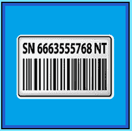

# 初学者序列号法

> 原文:[https://www . social engineering . info/2022/09/beginner-serial-number-method-done . html](https://www.socialengineering.info/2022/09/beginner-serial-number-method-done.html)

## **序列号法入门**

如果你*刚刚开始你的人类黑客艺术*的职业生涯，特别是通过**欺骗代表给你的账户充值或由他们支付费用发送替换物品**来利用公司的漏洞，那么准确地掌握完成工作需要做什么，以及如何处理在你的社会工程活动中不可避免地会遇到的某些类型的事件，可能是一个困难的过程。像[调查](https://www.socialengineers.net/2020/04/company-investigation.html)开始，[警方报告](https://www.socialengineers.net/2021/01/filing-police-report.html)被要求归档并返还，或者签署[法定声明](https://www.socialengineers.net/2020/06/asked-to-sign-stat-dec.html)或[宣誓书](https://www.socialengineers.net/2020/05/asked-to-sign-affidavit_14.html)之类的事情，会让你处于恐慌和困惑的状态——因为事实上你对有效处理每一件事情的方法几乎一无所知。

 

此外，像(但不限于)收到的[错件](https://www.socialengineers.net/2020/07/wrong-item-received-method.html)、DNA (未到达)[处理不良件](https://www.socialengineers.net/2021/04/disposed-faulty-item-method.html)、[密封箱](https://www.socialengineers.net/2020/05/the-sealed-box-method.html)、[漏件](https://www.socialengineers.net/2020/09/the-missing-item-method-done.html)、[部分](https://www.socialengineers.net/2020/09/the-partial-method.html)、[装箱](https://www.socialengineers.net/2021/02/the-boxing-method.html)、[损坏文件](https://www.socialengineers.net/2021/02/corrupted-file-method.html)[等，熟悉每一种**传统方法**是一项非常艰巨的任务如果这还不足以让你热血沸腾，你会完全不知道如何绕过](https://www.socialengineers.net/2021/02/corrupted-file-method.html)[承运人拍照](https://www.socialengineers.net/2020/12/carrier-taking-photos.html)并在交货时绕过[一次性口令](https://www.socialengineers.net/2021/04/how-to-bypass-otp.html)(一次性密码)——这一切都是因为 ***对于被称为*** **【公司操纵和剥削】**的复杂销售种类来说，你是全新的。

 

虽然记录上述事件和方法的教程已经超出了本文的范围，但我要做的是**从初学者的角度向您介绍所谓的“序列号方法”**，这非常容易理解，而且直截了当。**鉴于你是一个新手**，在继续阅读本指南之前，我强烈建议你阅读我的[社会工程初学者指南](https://www.socialengineers.net/2020/09/beginners-guide-to-seing.html)，当你完成后，你可以从这里停止的地方继续。以下是你将在今天的课程中学到的内容。

 

 

**目录**

*   What is the social engineering method?
*   Explanation of serial number method
*   How to get a valid serial number
*   Using serial number method

 

在深入研究序列号方法本身之前，最重要的是要清楚地了解什么是**“定义方法”，以及为什么它是每个攻击载体**的一个组成部分。然后，我们将进入*序列号方法* **的细节，如上面**的目录中所述。那么，事不宜迟，让我们开始吧。

 

 

**什么是社会工程方法？**

 

当你选择了你要瞄准的公司并研究了他们的条款和条件后，下一步就是制定一个**【战略】**关于你将如何实施攻击并在事后操纵他们的代表。也就是说，**你需要一个“计划”，用来从头到尾指导销售工程师**。而**“计划”**就是**“方法”**没有它，你的 SE 就不能、也不会有一个开始。为了让您深入了解**应用**方法的方式，这里有一个您可以与之相关的类比。

 

假设你从当地的家具店买了一套**卧室套房**，里面有梳妆台、一个高脚凳、床头柜&镜子，显然还有带板条的床- **处于折叠状态**。为了将所有这些放在一起并成功完成手头的任务，你需要**“组装说明”**，如果它们丢失或属于不同类型的卧室套件，工作就无法完成。同样的原则也适用于*社会工程*——在这种情况下，**“组装说明”**就是**“方法”** **，它支持你的目标**——退款或更换项目。明白了吗？很好！

 

现在，选择一种产品并选择想到的第一种方法并不容易。除了 [DNA](https://www.socialengineers.net/2020/08/the-dna-method.html) 和[收到的错误物品](https://www.socialengineers.net/2020/07/wrong-item-received-method.html)，这两种方法都可以用于几乎任何合理尺寸和重量的物品，**其他所有传统方法都必须基于物品的性质**-**“序列号方法”**当然也不例外，即用于需要某种功能才能运行的产品。那么**序号法**到底是什么，服务于什么目的？我们现在就去看看。

 

 

**序号法解释**

 

对 Argos、亚马逊、耐克、阿迪达斯等在线零售商进行社交策划的最常见方式是**先购买商品，然后使用任何其他方法**。这种方法的主要优点是，你有不止一种合适的方法，因此你可以选择最有可能对你有利的方法。当资金唾手可得时，一切都很好，但**不是每个卖家都有多余的钱，这就是“序列号方法”开始发挥作用的时候**，借此*你销售一件你不必从一开始就购买的物品！* 别急，这一分钟就完事了。

 

很明显，它与事实上包含序列号的商品有关，包括电脑键盘、苹果 AirPods、扬声器、固态硬盘(固态硬盘)等等。由于明显的原因，**它必须在保修期内才能开始索赔**。那么，当*你手头没有物品时，这种方法是如何工作的呢？*嗯，基本上**你作为销售人员，将获取你希望销售**的物品的序列号(下一个主题中有更多内容)**，并使用它来操纵代表，说该序列号所属的物品不工作。**

 

然后，销售代表/代理将继续进行一些故障诊断步骤，尝试确定它无法正常工作的原因，当你说服他它已经完全损坏时，他(通常)会要求你做两件事之一-“**退回它”，或提供“POD”(损坏证明)**。当你完成他的要求后，会派人来替换。**绕开一个豆荚，看我的教程**T5 这里。就退回来说，自然你不能退回一件你实际上没有的物品，所以使用[装箱法](https://www.socialengineers.net/2021/02/the-boxing-method.html)或[处理不合格物品法](https://www.socialengineers.net/2021/04/disposed-faulty-item-method.html)。如果手头没有**有效序列号**，您刚才所读到的内容是不可能的，这就把我带到了下面的下一个主题。

 

 

**如何获取有效序列号**

 

许多社会工程师很难找到他们想要的连载，如果你是这个等式的一部分，请放心，我会帮你搞定。**我将向你展示获得你计划销售的任何产品的序列号的最有效方法**。现在有一个实体我不推荐，那就是**、【易贝】、**，特别是如果是**、【个人卖家】、**——他们有账单要付，有嘴要养，就像你和我一样，因此**避免把他们作为目标**。好的，我在下面做的是创建一个可以找到连续剧的列表，以及一个简短的描述，解释你应该如何去获得它们，所以我们将从**“使用 YouTube”**开始。

 

 

使用 YouTube

 

YouTube 是获得有效序列号的绝佳途径，因为无数用户分享他们的视频，而**完全无视编辑/掩盖与他们在视频中展示的设备相关的可识别细节**——包括**“序列号”**。由于上传者的一步一步演示，序列号很可能会暴露，但**为了确保它仍在保修期内，请务必** **“查看视频上传的日期”**。如果是当前的**，那么你很可能已经准备好了。另一种确认方式，是对**项的&型号进行**检查。再说一遍，如果它是当前的，它就不言自明了。**

 ****

**请注意，**你的搜索结果和你输入的关键词**一样好。例如，假设你在寻找一个序列号，你必须找到显示它的视频，最好的方法之一是**输入你的物品描述，然后输入“拆箱”**。这是为了展示制造商是如何包装产品的，以及从盒子中取出产品的过程。例如，我输入了**“三星固态硬盘拆箱”**，它返回了一系列页面，显示了从盒子中取出硬盘及其附件的过程**。****

 ********

****信不信由你，我花了 45 秒才找到一个序列号！显然，事情不会总是那么简单，所以如果你碰巧遇到一些困难，**继续筛选视频，直到找到一部连续剧**——如果你足够努力，你最终会找到一部。这种方法的好处是，项目是全新的(因此**“拆箱”**，所以系列将被保修，但如前所述，**“总是检查用户上传视频的日期”**。****

 ********

 ********

****亲临商店****

 ********

****这是我最喜欢的方法，因为绝对没有任何风险。事实上，这几乎不涉及任何社会工程，这使得你作为一名销售人员的工作变得非常简单，然而要做到这一点，**“盒子上的序列号必须与物品上的序列号相同”**。你很快就会明白我的意思。那么，你如何知道盒子外部的序列号是否与物品上的序列号相同呢？那么，运用一些常识，点击谷歌**“图片搜索”**，输入类似于**“(你的物品)上的序列号在哪里”**。很明显，用你卖的产品代替你的物品。****

 ********

****我刚刚搜索了苹果 AirPods 无线充电盒，虽然用户用 ***序列号保护*屏蔽了图像，但它确认它位于盒子的底部**。简单地对你的 SE 做同样的事情。好的，假设你已经应用了上述策略，并且心中有一件要销售的商品，**找到一家销售完全相同型号&的商店，走进去，就像你是一个想买东西的普通顾客一样**。请记住，你(看起来)和其他人一样是个购物者，所以**在四处寻找你的商品时，请确保你冷静、镇定&放松**。****

 ********

****有些序列号很长，很难记住，所以当你找到你的产品后，**一手拿着盒子，另一手拿着手机**，然后假装你正在发短信。取而代之的是，导航到你手机的相机，然后**给这个系列**(在盒子外面)拍张照片，然后把它放回架子上。为了安全起见，**商品可能在“服务柜台”后面，这需要销售助理来购买**，所以只要假装你想确定它是正确的，问你是否可以先看看它。然后**用和上面一样的程序(用手机)**，把它还回去，说它不是你要找的那个。没有比这更简单的了！****

 ********

 ********

****购买物品，然后退货****

 ********

****由于这样或那样的原因，**如果你不能亲自去零售商那里进行店内销售** **，也不能使用任何上述方法**，我将要介绍的方法同样有效，而且好处是，对社会工程师没有压力——在这种情况下，就是你自己。唯一的要求是**你手头必须有资金来购买你打算销售的商品**，但是不要担心，你的账户会被 100%贷记，因此你不会亏本。****

 ********

****如果你还没想出这个题目的答案，你**购买该商品，当它到达时，记下序列号，然后通过说你收到的是作为礼物的同一件商品，或者任何符合零售商退货政策的东西来全额退款**。例如， [John Lewis](https://www.johnlewis.com/) 为**“改变主意”**提供退款(或换货)，因此使用该理由时您不会遇到任何问题。****

 ********

****我想指出的是**不同公司的退货政策不同**——有些有 15 天，有些设定为 30 天等等，所以一定要检查你没有超过你正在出售的公司的时间框架。回到 SE，当公司(与您购买的物品相关，以获得序列号)将资金偿还到您的信用卡中时，**您可以通过纯粹使用序列号对制造商或任何库存相同物品的商店进行社会工程**。****

 ********

 ********

****使用谷歌图片****

 ********

****这种特殊的方法是显而易见的，基本上不需要介绍，但是直到今天，我仍然不明白为什么许多人完全忽视了它，并且没有把它付诸实践。与 YouTube 一样，许多用户上传他们的视频，而**忘记隐藏可识别的细节，这同样适用于“在线分享图像”**。事实上，我刚刚用关键词**“三星固态硬盘序列号”**在谷歌图片上进行了一般性搜索，结果显示了好几页——其中大部分都以纯文本形式清楚地显示了序列号。**** 

 ********

****现在，您可能会问:**“我如何知道序列号是否有效，是否仍在保修期内？”**。如果你已经在销售领域工作多年，你应该非常清楚这一点，但是如果你刚刚开始做销售，那么你的问题是合理的。我将解释几个非常简单的方法，以至于你想知道为什么你没有想到它。第一个是**导航到制造商的网站，并做一个“序列号检查”**(或一些变种)，这将返回其保修状态，并显示它是否仍然有效。****

 ********

****例如，我浏览了**“戴尔网站”**，有一个选项可以搜索服务标签或序列号。我故意输入了一些随机数，但它返回了一条无效消息。**这表明它确实检查了有效的序列号**。第二种方法是给公司打电话，并且**表现得好像你是一个关心的客户，想知道你的产品(与系列相关的)是否还有保修期**。****

 ********

****因为你的电话看起来是合法的，你会发现**他们会毫不犹豫地满足你的要求**。使用谷歌图片获取序列号的唯一缺点是，在搜索结果中筛选页面需要一段时间，直到你找到你想要的。**但请记住，你不是在按时间表工作**，所以请花时间查找有效的序列号，当然，它也在保修范围内。****

 ********

 ********

******用序号法期待什么******

 ********

****每一个传统的社会工程方法，**都会触发一个或多个事件，这些事件会造成一定程度的困难**，序列号方法当然是等式的一部分。因此，充分了解**“索赔进行时会发生什么”**至关重要，这样您就可以将每个事件的复杂性降至最低。为了在这个过程中帮助你，我把三种常见的情况放在一起，包括如何有效地规避每一种情况，所以让我们从好的 ol '**“POD”**开始。****

 ********

 ********

****要求提供 POD****

 ********

****A**“POD”**是**“销毁证明”**的缩写，罗技(Logitech)和 SteelSeries 等公司经常使用这种方法，即**不是退还你的物品，“他们会要求你销毁它”，使其无法使用**，然后拍摄损坏的照片或视频，并作为电子邮件附件发送。你可能还会被要求在设备旁边放一张手写的便条，和/或出示它的序列号- **，只是为了证明它属于“你”**，而不是从谷歌图片中获取的东西。显然，POD 是用于具有某种功能的**科技类物品**。****

 ********

****你被告知销毁它的原因是为了**确保你的(看似)有缺陷的产品完全无用**，从而防止你伪造你的索赔。此外，**如果你的商品的成本高于退货的运费，公司会选择 T4——这不会花他们一毛钱。自然，你没有打算把你的产品砸成碎片，所以你需要像下面讨论的那样避开这个容器。******

 ********

****如何绕开一个吊舱****

 ********

****有几种方法可以绕过 **POD** ，第一种是[损坏的文件方法](https://www.socialengineers.net/2021/02/corrupted-file-method.html)，或者如果请求了**视频**，则[损坏的视频方法](https://www.socialengineers.net/2020/05/corrupted-video-method.html)被投入运行。或者，如果你精通使用**“Adobe Photoshop”**，尽一切办法使用你的技能来相应地处理图像。如果你选择以上方法(损坏的文件&视频)，**一定要通读我的教程，给 se 最好的成功机会**。****

 ********

 ********

****要求归还物品****

 ********

****当您拥有一个有效的序列号并提出保修索赔时，**并非每个公司都以完全相同的方式处理此事**。例如，如你所知，一些商店会**要求一个 POD** ，并指示你将销毁证明作为电子邮件附件发送，他们不会为收件箱收取该文件支付一分钱。如果没有与你提供的不一致的迹象，你的索赔将被批准。****

 ********

****另一方面，在使用**序列号方法**的某个阶段，你将不可避免地被告知**【退回产品】**，显然，这样的要求是无法满足的——你不能退回你没有的东西！**记住:你获得的是序列号，而不是物品**。因此，唯一的选择是**“规避物品的退货”**，通过使用以下子主题中概述的任何方法。****

 ********

 ********

****如何规避回报****

 ********

****基本上有**三种方法可以用来规避回报**，但是鉴于这篇文章已经比我预期的超出了很多阅读时间，我不可能在一个单独的主题中讨论每一种方法。相反，**我在这个博客上参考了我的指南，所以只需点击每个链接**就可以查看它们。方法有:处理故障项的[、漏液电池法](https://www.socialengineers.net/2021/04/disposed-faulty-item-method.html)[和装箱法](https://www.socialengineers.net/2020/06/leaking-battery-method.html)。****

 ********

 ********

****要求提供 POP****

 ********

****当你在网上或亲自在当地商场购物时，**你的交易**会有一张收据，这几乎是常识，所以没有必要详述这个显而易见的事实——那会浪费你我的时间。从公司的角度来看，需要一份**“购买证明”**(通常缩写为**“POP”**)来**确认客户要求退款或更换的商品是从他们的库存中购买的**或者在出售制造商时，该商品属于他们或给定的零售商。****

 ********

****当 **POP** 被交叉检查和验证时，代表将决定是否批准索赔。这就是销售工程师在购买商品并使用兼容方法时的工作方式，然而，如您所知，**一些销售工程师没有现金提前支付商品，因此他们会使用序列号方法，假装他们已经购买了该产品，并拥有“POP”**。但是你不能给你没有的东西，因此需要**绕过购买证明**是必须的，所以我们现在就来看看。****

 ********

 ********

****如何规避 POP****

 ********

****就操纵销售代表**驳回对 POP** 的需求而言，这并不是一件容易的事情，尤其是当**与那些仍然坚定地要求获得一个**并尽一切可能让事情变得尽可能困难的代理商打交道时。但是销售并不只是关注销售代表对你的影响，而是“你对他们的影响”。这样做的方式是比他们的要求领先一步——在这个例子中，**通过使用[损坏的文件方法](https://www.socialengineers.net/2021/02/corrupted-file-method.html)来绕过 POP** 。现在你可以使用像这样的在线服务[来创建一个假的，但是大多数公司都会验证它，因此**他们会立即注意到这不是真的交易**。](https://www.receiptmansion.com/)****

 ********

 ********

******总之******

 ********

****阅读完整篇文章后，你可能会认为这是一篇矫枉过正的文章，也就是说对于初学社交工程师来说，它涉及了太多的细节，但是**我是那种会涵盖每个角度并且不留任何侥幸心理的人**。因此，您在每个主题/子主题中愉快地阅读的内容为您提供了完美的素材，让您能够**制定并执行** **【序列号方法】**以充分发挥其潜力，因此，请将您所学的知识应用于每一个涉及**使用序列号获取替换物品**的 SE。****