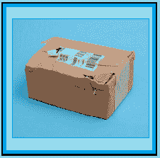

# 破损包装法

> 原文:[https://www . social engineering . info/2022/09/the-damaged-package-method-done . html](https://www.socialengineering.info/2022/09/the-damaged-package-method-done.html)

## **使用破损包裹法处理几乎每一件物品**

以你是一名高级社会工程师为由，或者为那些需要帮助才能成功打击零售商并在此后获得银行账户贷记的没有经验的顾客提供退款服务，你会非常清楚地知道**公司并不遵守“用于评估索赔的程序”以及“他们处理退货的方式”**。换句话说，曾经非常简单的 SE，现在已经变成了一个复杂的情况，要么需要以不同的方式处理，要么完全放弃并寻求替代方案- **这一切都是因为某个特定的公司“改变了他们的退款和更换操作”**。

 

例如，如果你是这个博客的忠实读者，毫无疑问你已经阅读了关于**的所有内容，这是打击社会工程领域最成功的方法之一，叫做** [密封箱法](https://www.socialengineers.net/2020/05/the-sealed-box-method.html)。由于退回了一件 ***看起来仍在原包装和状态*** 的产品，它欺骗了代表/进货员工，在没有引起怀疑的情况下接受了退货，对其进行扫描，将其放回库存，并在 x 个工作日内偿还您的资金。毫无疑问，它仍然保持其有效性，“**，但不是一对夫妇的网上商店”**。

 

如果你不知道[密封盒法](https://www.socialengineers.net/2020/05/the-sealed-box-method.html)不再适用于我即将提到的商店，你的销售工程师将会惨败。你会问，怎么会这样？嗯，在这篇文章发表的时候，**“亚马逊”和“苹果”都通过打开盒子检查里面的东西来仔细检查密封的盒子退货**，因此你的退款要求将被立即拒绝。我进行离题讨论的原因是，让你意识到**了解你计划开发的公司的所有最新发展是至关重要的**，同样重要的是**对你计划准备的**方法有充分的了解，然而，并不是每个人都能相应地选择和应用给定的方法。

 

如果有一种方法能适用于*几乎所有商品，而不管其大小&重量，以及你要寻找的目标网上商店的性质，那该多好？放心，是有的——具体来说就是**【破损包装法】**，这正是你今天课要学的。除此之外，我还介绍了**“损坏的包方法会带来什么”**，并以如何让它有**“超过 95%的成功率”**结束。当你读完整篇文章的时候，你将拥有有效地利用它来对付任何利用承运商提供服务的公司的技能。好了，不再拖延，让我们开始吧。*

 **

 **

***什么是损包法？***

 **

*看了这个题目的标题，我可以很有把握地说，你从未在任何活跃的社会工程互联网论坛或 Discord 服务器上遇到过**【损坏包方法】**，对吗？我也这么想。这是因为**我是这种方法的创造者，并以此命名，我也是制定其极高成功率**的人，正如本指南最后一个主题所讨论的。当然，你可能在销售活动中使用过类似的方法，但是关于**方法的设计、标签和应用**，这将是你第一次注意到它。*

 **

*那么**破损包装法**到底是什么，有什么用途？请允许我用一种非常简单的方式来阐述它的用法。我们会假装你使用了[遗失物品法](https://www.socialengineers.net/2020/09/the-missing-item-method-done.html)(也称为**“EB】-空盒子**)，说是在司机送完你的货后，**你打开了包裹/盒子，而物品并没有装在里面**。但是，您忘记将 ***物品重量*** 考虑在内，因此它**“登记托运”**，结果，代表拒绝了您的索赔，因为承运人的记录显示**包裹重量在他们的仓库**是正确的。*

 **

*当这种情况发生时，不仅使用[EB/缺失物品方法](https://www.socialengineers.net/2020/09/the-missing-item-method-done.html)，而且使用其他方法，如[部分](https://www.socialengineers.net/2020/09/the-partial-method.html)和[收到错误物品](https://www.socialengineers.net/2020/07/wrong-item-received-method.html)，很难(如果不是不可能的话)尝试证明您对缺失物品或收到错误物品的索赔- **重量得出结论，产品在挑选、包装和发送时没有出现错误**。如果你正在考虑**升级**，或者可能提起[贝宝纠纷](https://www.socialengineers.net/2020/06/paypal-chargebacks.html)或者遭遇[退款](https://www.socialengineers.net/2020/10/credit-card-chargebacks.html)，完全无视它- **公司有足够的证据让你的努力变得无用**。*

 **

*谢天谢地，你可以用**【破损包法】**很好很真实地拯救你的 SE，到让公司哑口无言的地步！这是该方法的工作原理。当您使用了上述任何一种方法，并且您的索赔因上一段所述原因被拒绝时，您应该联系销售代表并告知他**您注意到“包裹被撕开，上面有几滴眼泪”**。但是不要做得太过分，除了你需要的细节之外*不要说得太多* - **只要能让你的观点被**理解就行。*

 **

*我之所以建议**将信息保持在最低限度，**是因为如果你说包裹被撕得到处都是，**很可能在运输的早期阶段就被司机看到了**，而且因为**承运人没有提交损坏报告**，公司不会相信你的故事。只告诉他们包裹看起来损坏了，然后就不管了。如果你还没想出来，目标是让它看起来像是**包裹在运输途中被篡改了，你的产品在到达你的地址**之前被偷了。*

 **

*这是一个非常有效的方法，正如你将在本文的最后一个主题中看到的，**几乎每次都保证有一个有利的结果**——因为代表们几乎没有什么弹药来为自己辩护。听起来很简单，**在索赔评估**过程中，您将不可避免地遇到一些复杂情况，即来自严格遵守协议和按书办事的代表/代理，因此准确了解**“受损包装方法会带来什么”**至关重要，因此我们现在就来检查一下。*

 **

 **

***用破损包法期待什么***

 **

*对于每一个 SE 来说，根据产品的性质和公司的运作选择和制定具有同等价值的方法是至关重要的，这就是**了解“在 SE 进行过程中会发生什么”**——在这种情况下，**由破损包装方法引发的事件**。我将用通俗的语言解释我所指的是什么。作为销售人员，你知道在整理你的方法时你在做什么，对吗？你当然知道。但是，当销售代表评估你的索赔时，你知道幕后到底发生了什么吗？显然不是。*

 **

*我要说的是，你有能力和技能完美地巩固你的方法&项，为你的攻击做好准备，但在执行的那一刻，**“你对公司范围内发生的事情几乎没有控制力”**。因此，很重要的一点是要很好地了解代表们是如何处理**损坏包装方法**的，因此，如果他们向你提出各种问题和要求，**你将能够有效地解决他们的要求**。我在下面的副主题中讨论了一些常见的情况。*

 **

 **

*交叉检查承运人的记录*

 **

*一旦销售代表/代理被告知包含您订单的包裹已经损坏，他首先要做的事情之一就是**对为您送货的承运商**展开所谓的“调查”。供您参考，**调查基本上是对您的说法**的正式调查，目的是查看您向公司所说/提供的细节是否真实正确。如果你还没有经历过调查，没有必要惊慌- **这只是他们继续索赔的协议的一部分，因此没有理由担心**。*

 **

*因为你说包裹不在原来的状态，公司将**“交叉检查重量”** -这应该是在承运人的仓库托运货物时进行的。例如，假设你正在通过使用[缺失物品方法](https://www.socialengineers.net/2020/09/the-missing-item-method-done.html)出售一部大约 **175 克**的 IPhone 13。你已经联系了代表，并说打开箱子后，里面什么也没有，然后他联系了承运人，并被告知**与你的包裹**在重量上没有差异，因此手机不可能丢失。*

 **

*它得出的结论是，你的手机不仅从公司的仓库被正确地**发送出去，而且还被**放在包裹里，存放在运营商的仓库**，等待被分配和运送到各自的目的地——你的地址、[投递点](https://www.socialengineers.net/2020/09/using-drop-house.html)或任何其他用于接收货物的地点。因此，**他们有足够的证据驳回你的索赔**，他们确实这么做了，你的案子很快就结束了。在这种情况下，看起来你的 SE 已经走到尽头了，是吗？绝对不行！在下一个主题之后，我将通过使用**“破损包装法”**向您展示如何将它变成您的优势并使索赔获得批准。***

 **

 **

*使用 GPS/追踪拒绝索赔*

 **

*在可行的情况下，**全球定位系统/跟踪**信息被每个主要的运输公司用来监控货物，并确认货物是否被发送和接收到正确的发货人和收货人。就 **GPS** 本身如何操作而言，我相信你已经在你的手机上多次使用它来**找到你想要去的地方的坐标**，因此它几乎是不言自明的——我就不再赘述了。然而，追踪是一个有点复杂的过程，所以我将如下解释它是如何工作的。*

 **

*当你从网上购买商品并等待送货上门时，为了将商品送到正确的地址(你的家)，**需要在整个过程中对商品进行识别，识别的方法是给包裹分配一个“跟踪号”**，也就是在包含条形码的运输标签上。扫描条形码时可以显示跟踪号。**每个编号都是独一无二的，没有两个是完全相同的**，因此在确定哪个跟踪编号属于哪个包裹时不会有任何错误。*

 **

*以下是追踪在当地快递服务中的工作方式。**这是泛泛而谈，没有任何具体依据**。司机将在收集点提取您的包裹，**“扫描条形码”，它将立即记录发送者和接收者的详细信息**。在一天中的某个阶段，他会把它带到仓库，并对它进行第二次扫描。当它被安排交付时，**司机会再次扫描它**，然后把它放进他的货车。最后，当包裹到达投递点(你的家)**时，它将被最后一次扫描** -这确认它到达了正确的地址。*

 **

*如果你一直记着包裹被扫描的次数，你就会知道总共有**【4 次】**——在**收集点**，在**仓库**托运货物，就在货物被放入**司机的货车**之前，在**你的家**。考虑到所有这些因素，包裹在通过承运商的网络时可以被实时看到，然后成功送达正确的地点，因此**代表使用 GPS/跟踪信息“尝试”并拒绝您的索赔**。注意我引用了**“尝试”？那是因为有一种非常有效的方法可以让你彻底打消拒绝索赔的念头！**下面最后一个题目来看看是怎么做的。*

 **

 **

***>95%成功率的破包法***

 **

*如果你是这个博客的常客，你会知道我个人写的每一个方法都是完美的，因此它最大化了你计划销售的任何兼容产品和公司的退款或更换的可能性。与**“损坏包装方法”的不同之处在于，它默认的设计成功率超过 95%**，这意味着无论您如何使用它，结果都保持一致，并且**它将始终具有相同的成功程度——“超过 95%”**。*

 **

*原因是**它只有一种应用方式**，所以即使你上周才开始社交工程，你也不会在方法的执行上出错。一两分钟后你就会明白我的意思了。为了提醒大家，我想在**中回顾一下** **损坏包装方法经常触发**的事件。首先是**与承运人**交叉检查重量，以确定您的物品是否包含在包裹中。第二个也是最后一个事件是**使用 GPS/跟踪细节**来验证货物是否被运送到正确的地址。*

 **

*总的来说，公司会拒绝你的索赔，说重量是正确的，和/或 GPS/tracking 显示包裹已由承运商司机成功投递。**但是当破损包装法开始起作用时，这一切都完全没有用了！**严格按照来使用**是非常重要的，所以从这一点开始要注意每个单词。在您被告知退款或换货被拒绝后，告诉销售代表/代理提供包裹状况的照片证据 ***“在包裹送达您的地址的准确时间”*** 。***

 **

*而且，**照片必须清晰可见，** ***【包含包裹的每一个角度】*** 。请务必完全按照书面内容应用我在上面和本段中引用的内容，并将其转发给相关代表。我可以向你保证，销售代表绝对不可能满足你的要求。当然，像 DPD 这样的承运人会把包裹放在家门口，然后拍一张快照，但是没有一个司机会放大并拍摄“包裹的每一面”——这就是为什么**损坏包裹法**几乎在所有情况下都能成功——但只有当它按照本主题中讨论的方式执行时，你才能坚持你的要求。*

 **

 **

***总之***

 **

*关于**破损包裹法**的好处在于**它将始终保持相同的效率和准确性水平，永远不会失去其有效性，也不会过时**——因为它完全依赖于包裹的交付来取得成功，而承运公司将无限期地继续提供服务。*

 **

*如你所知，方法的好坏取决于它的应用和执行——特别是坚持要求 ***提供包裹被送到你的地址*** 的确切时间的证据，所以在你计划制定针对该方法的每个 SE 时，请记住这一点。*