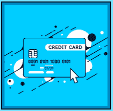

# 何时进行退款

> 原文:[https://www . social engineering . info/2022/06/when-to-hit-charge backs-done . html](https://www.socialengineering.info/2022/06/when-to-hit-chargebacks-done.html)

## **何时执行信用卡拒付**

当社会工程在线零售商意图**欺骗他们的代表去执行他们不应该做的行为**，即信用支付购买物品的全部费用或免费发送替代产品时，**它并不总是按照计划进行**。无论你是作为一名中级销售人员，还是已经在现场服务客户多年的高级退款人员，**在你的销售活动**中的某个时刻，你都会遇到复杂的情况——许多销售人员都以失败告终。

 

即使你已经**研究了关于你的目标**的所有信息，并且确定了为他们送货的承运商的来龙去脉**，然后**根据(研究的)发现完美地制定了你的方法**，SE 仍然可能过早地结束。例如，许多销售人员在非常轻便的商品**上使用[缺失商品方法](https://www.socialengineers.net/2020/09/the-missing-item-method-done.html) **获得了成功，比如一只表壳重量仅为 21 克的 Apple Watch Series 7，然而在被告知索赔获得批准后，**销售代表/代理人决定撤销他的决定，无缘无故拒绝退款**。**

 

当客户要求**将索赔升级**并由某个更高级别的人审查时，令他非常失望的是，**最初的决定保持不变，此案随后被结案**。那么，当你用尽了所有你能想到的操纵策略，但公司一再拒绝让步，并不断拒绝你的退款请求时，你该怎么办呢？这就是我的切入点，向您介绍所谓的**“退款”**，即您要求您的信用卡提供商将资金退还到您的账户中。

 

然而，许多社会工程师要么**滥用退款，提交一份又一份**，要么在他们的 SE 的情况下**在完全没有必要**的时候这样做。如果你是这个等式的一部分，那么这个教程是为你准备的，但是即使你熟悉退款是如何构成的，**我强烈建议阅读每个主题** -因为会有一些你不知道的片段。以下是你们今天将分别学到的内容。

 

*   What is dishonor?
*   Clearing the arrears
*   No deduction will be made during active deduction
*   Deduction for preservation of high-value items is the main method
*   Use deduction as backup

 

好的，那么让我们在开始这篇文章的时候，先清楚地了解一下**退款意味着什么**，以及**在社会工程领域**的使用方式。

 

 

**什么是扣款？**

 

虽然**“退款”**有时被视为与贝宝直接相关，但实际上是通过**联系你的信用卡提供商并要求退款**来完成的。换句话说，买家(你是“社会工程师”)告诉信用卡提供商撤销账户上的费用，理由是**购买是通过 PayPal** 完成的，将首先从他们那里收集信息。信息的类型可以包括(但不限于)购买证明、**运输单据**、买方&卖方、**交易记录**等之间的所有**通信。**

 

为了帮助确保流程顺利进行，**在开始退款之前，准备好尽可能多的细节(包括伪造的凭据等等)是至关重要的**-因为要求你做的一切都是由 PayPal 收集的，他们会将细节转发给信用卡提供商进行审查。因此，**由“信用卡提供商”最终决定买家(卖方)是否会收到退款**，不管 PayPal 怎么说！

 

如果你制定了方法，并在**之前执行了 SE，几乎没有出错的余地，**这大大增加了退款对你有利的可能性，当退款发生时，**公司或 PayPal 对此无能为力**。请注意，退款有一个可以提交的时间框架，即购买产品后 180 天的**，所以为了不超过这个时间，请务必记住。这个主题涉及的内容很多，但是面面俱到超出了本指南的范围。好了，接下来我们来看看**退款对新客户的影响**。**

 ****

 ****

****清除拖欠账款****

 ****

**每一家你第一次打算出售的公司，**都需要通过添加你的电子邮件地址、联系电话、首选支付系统来创建一个在线账户**，这样的例子不胜枚举。当它完成时，你已经有效地将你的方法应用于你将要销售的物品的性质，攻击媒介可以被启动，SE 将朝着实现它的目的前进- **最好是退款进入你的银行账户。**然而，这并不像听起来那么简单——有一个因素导致了许多失败的系统工程师——特别是**“一个新的在线账户”**。**

 ****

**那么一个**新鲜在线账号**到底是什么，为什么它会对你的社会工程活动产生负面影响？很高兴你问了！简而言之，**这是一个新创建的账户，交易历史记录不佳，没有信誉**，因此，直到它随着时间的推移而成熟，拥有许多合法购买和良好的跟踪记录，**当以任何身份出售时，它将(在某种程度上)吸引注意力**。例如，如果你在同一个公司**工作过**，你显然会尝试退还或更换每一笔购物。**

 ****

**这就是销售的意义——不花一分钱就能获得商品。但如你所知，**索赔即使在最有利的情况下也会被拒绝**，因此，销售人员倾向于执行**“多次退款”，这很有可能引起代表**的兴趣——他们随后将调查账户并筛选每笔付款、事件和活动。因此，它会立即引起怀疑，并很可能导致帐户被**标记**或**关闭**。这是一个响亮而清晰的信息- **消除“新客户”的退款**。**

 ****

 ****

****主动出击时不要打退堂鼓****

 ****

**当销售工程师离开您当地的环境，并由公司的代表/代理负责时，**在评估索赔的过程中，您几乎无法控制所采取的步骤**。像[调查](https://www.socialengineers.net/2020/04/company-investigation.html)开始、[警方报告](https://www.socialengineers.net/2021/01/filing-police-report.html)被要求、或者[被要求签署文件](https://www.socialengineers.net/2021/05/asked-to-sign-documents.html)、**在打击各种形式和规模的公司**的某个阶段会找上门来。如果你是从一个先进的角度来阅读这篇文章，你会很好地真正知道所有这些事件只是公司协议的一部分，以推进索赔，因此没有理由担心。**

 ****

**然而，有数不清的 SE 要么不知道上述事件意味着什么，要么不知道如何处理它们，因此他们决定**“在 SE 仍在运行时进行退款”**。这是一种不好的做法，而且*永远不应该在索赔正在进行时进行*。为什么？好吧，如果代表批准了，**您就浪费了本可以用于更有价值和更有益目的的退款**，这将在下一个主题中讨论。最后，每个 SE 的目标显然是取得成功的结果，所以等待它最终确定下来。**如果没有达到预期效果，那么就应该考虑退款**。**

 ****

 ****

****主要是对高价值物品进行扣款****

 ****

**如果你注册了一个在线社会工程社区，比如互联网论坛或 Discord 服务器，你会发现有许多针对**“高价值物品”**的讨论，其中许多讨论在措辞**和解读**上有很大不同。正因为如此，**它可能会相当令人困惑和误导**但请放心，我会按如下方式为您澄清这一切。没有一个固定的数字来定义什么是高价值的物品，但老实说，大部分归结于使用常识和良好的判断。******

 ********

****根据经验，**任何“最低价格在 800 美元左右”的东西都被认为是高价值物品**。当然，如果一个产品超过这个数字，它也属于同一类别。现在你可能想知道为什么我向**推荐“专门为高价值项目节省退款”，但是如果你仔细看这个主题的标题，你会注意到它是以**“主要”**开始的——意思是**在很大程度上是**，因此任何值都可以。然而，鉴于价值数千美元的物品更容易出现故障，**最好将你的大部分退款用于此类场合**。通过这样做，您可以将它用作**“备份”**，这就引出了本文的最后一个主题。******

 ********

 ********

******使用充值卡作为备份******

 ********

****在您完成**信息收集会议**后，通过确定公司的运营方式以及他们用来发送货物的承运商类型，您可以通过**“物品和方法制定”**做出明智的决定——选择一种与您希望退款或更换的产品性质完全兼容的方法。因此，你已经准备好了完美的材料，给 SE 带来了最佳的成功机会，但社交工程并不全是阳光和彩虹- **它确实会失败，即使你做了所有正确的事情**。****

 ********

****当然，你可以**要求升级你的申请，并由一名没有参与拒绝申请的最初决定的团队成员**重新评估，但是当你被告知升级也被拒绝时会发生什么呢？你猜对了，**通过联系你的信用卡提供商**“打了个退单”。这就是为什么我总是建议保留你的退款，并在其他方法都失败时用它作为“备份”的主要原因。简而言之，当您的索赔被终止，并且对此无能为力时，**“诉诸退款”**。****

 ********

 ********

******总之******

 ********

****如果您已经阅读并理解了每个主题中的每个细节，那么毫无疑问，您现在已经深入了解了**退款是如何构成的**，包括**应该在 SE 的哪个阶段使用**，以及**在 SE 未按计划进行时将其作为备用**的优势。作为结束语，我想重申，在决定是否进行退款时，对项目 **值**进行**选择是一个好的做法。******

 ********

****举例来说，如果是一张仅售 6.50 美元的微型 SD 卡**，从逻辑上来说，不值得花费时间和精力与银行来回奔波，以追回区区几美元。对值得通过这一程序的商品发起退款——笔记本电脑、手机、苹果智能手表，以及基本上**任何价格非常合理的产品**。******