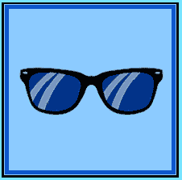

# 社会工程太阳镜

> 原文:[https://www . social engineering . info/2022/04/social-engineering-太阳镜-done.html](https://www.socialengineering.info/2022/04/social-engineering-sunglasses-done.html)

## **如何社会工程师男士&女士太阳镜**

毫无疑问，像 Zalando、Nike、Amazon、John Lewis 等大规模运营的社交工程网上商店需要一套特殊的技能来**操纵他们的代表做他们不应该做的事情**——即退款**的信用账户**，或者自费发放**替换物品**。原因是，在评估索赔时，他们都有**各种协议**并且攻击媒介的一个错误举动会导致 se 过早结束。

 

例如，如果使用[密封盒法](https://www.socialengineers.net/2020/05/the-sealed-box-method.html)，用同等重量的物品替换原来的物品，并且销售人员**没有特别注意按照其工厂状态重新密封好**，退货很可能会被检查。因此，**与其包装的不一致将表明篡改的迹象**，因此退款请求将被拒绝。对于[错误项目接收方法](https://www.socialengineers.net/2020/07/wrong-item-received-method.html)也是如此。为了获得有利的结果，必须是错误的物品本身，**从同一家公司**购买，在**不同的账户**和**发送到与社会工程师无关的另一个地址**。

 

如果这些要素中的任何一个(**公司**、**账户**、**地址**)不适用，几乎可以保证 se 将在索赔评估的早期阶段结束。不仅仅是方法会有问题，某些类型的“产品”也会造成某种程度的困难，比如一台**电脑显示器，由于它的尺寸&重量，绕过送回的需要，是一个艰难的过程。这种**【拳法】**显然是不可能的(后面会有更详细的介绍)，更别提使用有缺陷的所谓 [FTID 垃圾](https://www.socialengineers.net/2020/07/the-ftid-method.html) - **完全是浪费时间和精力**。许多其他方法也不兼容。**

 

从本质上讲，它基本上只留下了一种适合监控器的方法，即[处理故障项目](https://www.socialengineers.net/2021/04/disposed-faulty-item-method.html)，这不是一项容易的任务- **它需要将销售代表/代理推到崩溃点，以获得任何成功的机会**，如果销售人员在整个攻击过程中没有保持坚定，也可能过早地失败。正如你所看到的到目前为止你所阅读的每一种方法和策略，**“项目和方法制定”**(意味着选择一种完全适合项目性质的方法)，必须做到不留任何错误的余地，但是有一种特定的产品可以非常容易地使用——特别是**“太阳镜”**。

 

假设*太阳镜是根据*选择的 *，那么戴起来就很简单，因为它们**小**，**极轻**，而且有许多**兼容的方法**可供选择——所有身材和大小的人都可以戴。话虽如此，我继续在互联网论坛和 Discord 服务器上遇到社交工程师，他们由于这样或那样的原因，在试图整合他们的 SE 时遇到了重大问题。如果你是同一个等式的一部分，请放心，我会保护你。*

 

今天你将学到的是如何使用我亲自挑选的**的“三个最好的方法”**社会工程师男士&女士太阳镜**，以及**【选择合适的重量】**的重要性。作为这篇文章的结尾，我讨论了**“戴太阳镜时要注意什么”**——有了这些知识，你就能以最小的复杂性处理每一个事件。好了，事不宜迟，让我们从**“挑选太阳镜的方法”**开始。**

 ****

 ****

****法 sè太阳镜****

 ****

**在**“公司操纵和剥削”**的当今世界中使用的每一种传统方法都是为其自身的目的而构建和设计的，因此最重要的是有能力**识别、选择、理解并利用一种给定的方法来充分发挥你计划销售的产品的潜力**——在这种情况下，就是**“太阳镜”**。因此，这将极大地帮助 SE 从一开始就平稳运行，并继续朝着正确的方向前进，直到最终批准退款或更换。**

 ****

**在我向你介绍**“几乎在任何场合都能确保成功的三种方法”**之前，我将简要解释一下*方法的总体目标*——因为我相信有很多读者从初学者的角度阅读这篇文章**，他们在销售领域几乎没有经验。下面是方法是如何操作的。当你选择了你想要销售的公司并研究了他们的条款&条件后，下一步是**制定一个你将如何实施攻击的“策略”并在事后操纵他们的代表**。****

 ********

****也就是说，你需要一个**“计划”来从头到尾指导你的销售工程师**。**“计划”**就是**“方法”**没有它，你的 SE 就无法(也不会)开始。请允许我提供一个你能理解的类比。假设你从宜家购买了一个娱乐单元，包括折叠状态的搁板、抽屉、橱柜等。**为了将它们组装在一起并完成你的项目，你需要“组装说明”**，如果它碰巧丢失或属于另一个单元，这项工作就无法完成。****

 ********

****同样的原则也适用于社会工程。在上面的场景中，**“汇编指令”**就是**“方法”**，当被翻译成攻击向量时，**它支持你想要实现的目标**——最好是在你的账户中生成退款。有道理？很好！既然你已经对方法履行其作用的方式有了一个很好的想法，你已经准备好用你最喜欢的一副**太阳镜**来制定**“三个最好的”**，所以我们将从好的 ol’**“遗漏项目方法”**开始。****

 ********

 ********

****漏项法****

 ********

****从销售的角度来看，选择**缺失项目方法**背后的逻辑是由于(所选)太阳镜的重量非常轻，但**“每个销售代表都必须实施重量限制”**。你很快就会明白我的意思。那么到底什么是缺项法呢？很高兴你问了！顾名思义，它用来表示从在线零售商处订购的商品，在承运商司机交付后打开包裹/箱子时**不见了。例如，我们将假设你从一家名为 [Zalando](https://zalando.com/) 的时尚公司购买了一副重约 22 克**的**宝丽来太阳镜，并让他们的一个承运伙伴将它送到你家。******

 ********

****在**打开【盒子/箱子】**后，你会联系 Zalando，告诉他们里面什么都没有，意思是**太阳镜本身不见了**——目的是要求退款或更换。或者，你可以说**“包裹被打开了”**，它是空的- **盒子/箱子和眼镜不在那里**。当然，你确实收到了，但你是为了销售的目的才这样说的。现在，除非代表/代理人脑残了，当场批准索赔，否则公司很有可能会展开调查，并与为您送货的承运人联系。****

 ********

****他们特别检查的是在承运人的称重设施记录的**【重量】****——以确定太阳镜是否在包裹中。但是因为**它们像羽毛一样轻，所以它们绕过了检测**，因此*没有证据表明它们在包装*中，索赔最终对这些人有利。这就是为什么**遗漏项目方法**如此有效的原因——当太阳镜的重量(详见页面下方)正确应用该方法的公式时，**公司/承运商不可能证明它们包含在货物中！**另一个同样强大的方法是**“分部方法”**，这就把我带到了下一个话题。******

 ****

 ****

**分部分项法**

 ****

**鉴于你刚刚读过缺失项方法，你对**“分部方法”**所需要的东西不会有任何问题，也就是说，因为**它基于类似的概念工作，但在执行方式上略有不同**。也被称为**【部分】**，这种方法适用于*从网上商店订购一堆商品*，但声称当你收到订单时，订单已经**【部分完成】**。换句话说，例如，**购买了 5 件物品，但只收到了其中的 3 或 4 件**。从本质上来说，**少了一两个**——这取决于你选择销售的数量。**

 ****

**它的执行方式几乎与缺失商品法相同，但你**“在同一批货中购买多件商品”**并不是购买一件商品并单独出售，然后联系销售代表并告诉他**当你打开盒子/包装时，有一件或多件商品不在里面**。与缺失物品法一样，你要销售的每件产品*都必须足够轻，不会在托运时记录重量*。迷茫？不要担心，我已经在下一个主题**“选择合适的权重”**中讨论过这个问题。**

 ****

**这里有一个如何使用分部方法的简单例子。我将从第三人称的角度来描述这个人，而不是你自己。他一共订购了 6 件物品，**其中两件是雷朋贾斯汀的长方形太阳镜，每副重 29 克**——这就是他将要销售的，**两副太阳镜**。当他的快递到达时，销售人员等了 20-30 分钟，然后打电话给公司解释说**太阳镜不在包裹里**。不出所料，**一个** [调查](https://www.socialengineers.net/2020/04/company-investigation.html) **被打开**，以确定为什么发送和接收的货物存在差异。**

 ****

**销售人员很清楚调查只是推进索赔的协议的一部分，所以没有理由担心。由于**两副太阳镜的重量几乎为零**，索赔专家团队无法确定整个包裹的重量是否有差异，因此**他们的调查结果是不确定的**。**

 ****

**结果，**他们没有证据拒绝**的索赔，因此两副太阳镜的退款被打入了顾客的账户。这清楚地表明了为什么我在销售太阳镜时全力推荐**【局部法】**(以及提到的其他方法)。但不止于此！还有一个我想讨论的叫做**“拳法”**。**

 ****

 ****

**拳法**

 ****

**有许多方法可以表演**“拳击法”**，但是为了这个教程的目的，我将只演示下面的一种。这种方法本身也被称为**【盒子】**，通过购买一件产品(在这种情况下，是**【太阳镜】**)来使用，在承运人把它送到你的地址后，你会**打电话给代表，告诉他它们坏了，或者其中一个镜片被刮花了**(或者任何你能想到的保证退款/更换的东西)。当然，眼镜是好的，但你说它们不好，以获得另一副免费眼镜或退款。**

 ****

**在大多数情况下，销售代表不会相信你的话，而是**要求退回它们**，这时**“拳击法”**开始发挥作用，通过**只发送里面什么也没有的盒子**。这种方法的目的是让箱子看起来好像在运输过程中被篡改了，有人(显然是)在包裹被送到公司之前偷走了太阳镜。然而，这并不像听起来那么简单- **当您准备将其发送回**时，必须采用某种方法，如果没有正确完成，SE 很有可能会失败。**

 ****

**显示篡改迹象的最佳技术是**在盒子的一侧切开，最好是*在运输过程中不太可能被注意到的地方*，然后用不同颜色的胶带**密封。此外，不要做得太明显-如果承运人在收集点看到它，就会提出损坏报告，从而免除他们的责任，让你承担责任！ 继续向前，当公司收到包裹 、 **时，他们会发现包裹已经从原来的状态改变了，并且会认为确实有人偷了你的太阳镜** 。**

 ****

**即使托运货物的重量与承运人进行了交叉检查，也几乎没有用——如你所知，**太阳镜规避了检测**，这就是为什么当按照本主题所述进行配制时，**拳击遇上** **球棍**的成功率非常高。考虑到所有上述事件，该公司将别无选择，只能向您的帐户退款，或者(如果您愿意)发送替换太阳镜。显然，**如果你没有相应地计算“重量”**，所有这些都是不可能的，所以接下来我们将看看如何**选择合适的重量**。**

 ****

 ****

****选择合适的权重****

 ****

**虽然太阳镜通常很轻，*有许多品牌比其他品牌*重得多，因此**它们不能与“遗漏项目”和“部分方法”**一起使用——它们的重量将在承运人的仓库(或其他地方)对包裹称重时被计算出来，您的 se 将结束。就**“拳击法”**而言，它与厚重的太阳镜一起工作的唯一方式是用[干冰](https://www.socialengineers.net/2020/06/seing-using-dry-ice.html)来代替它们，这意味着**你送那个(干冰)而不是太阳镜**。如果你对如何应用它感兴趣，请务必阅读我的[指南](https://www.socialengineers.net/2020/06/seing-using-dry-ice.html)。然而，本教程不涉及干冰，所以我不会讨论它。**

 ****

**如果你还没有意识到的话，**“项目的重量”**在确保**缺失项目**和**部分方法**达到其目的时起着不可或缺的作用。也就是说，**在包裹从派送到通过承运商网络并最终到达目的地(您的家、[投递点](https://www.socialengineers.net/2020/09/using-drop-house.html)或任何其他用于接受交付的地点)的任何阶段**称重时，都不应检测到产品。现在，如果你是这个博客的常客，你会看到我总是建议**物品不要超过“120 克”**，这是把它推到了绝对极限。**

 ****

**你会发现大多数太阳镜都在 120 克的重量范围内，比如[这款](https://www.amazon.com.au/Hawkers-Unisex-Silver-Gradient-Sunglasses/dp/B07PFR9GNP/ref=pd_di_sccai_cn_sccl_9/355-0324575-0348933?pd_rd_w=smBaw&pf_rd_p=63c98ab1-87aa-42d5-9a93-ce1201cba2b5&pf_rd_r=W8C0RHAEMY3HTCC33NXC&pd_rd_r=7e728cec-24bb-4b4f-addd-29f541eafff7&pd_rd_wg=QqwOP&pd_rd_i=B07PFR9GNP&psc=1) **只有 90 克**，但是为了让上述任何一种方法**都有超过 95%的成功几率**，选择**最大重量为“50 克”** - [这款](https://www.amazon.com.au/Polaroid-PLD-2090-Mens-Sunglasses/dp/B083MNKC4H/ref=asc_df_B083MNKC4H/?tag=googleshopdsk-22&linkCode=df0&hvadid=463597089299&hvpos=&hvnetw=g&hvrand=13541612192160919884&hvpone=&hvptwo=&hvqmt=&hvdev=c&hvdvcmdl=&hvlocint=&hvlocphy=9071477&hvtargid=pla-925845852623&psc=1) **只有 *35 克*** ，可以绕过关于**【部分法】**，如果你要出售**多副太阳镜**，*你必须将每副的重量合并成一个数字，并保持在 120 克以下*。例如，如果一个是 **65 克**，另一个是 **45 克**，则按 110 克计为**一个单位**。算一算:65 + 45 显然等于 110！**

 ****

 ****

****买太阳镜要注意什么****

 ****

**这篇文章已经超出了我预期的阅读时间，所以我会尽量让这个话题简短。好吧，甚至在考虑社会工程你最喜欢的太阳镜之前，**最重要的是“研究公司的仓库运作”**，确定他们的*挑选&包装程序*——这在**缺失项目**和**部分方法**的情况下，将得出结论，如果它们能够付诸实践。过几分钟左右你就会明白我指的是什么了。**

 ****

**那么为什么一定要进行**研究**？嗯，很多用户不知道的是，某些公司实际上**“检查他们的货物，因为他们被装在盒子/包装里”**在打包之前，把它寄给买家。例如，我可以很自信地说，一家名为 [Shade Station](https://www.shadestation.co.uk/) 的英国太阳镜(和手表)零售商的运作方式是挑选他们的库存、**“打开太阳镜盒子以确保产品在里面”**，然后包装并发送给客户。具有类似设置的其他商店也以相同的方式工作。**

 ****

**这是一个巨大的问题，最终*结束了两个缺失的项目&部分方法*。如果你仍然打算说你的太阳镜不见了，再想一想- **他们会给你发** [闭路电视](https://www.socialengineers.net/2020/10/cctv-cameras-in-warehousing.html) **录像，清楚地显示“你的产品在箱子里”，并且包装完整！**说到[闭路电视摄像机，](https://www.socialengineers.net/2020/10/cctv-cameras-in-warehousing.html)许多公司都让他们监控他们的仓库库存，但是您确实可以灵活使用缺失项目&部分方法- ***仅当闭路电视摄像机用于验证货物包装*** 。方法是购买完全密封的太阳镜，然后说**“一打开箱子，它们就不见了”**。**

 ****

**摄像机不是 x 光机，因此**它们无法查看“箱子里的东西”**，所以请记住这一点，以便将来 se 使用。但是你怎么知道你打算销售的公司，**是否在包装**时检查他们的产品，以及是否在他们的仓库里安装了**闭路电视摄像头** **？**答案很简单。如果你注册了一个销售社区，**询问其他销售人员最近是否对问题**中的 **公司进行了社交工程，和/或在一个独立/测试账户上点击[练习运行](https://www.socialengineers.net/2020/05/perform-practice-run.html)【试用 SE】。然后，你可以根据你的调查结果做出明智的决定(是否销售它们)。****

 ****

 ****

****总之****

 ****

**看完本文的每一个话题(如果你还没有，现在就回去做！)，**你对如何高效、有效地销售太阳镜**了如指掌，这三种方法几乎在任何场合都能取得令人满意的效果。**

 ****

**你也已经了解了为什么坚持**“120 克重量限制”**是至关重要的，并且深刻理解了**识别一家公司的仓库环境**——即其结构(有或没有[闭路电视摄像机](https://www.socialengineers.net/2020/10/cctv-cameras-in-warehousing.html))，以及**挑选&包装订单**的过程。总的来说，你现在有工具，资源和专业知识，以最高的信心和成功的社会工程太阳镜。**