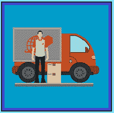

# 适用于初学者的 DNA 方法

> 原文：<https://www.socialengineering.info/2021/10/the-dna-method-for-beginners-done.html>

## **DNA 方法入门**

如果你是这个博客的粉丝，并且一直在阅读我的教程，你会很清楚**几乎所有的文章都非常详细，以确保每个角度都被涵盖，不留任何机会**，因此你的社会工程经验在最大程度上被最大化。尽管我通过提供我的读者可以理解的类比和场景来简化一切，出于这样或那样的原因，许多读者发现理解所写的内容有些困难——特别是在今天的**公司操纵和剥削**的世界中使用的传统方法——其中的**“DNA 方法”**是等式的一部分。

 

换句话说，**许多社会工程师无法理解 DNA 方法是如何构建的**，他们也不理解 DNA 方法对他们计划销售的公司和项目的制定和实施。例如，我遇到过无数的顾客，他们说他们选择了另一种方法，因为他们的产品对 DNA 来说太重了，但如果他们知道它的目的，**他们会意识到重量是无关紧要的，完全无关紧要的**。此外，他们认为 GPS/跟踪信息证明了货物的接收是正确的，并结束了 SE，然而**却完全不是这样**。

 

鉴于上述所有情况以及页面下方讨论的一系列其他情况，我决定整理一份初学者指南，它不同于我在本博客上记录的其他教程。**你将要阅读的内容，旨在通过简单明了、开门见山、简单易懂的方式让你清楚地了解 DNA 方法，从而回答你所有的问题和顾虑**。每一个细节都保持在最低限度，但有效地解决了手头的主题，因此你将能够以令人难以置信的轻松解释其内容。所以不要再拖延了，让我们开始吧。

 

 

**DNA 方法介绍**

 

DNA 是**【未到达】**的缩写，顾名思义，用来表示由承运人司机、**安排递送的包裹没有到达您的住宅、** [投递点](https://www.socialengineers.net/2020/09/using-drop-house.html) **或任何其他用于接受递送的地点**。当然，你确实收到了，但你声称不是为了销售。因为你给人的印象是你还在等司机来取车，所以你不应该知道车是什么时候来的，所以最好在第二天联系销售代表，问他为什么他们还没有把车送过来。

 

根据你从事社会工程的公司，他们可能会对**说，去邻居**那里核实一下，看看你的包裹是否被意外地交给了他们，或者销售代表/代理人可能会告诉你**等几天，看看它是否会出现**，如果没有，给他回个电话，他会试着找到它的下落。正是在这个阶段，你的索赔*可能*变得有些**复杂、冗长，而且(有时)某些类型的文件需要签字&退回**，这就把我带到了下一个话题。

 

 

**用 DNA 法期待什么**

 

如同每一种方法一样，DNA 有它的利弊，进一步到上面的话题，坏处是**它的共同性引发了所谓的** [调查](https://www.socialengineers.net/2020/04/company-investigation.html)。进行调查(通常)有几个原因。第一步是**与承运人联系并交叉检查他们的 GPS/跟踪记录**以确定为什么包裹没有到达正确的目的地——你的地址或[投递点](https://www.socialengineers.net/2020/09/using-drop-house.html)。第二个是，**公司认为丢失的包裹是由于与盗窃相关的事件**，例如司机将包裹放在你家门口无人看管，之后包裹被盗。

 

当这种情况(似乎)发生时，很有可能**你会被要求提交并返回一份** [警方报告](https://www.socialengineers.net/2021/01/filing-police-report.html)——只是为了确认你所说的关于没有收到你的包裹的一切都是真实和正确的。在某些场合，**需要在** [法定声明](https://www.socialengineers.net/2020/06/asked-to-sign-stat-dec.html) **上落笔也是一种要求**，这与警方报告的目的类似——声明你没有在你提供的信息上撒谎。虽然每个事件听起来都很可怕，但我可以向你保证，没有什么可担心的。一份**【调查】****【警方报告】**和一份**【法定声明】**只是他们推进你的索赔的协议的一部分，仅此而已。

 

 

**适合 DNA 法的物品**

 

DNA 方法的最大优势在于它的灵活性，这与它所使用的物品的性质有关。与大多数其他方法不同，如[丢失物品](https://www.socialengineers.net/2020/09/the-missing-item-method-done.html)、[部分](https://www.socialengineers.net/2020/09/the-partial-method.html)、[收到错误物品](https://www.socialengineers.net/2020/07/wrong-item-received-method.html)等等，**DNA 不与任何特定的重量和大小**相关，因此除非你正在寻找阿瑟家族的家(可以这么说吧！)，您可以选择想到的任何产品——因为**您只是声称包裹没有到达**。不管它重 40 克还是 40 磅，事实是**司机忘记放下你的包裹，因此重量&的大小与此无关**。

 

但是，运用常识和良好的判断力，对你的销售工程师要现实一点。例如，如果你要以超过 3000 美元的成本设计一台**重 615 磅的 78 英寸商用冰箱，它不会在没有任何形式的验证的情况下被扔在你家门口。**该公司会格外小心，确保邮件被正确送达**，比如安排一个 [OTP](https://www.socialengineers.net/2021/04/how-to-bypass-otp.html) (一次性密码)，如果你不在家，邮件会被送回承运商的仓库，或者被转送到一个安全的收集点。如果你计划出售电话、扬声器系统、衣服等，那么**DNA 就足够了**。**

 

 

**什么是跟踪，为什么没用？**

 

为了在托运货物通过网络时对其进行监控，并帮助确保包裹到达正确的目的地，**大多数运输公司使用“跟踪”**——这基本上显示了包裹在任何给定时间的位置，以及预计到达收件人的时间。当用户使用 DNA 方法提出索赔时，**公司将尝试使用跟踪信息来确认包裹已成功送达正确的** " **地址"**，并且他们将使用这些(跟踪)细节来尝试拒绝您的索赔。

 

注意到我上面是如何引用**【地址】**的吗？那是因为追踪只能核实货件到一个**【地址】**，而不是到一个**【人】**，这实质上意味着**【你】**没有亲自收到包裹，你的**【地址】**收到了！因此，任何事情都有可能发生——一个过路人偷了它，或者你的邻居做了同样的事情，或者司机自己拿走了它——是的，我目睹了很多次。因此，当使用 DNA 方法时，请始终坚持使用**“您没有亲自收到您的包裹”**的说法——这就是跟踪确认没有用的原因。

 

 

**如何用假签名有效签名**

 

几乎每一家大规模运营的承运商，如联邦快递、DHL、UPS、DPD 等，都有他们必须遵守的协议，他们用来标记托运货物已交付的一个非常常见的程序是**在将包裹交给客户**时要求签名。就像你刚刚在上面读到的跟踪一样，**签名几乎是无用的——因为任何人都可以签收**，甚至是承运人的司机，尤其是当他在预定的送货运行中迟到的时候。

 

为了帮助使签名无效，**社会工程师不用他们的真实姓名**签名，即使(在很大程度上)这足以让代表相信这不属于他们，我会告诉你如何有效地伪造它，从而**它不会以任何方式、形状或形式与你的真实身份**相关联。这是通过用一个和你完全不同的名字签名来完成的，但是在某种程度上**“它有些清晰/可读”**。因此，销售代表/代理人会阅读它，并发现它与您的真实姓名不匹配，因此他不可能将它与您联系起来。总而言之，你是清白的！

 

 

**承运司机拍照**

 

在既没有签名又没有 [OTP](https://www.socialengineers.net/2021/04/how-to-bypass-otp.html) 的情况下，一些承运人实施了其他措施，即**“拍摄投递点的照片”**(你的房子或其他)，用于验证司机确实将包裹送到了正确的房子。在这篇文章发表的时候，**“DPD”为许多主要零售商服务，如亚马逊和 ASOS** ，他是一个拍照的载体，所以在未来的 se 中要记住这一点。一般来说，照片有几种拍摄方式。司机要么**将包裹放在你家的门阶**或附近位置并拍照，要么他会让你**打开前门，然后在入口通道**拍下包裹的快照。

 

每种方法的目的都是通过使用放在你家门口或入口处的包裹的照片证据来确认送货，所以如果你否认你的订单没有到达，他们会参考他们的照片，但同样，这是没有用的。你会问，怎么会这样？嗯，**就你的物业外部照片而言，“谁敢说没有人偷你的包裹？”**。如果司机愿意，他可以拍 100 张照片——这并不能改变**“它被遗忘在你家”**的事实。至于入口通道，只需从另一个房间添加一块地毯和一张桌子&椅子来改变外观，这样**就不会与他们的照片相配，给人一种这不是你家的印象！**

 

 

**总之**

 

除了我在这篇文章中介绍的以外，还有很多关于 DNA 方法的内容，但是正如我所说的，这篇教程是针对那些对其配方和用法没有什么经验的初学者的**。我还确保专门讨论通常与 DNA 相关并由 DNA 触发的事件，因此你会很好地理解会发生什么，包括随着事态的发展做好准备处理有问题的问题。最后，随着你技能的进步，把这个指南当作**完全熟悉 DNA 方法的垫脚石。****