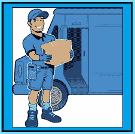

# DNA 方法的影响

> 原文:[https://www . social engering . info/2021/12/the-impact-of-DNA-method-done . html](https://www.socialengineering.info/2021/12/the-impact-of-dna-method-done.html)

## **DNA 方法对司机的影响&自己**

当在正确的背景下使用并发挥其全部潜力时，**“社会工程是一个非常强大的工具”** **它可以实现任何想到的事情**。无论是对 3000 美元的游戏笔记本电脑使用[序列号方法](https://www.socialengineers.net/2020/04/serial-number-method_13.html)并通过实施[泄漏电池方法](https://www.socialengineers.net/2020/06/leaking-battery-method.html)来规避销售代表的退货请求，还是用[装箱方法](https://www.socialengineers.net/2021/02/the-boxing-method.html)击打最新的 IPhone，使其看起来好像包装被篡改，物品在运输过程中被盗，**每个事件都可以在几乎每个场合操纵公司代表** - *由拥有专业知识的高级销售人员制定【T11*

 

当然，我指的是**“公司操纵和剥削”**，销售代表/代理商被欺骗，将购买产品的全部费用记入贷方账户，或者由他们支付费用发送替代产品，而用户仍然可以保留原来的产品。**这种类型的社会工程要复杂得多**(与老派窃取机密信息、用户名&密码等相反)，因为**完成工作需要一套特殊的技能——特别是当销售代表严格按照书本工作**并仔细评估索赔时，而不是那些没有脑细胞的人当场批准索赔。

 

如果你在上述职位上已经干了好几年，你会很清楚**你的活动对 John Lewis、Zalando、Nike、Wayfair、Amazon 和许多其他大规模经营的公司**影响很小甚至没有影响——也就是说，因为你的目标是价值数十亿美元的实体，他们的员工(和其他 人员) 根本不在乎财务损失或其他。然而，对于在个人层面 【在某种程度上】受到影响的 **个人来说，情况就不一样了——具体来说就是** **【承运人司机】** 和 **【你自己】** 。不要担心，这将在 30 秒左右的时间里产生完美的意义。

 

虽然这(大部分)不是你自己的错，但有一种叫做**“DNA(未到达)”**的方法往往会触发几个事件**，对“你”和“司机”**产生负面影响，因此相应地识别和处理每个事件至关重要。例如，你有没有经历过**“司机打电话给你的手机或上门询问你为什么声称包裹没有到达？”**。或者你的社会工程行为**可能**导致**“司机失业？”**。如果你还没有遇到这两个事件中的任何一个，那么当务之急是在任何人受到伤害之前认识到它们**——成为你自己和司机。**

 

这就是促使我写下这篇文章的原因。当**“司机打电话/拜访他们家”**的时候，很多人几乎不知道该做什么，他们也不想让他**“和他的雇主有麻烦”**，因此他们对是否应该使用 DNA 方法犹豫不决。请放心，我会消除你所有的疑虑、问题和顾虑，因此当你读完这篇文章时，**你将准备好以积极的方式处理每一件事**。在讨论之前，了解 **DNA 方法**是非常重要的，所以让我们在下面的主题中检查一下。

 

**什么是 DNA 法？**

 

顾名思义，**【DNA 方法】**(是**【未到达】**的简称)，被社会工程师用来表示他们一直等待送到他们家或[投递点](https://www.socialengineers.net/2020/09/using-drop-house.html)的包裹没有如期到达。也就是说，**他们从网上商店购买了一些东西，但是承运人没有把它送到他们的住所**。很明显，SE'er 确实收到了它，但是声明他没有收到。关于 DNA 最好的事情是，它是**“基于载体的”**并且被认为是一种**通用方法**，因此它与几乎任何合理大小和重量的物品兼容。

 

换句话说，只要你不是在出售家庭住宅(可以这么说！)，产品的大小和重量并不重要，**但选择可销售的**商品是现实的，而不是(例如)大约 200 公斤和 2 米高的商品- **，因为它需要某种类型的人对人验证**，如 [OTP](https://www.socialengineers.net/2021/04/how-to-bypass-otp.html) (一次性密码)。好的，考虑到**“DNA 的目的是通过声称包裹没有被投递来销售公司”**，我希望你用一分钟的时间从逻辑上思考一下。当从网上订购时，包裹到达你家的唯一途径是通过承运商的**，对吗？我很高兴你同意。**

 

本质上，无论你买了什么——无论是 IPhone、苹果 AirPods 还是一双运动鞋，这都不会改变承运人会开车经过并放下你的包裹的事实——无论重量**尺寸&尺寸**。然后你会联系公司**“第二天”**(你不应该知道它来了，所以等到第二天早上/下午)，并告诉代表你仍然在等待交货。无论你做什么，**“不要给出比需要的更多的细节”**。你说得越多，他们就有越多的理由拒绝你的索赔！

 

由于这种方法的性质，通常会进行[调查](https://www.socialengineers.net/2020/04/company-investigation.html)，由此**公司将与为您送货的承运人联系，交叉检查他们的货运文件**。一般来说，他们会试图找到你的包裹的下落，并确定它没有到达目的地-你家的原因。当他们结束调查后，**他们会使用“跟踪/GPS 信息”来说明邮件已被发送&并被正确送达**，然后(试图)拒绝您的索赔。然而，跟踪是一种无用的验证形式，即因为它只确认向**【地址】**，而不是向**【个人】**的交付。

 

这样，**“你没有亲自收到包裹”**。例如，如果它被扔在你家门口，任何事情都有可能发生——一个路人偷了它，或者可能是邻居拿走了它。无论可能性是什么，如果你坚持说**你自己或者一个家庭成员** **【没有亲自接受包裹】**，DNA 方法有非常高的成功几率。现在，许多承运商司机**记得他们将货物交付给了谁**，当你声称货物没有到达时，他们会生气，因此，事情会变得相当不愉快，这让我想到了我的下一个问题 ***承运商司机联系你*** 。

 

 

**承运司机亲自联系您:**

 

在我开始之前，请注意这个话题与**司机的行为对“你自己”**的影响有关，也讨论了如何有效地处理因他的行为而发生的一系列事件。好吧，因为承运人的司机很清楚他们已经把货物放在了正确的地址，他们已经很好地完成了自己的工作，当人们说不是这样的时候，他们往往会感到不安——许多司机会自己解决问题，并**拜访社会工程师的家，或通过电话**取得联系。不管是哪种情况，**司机都会问各种关于送货的问题**，以及你为什么说没有收到。有时候，他甚至会要求你签署一份文件——只是为了洗清自己的过错。

 

在这种情况下，鉴于你并没有故意针对司机，**“这是他自己的决定”**，因此**你需要保护自己**免受他的举止和苛刻态度的影响。你看，有时候**司机会想尽一切办法与你联系**，如果这意味着打 20 多个电话或不断拜访你的家直到有人应门，**他每天都会这样做**。我经历过非常相似的情况，我的手机有大量未接来电，我的门铃的声音一整天都很烦人。

 

在 DNA 检测过程中，当司机发生上述事件时，您必须按照以下方式了解一些非常重要的因素。**“他没有权利踏上你的私人领地，要求得到答案，并转交文件签字，你也没有义务以任何方式、形状或形式满足他的需求”**。许多乘客觉得他们必须通过与司机交谈并遵从他的要求来解释自己，但事实并非如此！**他只是一个“送货司机”，而不是警察**，所以完全无视他与你沟通的尝试，他迟早会放弃的。

 

 

**承运司机失业:**

 

毫无疑问，各种规模的社会工程公司都有一定的风险，你的销售活动可能会导致严重的后果，其中之一就是**“承运人司机失业”**。当你通过从价值数十亿美元的公司获得退款&替换项目来谋取私利时，这是没问题的，因此它不会以任何方式影响他们，但是**如果你的行为导致一名司机发现自己在失业名单上，那么这是完全不可接受的**。不应该以牺牲你的自我为代价解雇任何人——他们也有账单要付，有张嘴要养活，所以在不影响司机职业的情况下，这对于社会工程师来说是至关重要的。

 

那么，您如何确保您的销售事务保持在您自己的环境范围内，并且**不会对承运人司机和他的交付产生任何影响？**虽然你无法控制公司决定如何处理你的 DNA 索赔，但你可以做的一件事是，如下所述，显著降低司机失业的风险。理由是**为你所在地区**服务的是同一个运营商&的司机，而且你相当有规律且一贯地这么说**“永远不要和司机交朋友”**是最重要的。为什么？嗯，有固定送货时间表的司机们**会经常去同一个地点**——包括你的住宅。

 

现在，如果你是那种经常购买一系列合法和可销售商品的人，很可能**你们两人之间会发展出某种程度的友谊**因此，大多数时候，他可能会选择直接把包裹放在你家门口，或者自己签收——这一切都是因为他相信你是一个诚实、真诚和值得信赖的人。**如果你利用这一点，通过“重复和成功的 DNA”**，司机很有可能会因未能履行职责而受到斥责，因此**他最终可能会被雇主解雇。我不需要再详细说明了，是吗？这个信息响亮而清晰——做一个负责任的人，尊重司机的**“他是谁”**，而不是他谋生的**。****

 ****

 ****

****总之:****

 ****

****DNA 是极少数能对个人水平产生直接影响的方法之一**，因此，识别、处理和防止**会给你自己和司机**带来巨大困难的事件非常重要——这正是你从这篇文章中学到的。现在，我之所以将**驱动因素**作为等式的一部分，是因为作为社会工程师，**“我们永远不应针对或影响任何个人”**如果你不这么认为，请将自己置于驱动因素的位置。**

 ****

**如果你的老板因为太多没有收到你名下的货物的报告而解雇你，你会高兴吗？我不这么认为。最后，你现在已经很好地理解了 DNA 方法是如何运作的，以及它的负面性，所以**在你计划执行**的每个 se 中明智地使用你的知识。**