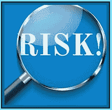

# 重复销售的风险

> 原文:[https://www . social engering . info/2022/01/risks-of-seing-repeally-done . html](https://www.socialengineering.info/2022/01/risks-of-seing-repeatedly-done.html)

## 屡战屡胜之险

在当今时代，社会工程对于攻击媒介的执行方式以及欺骗特定目标背后的意图有了全新的含义。例如，如果你点击谷歌搜索并导航到(搜索)互联网论坛/论坛或 Discord 服务器，超过 90%的讨论将与**在线购买产品有关，然后欺骗代表产生退款或发送替换项目，费用由他们承担**。在社会工程的说法中，这被称为**“公司操纵和剥削”**，这是有充分理由的。目标是**操纵**公司的代表和**利用**他们的漏洞——这完美地描述了上面引用的标题。

 

每一家公司的防御机制都可能被渗透，无论他们在哪个层面上运作，但为了做到这一点，最重要的是**使用战略方法，并且不引起任何怀疑**。这种方式是通过**选择一种完全适合问题产品**性质的“方法”，从而从一开始就支持攻击，并帮助确保它朝着正确的方向前进，最终以有利于客户的方式完成索赔。例如，如果您熟悉[部分方法](https://www.socialengineers.net/2020/09/the-partial-method.html)，您会知道选择比**【120 克】**小的**，因为它不会在大多数运输秤上被检测到。**

 

在联系销售代表/代理商，告诉他丢失的商品后，一项[调查](https://www.socialengineers.net/2020/04/company-investigation.html)开始了，以确定为什么您的订单部分被满足。鉴于**产品非常轻，绕过了每一个称重设备，没有任何证据拒绝索赔**，因此你的银行账户被贷记，而你保留了最初购买的物品。当不用支付一分钱就能获得商品时，这是非常令人兴奋的，因为该公司很少受到干扰，**人们很容易沉迷于一次又一次地退款** -这就是问题开始的时候，也就是当**“漫不经心地反复出售同一家公司”**。

 

如果**同一个承运人在为您的货物**提供服务，他们也可能会遇到问题- **特别是在使用** [DNA](https://www.socialengineers.net/2020/08/the-dna-method.html) **(未到达)方法**时，因为您责怪承运人未能交付您的包裹。作为所有事件的结果，许多后果是可以预料的——这可能会影响到您的个人层面,以及您的**在线帐户**,您的**居住地址**的地位，在极少数情况下，**法律诉讼**也可能生效。现在我并不是说这样的事件**会**发生，而是说它们很有可能**【可能发生】**——尤其是如果你忽视了对你的社会工程行为采取预防措施的话。

 

这就是我的切入点。你将从这篇文章中学到的是**当“同一家公司&承运人被卷入”**时，如何显著降低你的系统工程师引起怀疑的风险，从而使你能够以安全可靠的方式继续销售。你将要阅读的内容可能不适用于你当前的环境，但是**可以在任何时候被触发**，所以一定要从这一点开始吸收每一个单词。在下面的每个主题中，我还列出了最有可能因销售人员的行为而对公司和承运人产生的**“影响】，这将让您清楚地了解与风险相关的内容。好了，事不宜迟，我们开始吧。**

 

 

**重复销售同一公司:**

 

当你有一个或多个你擅长制定的最喜欢的方法，并且**它们已经和“同一家公司”对抗过无数次**，毫无疑问你会优先选择这些方法。毕竟，考虑到他们已经在这家公司取得了成功，继续利用每一个机会是完全有意义的。然而**“使用”**它们是一回事，而**“过度使用”**它们则完全是另一回事——因为这往往会导致**连续多次重复攻击同一家公司(同一客户)**，因此，这会给评估你索赔的销售代表敲响警钟。

 

例如，假设你在亚马逊(除了你还有谁)上用[错误的收货方法](https://www.socialengineers.net/2020/07/wrong-item-received-method.html) **在几周内成功退款 4 次，说收到的产品与最初购买的完全不同。现在我想让你用一分钟的时间逻辑地思考一下。亚马逊(或其他公司)在 4 周内出现 4 次单独提货&包装错误的几率有多大？**。我来为你解答- **“零”**。当然，你的要求显然每次都得到了批准，但这并不一定意味着你的销售活动不会被注意到- **公司可能会决定在晚些时候采取某种行动**，这就引出了我在下面的副主题中的下一点。

 

 

冲击 - 在线账号标记

 

当你从一个销售代表到另一个销售代表连续获胜时，**很容易忘乎所以，忘记每一个销售代表发生的准确时间**，虽然你可能会觉得你的退款已经全部解决，但在公司索赔部门的幕后，**“每一次沟通和索赔都有记录”**。基本上，如果销售代表/代理有理由调查您的账户，可能是因为(例如)发现您退回的相当多的错误商品不是他们库存的一部分，**他们不仅会检查这些事件，还会检查所有其他交易**。

 

他们通常寻找的是不寻常的消费模式，基本上是账户上任何不正常的活动，如在特定时间内**大量退款**。如果事件不太严重，并且 ***不保证立即关闭*** (在下一个子主题中有更多信息)，**“您的帐户将被标记”，这意味着它正被积极监控可疑行为**。鉴于每家公司在信息的格式和用词上各不相同，我不可能涵盖所有内容，所以我将提供一封由亚马逊生成的典型的 OFM 电子邮件**，如下:**

 

*【你好，】*

 **

*我们注意到您已经为大量订单要求退款。我们理解，在正常的业务过程中，订单偶尔会出现问题，但是您报告的订单问题数量异常之多，超出了这一例外。*

 **

*当我们注意到此类异常账户活动时，我们会逐个评估每个账户，以确定是否有必要采取额外措施或关闭账户。因此，我们无法再为您货件的额外问题进行补偿。如果这个问题持续，我们可能不再允许你在我们的网站上购买*。

 

*如果您认为您可能错误地收到了此邮件，或者如果您想澄清您的订单活动，请在 30 天内回复此电子邮件“*。

 

这是一条标准的自动信息，由亚马逊的账户专家团队发送(只是一群有着奇怪名字的办公室职员！)，以**警告你，你已经在问题账户**上申请了太多退款。注意我是如何用绿色突出显示一些单词的？这是因为它们实际上表示**账户仍然有效**。这里有一个解释:

 

我们不能再为追加问题 - **“追加问题”**表示该账户在未来仍可使用。

如果这个问题继续 - **“继续”**暗示同一账户的进一步购买。

 

 

冲击 - 在线账户关闭

 

如果你在相当长的一段时间里一直使用同一个账户定期进行每笔交易，你显然会尝试对每笔交易进行退款。这就是社会工程学的要点——获得绝对免费的商品，但是**你声称的越多，吸引客户服务代表**注意的机会就越大。如果你不改变你的做法，继续不负责任地销售一个又一个产品，**你的在线账户可能会在没有通知的情况下被关闭**。没错，**你不会被提前告知你的错误，**相反，你会在某天早上醒来查看你的电子邮件，收件箱里会有一封大意如此的邮件。

 

**

 **

忽略这些因素到底是什么的全部细节是我们无法做到的——我们无法像公开信息一样分享这些信息，这可能会导致对我们服务的更不公平的使用。如果你有任何其他问题，请提出来。

 **

*【彼得】*。

 

上面的信息非常模糊，除了说明**“异常回报”**之外，它没有说明为什么被关闭，但有一点是肯定的，**一旦一个账户被“永久关闭”，特别是被亚马逊关闭，那就结束了——(在很大程度上)它永远消失了**。然后你需要完成创建新账户的艰巨任务，改变与旧账户相关的每一个可识别的细节，希望多重账户不会被发现。这当然是一种不便，如果你花时间采取一些措施来最小化账户关闭的风险，这是可以很容易避免的。那你是怎么做到的呢？**以下是我的简短建议列表，这些建议将有助于确保该帐户的长久性**。

 

*   Use a mature account (at least 12 months)
*   Leave enough space between each se (6-7 weeks from one se to the next for safety reasons)
*   [self-evident]
*   Change the value of goods (hit low-value goods from time to time)
*   Don't use the same method many times in a row (you don't need to explain this)
*   Let Arthur rest for a period of time (stop for several months and repeat) T32

 

冲击 - 发出停止&发出停止通知

 

尽管这在社会工程领域并不常见，但熟知**“停止和终止”**通知也是至关重要的——即由于**其性质的严重性**。我的意思是。当一名销售人员过分要求同一个公司退款&更换产品时，公司**会发出一封 **"C & D"** (停止)信，要求社会工程师停止其活动**。基本上，它提醒他，他的行为违反了公司的合同和/或条款，并让他立即停止他正在做的事情。将 a **C & D** 视为终止退款请求的警告通知。

 

现在，事情开始变得严重了。如果卖方无视停止和终止，继续沿着同样的道路，如**在通知发出后继续退款，那么发出通知的公司可以采取法律行动**。在最坏的情况下，法律程序可能已经在进行中——这将在信中说明。正如你所看到的，后果是严重的，因此当你收到通知的时候，不要把它当成一个笑话，让**接管并损害你的判断- **马上结束你的社会工程！****

 ****

 ****

****同一承运人重复为您的货物服务:****

 ****

**如您所知，在连续多次寻求向一家公司退款时，**从一个 se 到下一个**应用许多预防措施是至关重要的，因此这将有助于防止引起怀疑，并允许每个 SE 以最小的复杂性流动。同样重要的是**“注意为您送货的承运商”**。许多用户倾向于只关注网上商店，许多人没有意识到当**“同一家运输公司将包裹运送到同一目的地”**时，也可能会经历严重的后果。**

 ****

**因此，它会对**【你自己】**和**【承运商司机】**产生个人层面的影响，因此你肯定会想尽一切办法避免它。在结束本指南之前，我已经在最后两个副主题中讨论过这些。此外，**“您的居住地址也可能受到影响”**，因此在他们有机会开始之前，必须找出原因，所以让我们先来看看当**您的** **居住地址被标记并列入黑名单**时会发生什么。**

 ****

 ****

**影响 - 住宅地址被标记/列入黑名单**

 ****

**事实是，这篇文章中描述的销售能力并不完全基于合法的理由，因此，**许多用户更喜欢匿名他们的包裹将被送到哪里****——一个共性是** [投递房屋](https://www.socialengineers.net/2020/09/using-drop-house.html)，这是一个空置的家，与社会工程师没有任何联系。然而，**很难找到每次送货的单独投递点** -特别是当频繁地从不同的零售商那里订购产品时，因此最好的选择是简单地**使用您自己的居住地址**。如果你通过相应地操纵它给人的印象是 SE 是一个合法的权利主张，那就没什么好担心的，但是同样的事情不能说**“当同一个携带者定期去你家的时候”**——也就是当使用 [DNA 方法](https://www.socialengineers.net/2020/08/the-dna-method.html)的时候。**

 ****

**你问，怎么会这样？嗯，类似于连续多次给同一家公司退款——**记录被存储，账户被置于显微镜下**导致账户被关闭，但和运营商的区别在于，一旦你的居住地址被运营商自己标记并列入黑名单，**“它(可能)适用于每一家使用同一家运营商送货的公司”**。对于*示例*，如果**“DHL”**将您的地址列入黑名单(由于声称您没有收到一系列包裹)，并且它与亚马逊、John Lewis 和 Zalando 合作，那么**这些公司通过“DHL”向您的地址发送的货物可能会被拒绝**。明白了吗？很好！所以一定要明智地使用 [DNA 方法](https://www.socialengineers.net/2020/08/the-dna-method.html) - **不要过度使用同一种载体**。**

 ****

 ****

**冲击 - 承运司机联系你**

 ****

**在开始之前，请注意这仅与 [DNA 方法](https://www.socialengineers.net/2020/08/the-dna-method.html)有关，当你说包裹(司机确实送来了)没有被你或你的任何家庭成员收到时。**因为承运商司机很清楚他们已经很好地完成了他们的工作，通过在正确的地址放下他们的货物，当人们不这样说时，他们往往会生气**。如果你的行为随着 [DNA](https://www.socialengineers.net/2020/08/the-dna-method.html) 重复出现，许多司机会自己处理问题**去拜访这些人的家**，或者通过电话与**取得联系。不管是哪种情况，司机都会问一些关于送货的问题，以及为什么你说没有收到。有时，他甚至会要求签署一份文件，以洗清自己的过错。****

 ****

**鉴于你没有故意针对他，这是他的个人选择，**你需要保护自己免受他苛刻态度的影响，不要让他在情绪上影响你**。有时候，他会不惜一切代价与你联系，如果这意味着打 20 多个电话或不断拜访你的家，直到有人应门，他每天都会这样做。有些乘客觉得他们必须通过与司机交谈并遵从他的要求来解释自己，但事实并非如此。**他是“送货员”，不是警察，因此他没有权利进入你的私人领地审问你**(可以这么说)，所以不要开门或接电话。**

 ****

 ****

**冲击 - 运兵车司机失业**

 ****

**从社会工程学的角度来看，向每年盈利数百万/数十亿美元的公司退款，不会造成财务损失，但如果**“你的销售导致承运商司机失业”**，情况就完全不同了。不应该以你的社会经济地位为代价解雇任何人——他们也有账单要付，有张嘴要养活，所以**以不影响司机职业的方式进行社会工程是至关重要的**。为了做到这一点，你需要确保你的销售事务保持在你自己的环境范围内，不要与承运人的司机和他的货物发生任何关系。**

 ****

**虽然你无法控制公司如何处理你的索赔，但你可以做的一件事是**显著降低司机潜在发现自己在失业名单上的风险**，如下所示。如果你经常持续唱歌，而且是同一个司机送你的包裹，那么**不要每次都使用** [DNA 方法](https://www.socialengineers.net/2020/08/the-dna-method.html)**。当**同一个承运人司机参与**时，过多的未收到货物的索赔可能会导致其老板的某种谴责/惩罚——可能会发出正式警告或**因未能履行其作为送货司机的职责而被解雇**。这个信息是响亮而清晰的- **做一个负责任的人**，尊重司机**“他是谁”**，而不是他以什么为生**。******

 ********

 ********

******总之:******

 ********

****这篇文章的目的是让你很好地了解**以不小心的方式**重复出售，可能对你**个人**产生影响的方式和原因，包括**影响你的在线账户**的地位，以及你的**居住地址被列入黑名单**的可能性。此外，正如您刚刚阅读的内容，您已经了解到**您的行为也可能会危及运营商司机的工作** -您现在知道如何在未来的 se 中防止这种情况发生。总之，你已经获得了社会工程师的技能和知识，这将有助于确保每一次 SE 的积极成果。****