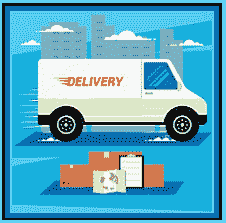

# 对运营商有什么期望

> 原文:[https://www . social engineering . info/2020/12/what-to-expect-with-carriers-done . html](https://www.socialengineering.info/2020/12/what-to-expect-with-carriers-done.html)

## **对运营商的期望以及如何保护自己的 SE。**

让我们面对现实吧，我们没有生活在一个完美的世界里，也永远不会。在执行某项任务时， ***总有“至少一个障碍”需要被克服和解决，然后事情才能开始向前推进*** ，这当然也适用于社会工程。不管你面对的是谁，不管是你的医生在你开始没有生病的时候为你开具一份病假证明，还是通过操纵 Zalando 和 John Lewis 的代表为他们发放退款和更换物品来打击他们的在线公司- ***你的攻击向量永远不会 100%按照计划进行*** 。为了最大化成功的机会，最重要的是你要考虑与你的目标相关的**“一切”，然后分析每一个细节，并将其应用到你的 se 中。注意我是如何使用**“一切”**作为关键词的？这是有很好的理由的，你会在下一段看到原因。**

 ****

**如果你还没有猜到，我指的是**“公司操纵和剥削”**如果你是一个活跃的销售社区的一员，你会确切地知道我在说什么，以及让你的索赔获得批准所涉及的复杂性。在选择想要退款或更换的物品时， ***主要关注公司和物品*** 似乎是正常的程序。例如，我在某个特定的论坛上看到过很多寻求帮助的帖子:**“我要用苹果 AirPods 唱 Argos，最好的方法是什么？”**。虽然这绝对没有错，但还有一个非常重要的实体，超过 70%的社会工程师没有将它作为方法准备和攻击媒介的一部分，那就是 ***“用于服务公司交付的承运商”*** 。**

 ****

**对承运人及其递送包裹的程序有充分的了解，与熟悉他们签约服务的公司一样重要(如果不是更重要的话)。然而，直到今天，我仍然不明白为什么大多数人完全无视它，然后他们想知道为什么他们的 SE 过早地结束了。这就是促使我写这篇文章的原因——为您提供一份详尽的 ***“对运营商有什么期望，即它们的参与，它们如何影响&使您的 SE 复杂化，以及您可以做些什么来操纵它们”*** 。在我深入讨论这些之前，请允许我简要解释一下为什么在执行 SE 时将运营商公司纳入考虑范围至关重要。你可能没有意识到，但是 ***根据使用的方法，*** 你实际上是在同一个会话中**【执行两个 SEs】**，你的声明只会对你有利 ***“当两个都成功 SEd”***。**

 ****

**例如，如果您使用的方法在某种程度上涉及到运营商司机，那么您将始终首先看到的是 ***【运营商】*** ，然后是 ***【公司】*** 。这样的方法有***【DNA】***(未到达)、 ***【拳击】*** 、有瑕疵(且无用) *FTID 法*和 ***遗失物品法*** (仅在声称物品在运输途中被盗时)。尽管您最初是向公司本身下订单，但**“您的实际 SE”**与这些方法中的每一种都相反——**“承运商优先”****“公司最后”**。让我们看看在使用 DNA 方法时它是如何工作的。你已经决定通过使用*DNA 方法在亚马逊上为 GHD 专业直发器做社会工程，所以你已经下了订单，等待发货。司机如期而至 ***你的意图就是简单的用假签名*** 签收包裹，然后联系公司说你没收到。***

 ******

***然而，当司机向你走来时， ***他友好地要求打开你的前门，把包裹放在你家的入口通道上，给包裹拍张照片***——这将用于验证快递是否到达了正确的地址。你能看到刚刚发生了什么吗？没错，这是**“在进入公司之前，您需要首先销售的运营商”**！如果你允许他继续拍摄你的房产**“原始状态”**，这将对你的索赔产生重大的负面影响，以至于 ***很难证明照片*** 中不是你的家。只有当你使用了照片认证，你才能继续销售公司。我已经在上面引用了**“在它的原始状态”，这是有很好的理由的，意思是在下一个主题中， ***我将向你展示如何渲染载体照片非决定性的*** 。因此，不要再拖延了，让我们从对运营商的普遍预期开始吧。因为这篇文章的性质，它非常详细，所以给自己泡几杯咖啡，开始阅读。*****

 **********

*******司机拍照:*******

 **********

*****在验证包裹是否成功送达正确目的地方面，有许多方法可以做到。一些承运商实际上通过拍摄物业入口通道的照片来标记他们的交付已经完成**。在撰写本文时，为亚马逊和 ASOS 提供服务的**、【DPD】、**通过**、*请求家庭成员允许将包裹放在门口，然后对其(及其周围环境)进行拍照，并使用照片作为送货证明*、**。其他运营商也使用类似的程序，所以你需要通过研究你要销售的产品来充分了解它，一旦你确定了它，在司机到达** 之前，你需要做一点准备。那你怎么阻止他拍照呢？好吧，你没有，而是通过 ***使用一种非常聪明和精心设计的方法，“让他看起来好像没有踏上你的财产*** ”，下面是你如何做到这一点。*****

 **********

*****为此， ***您的包裹必须通过跟踪*** 发送，这样您就可以准确地看到包裹的位置和到达时间。记住:**“你给人的印象是司机从来没来过你家”**。大约在他预计到来的 15-20 分钟前， ***重新布置你的入口*** ，移走所有的家具，用另一个房间的地毯、椅子、桌子等代替，并确保当前门打开时 ***一切都清晰可见*** 。你刚才做的是**“给人一种不是你家的样子**，所以当司机到来要求拍照时，允许他这样做。 ***当他离开的时候，按正常的*** 把你的家具放回去，然后第二天联系公司，说你还在等你的订单。如果他们决定去你家，将他们的照片与你家门口的当前(和原始)布局进行比较， ***“他们不会匹配】*** ，因此没有证据表明你的包裹到达了正确的地址！期待 SE 对你有利。*****

 **********

*******对 OTP 的请求:*******

 **********

*****如果你恰好是社会工程的一个高价值物品，有些公司要求 ***一个“OTP”(一次性密码)来验证发货*** 。这意味着，动态口令将发送到您的手机号码或注册的电子邮件地址 ***，当承运商司机到达时，“您必须告诉他接受您的包裹的密码”*** 。如果你不这样做，他完全有权利拒绝送货。现在我不能代表每一家公司，但我可以说的是，“亚马逊”往往会不时地使用这种形式的验证，在印度更大程度上是针对超过一定成本的商品。根据公司的不同，有些公司会在“您的商品发货后” 发送 OTP，因此，如果您打算通过使用假签名来使用 DNA 方法，您的 se 将在有机会开始之前结束！*****

 **********

*****许多用户继续问我如何阻止一次性密码的生成，但除了你做不到这一点之外，这根本不是问题所在。目的是 ***“让承运商司机把包裹交给你，而不需要读出你的密码”*** 。鉴于记录如何避开 OTP 的完整教程超出了本文的范围，我将提供几个与 ***接收您的“手机”和“电子邮件地址”*** 的一次性密码相关的示例。*****

 **********

*****手机生成的动态口令*****

 **********

*****你要做的第一件事，就是买一部非常便宜的二手手机，几乎不花什么钱 ***在司机到达*** 之前打碎玻璃。不过，不要做得太过分——只要足以表明它已经损坏，特别是 ***【非功能性】*** 。当邮递员来了，司机向你走来时，假装你正在看手机，准备读出密码，但相反，你脸上带着非常痛苦的表情“故意把它放下”，然后把你的手机放在他的视线范围内，“试图向他展示 OTP”。 ***这给人的印象是你没有试图隐藏什么*** 。然后通过对造成的不便深表歉意来赢得他的好感。*****

 **********

*****此外，在整个考验中， ***直呼他的名字*** (取自他的制服)——当你与他交流并不断说出他们的名字时，人们会感到感激。最后，告诉他包裹里有一个家用血压计，急需它来监测你母亲的血压。考虑到以上所有因素，如果你已经有效地执行了你的 SE，那么司机很有可能会直接把包交给你！如果他要求签名，你知道该怎么做- ***伪造*** 。*****

 **********

*****生成的动态口令发送到您的电子邮件地址*****

 **********

*****与将动态口令发送到您的手机不同， ***一些公司会将它发送到您的账户*** 上注册的电子邮件地址，其目的相同-在包裹可以交给您之前，它必须被转发给运营商司机。这个 SE 的意图是 ***操纵司机，让他认为你实际上没有收到密码，同时也给人一种印象，你正在尽最大努力从你要出售的公司那里得到密码*** 。因此，当司机到达并跳下他的货车时， ***假装你正在和一个代表通话，问他为什么没有发送动态口令，并重新发送一次*** ，并确保司机能清楚地听到你的通话结束。*****

 **********

*****考虑到承运商有一个固定的送货时间表和截止日期，他们通常不喜欢等待，因此你可以利用这一点。请记住 ***“你似乎在打电话”*** ，因此这显然不是一次真正的对话。好的，告诉销售代表/代理，您将查看您的电子邮件，并向司机传达同样的信息。如前所述， ***运营商不喜欢干等着，所以与其马上在你的手机上查看，不如进入你的家，假装你正在电脑上查看你的信息-*** 确保慢慢来。*****

 **********

*****大约几分钟后，出来告诉司机你的邮件没有通过，并真诚地为延误和 ***道歉，同时请代表再发一次*** 。如果需要，重复这个过程，最后， ***让司机放心*** 主动签收包裹，并出示你的身份证(驾照等)。别担心，承运人可能会看你的身份证明，但他们不会拍照片，所以这对他们来说没用！总而言之，基于以上所述， ***你很有可能在没有动态口令*** 的情况下拿到你的包裹。*****

 **********

*******司机上门或打电话:*******

 **********

*****在开始之前，请注意 ***仅与“DNA 方法”*** 有关，当说包裹(司机确实送来了)，你或你的任何家庭成员都没有收到。 ***因为承运人的司机很清楚他们已经把货物送到了正确的地址，从而很好地完成了自己的工作，所以当人们说不是这样的话时，他们往往会生气*** 。因此，他们会亲自去拜访这位社会工程师的家，或者有时会打电话联系他。无论是这种还是那种， ***承运人司机都会问你各种关于送货的问题，以及你为什么说没有收到*** 。如果你不开门或不接电话，他们会一直回来直到有人开门，接电话也是一样。*****

 **********

*****我亲身经历了整整一个星期，我的手机每天从同一个号码打来多达 10 次电话，在从一个匿名服务回拨后，你猜对了——电话的另一端是运营商。 ***有时他们会从一个私人/未知号码*** 打来电话，所以如果你接到大量类似的电话，请记住这一点。现在，我不是说承运人**会和你联系，而是他**可能会找你麻烦，因此，你需要为意外的拜访或电话做好准备。如果你一个人住，那就很明显了。他可以尽情浪费时间敲你的门和/或打你的电话——不要回复这两个 。如果是你父母的房子，简单地告诉他们 ***你买了一件东西，但“合法地”没有收到，并向他们出示收据/POP*** 。他们肯定会相信你而不是司机。*********

 **********

*******请求签名:*******

 **********

*****虽然这是显而易见的，但那些对人类黑客技术(包括使用 DNA 方法)不熟悉的人，将对司机 递送包裹时 ***会发生什么知之甚少。每个运输公司都有特定的协议要遵守，虽然有些司机不在乎，把包裹放在门口(我在下一个主题中已经提到过)，但最常见的验证递送的方式是从账户持有人或家庭成员那里获取签名。*作为一个你自己，你需要记住的是，仅仅因为你签了名，并不意味着*这个签名属于你或者任何占据你家的人。********

 ********

*******任何人，比如路人，都有可能在司机的手持设备上乱涂乱画，拿着你的包*** 走了。此外，大多数承运人都很匆忙，根据我自己的经验，我可以很自信地说 ***他们倾向于自己签收***——特别是当他们的剩余货物延误时。虽然这可能取决于司机是谁，以及他是否严格按章办事，但 ***“联邦快递”是一个代表收件人落笔的承运人*** 。考虑到所有这些，您可以清楚地看到，在验证托运时，签名几乎没有任何价值，因此很明显，当要求您签名时，您会怎么做- ***写下任何与您无关的内容*** 。****

 ********

******司机把包裹留在你家门口:******

 ********

****正如您刚刚在上面读到的，每个承运商在为客户提供服务时都有自己的指导方针，有些会要求提供一次性密码(OTP ),有些会要求在将包裹交给买家之前签名。我相信你听说过这样一句话:**“规则是用来打破的”**，许多司机肯定对此感到内疚，因为他们在日常运营中忽视了遵守他们的政策&程序和 ***【把包裹放在家门口】*** 。尽管这样做的好处显而易见，但我仍然会在我注册的 SEing 论坛上看到一些帖子，请求帮助，比如:**“嘿，我正在 Zalando 做 SE，DHL 甚至没有敲我的门，他们只是留下包裹就开车走了。我该用什么方法？”**。****

 ********

****老实说，我不明白为什么这样的问题要从- ***“方法”的答案只是一个常识问题*** ，不管你是否几周前才开始唱歌。逻辑地思考一下。 ***司机把包裹扔在你家前门，然后离开*** 。唯一可以确认(而不是断定)你的包裹到达了正确地址的是追踪细节，这是没有用的——即因为一个标记为<u>递送</u>的**包裹，并不意味着 **<u>“你亲自收到了它</u>** ”。那么基于这一切，你认为什么方法几乎可以保证奏效呢？正确，是**【DNA】**。他们基本上已经 DNA 化了自己(可以这么说！)，所以你现在知道类似情况下该怎么做了。******

 ********

******司机将包裹放在安全的地方:******

 ********

****回顾一下到目前为止所讨论的内容，有许多不同的方式来验证包裹的交付- ***签名*** ， ***一次性密码*** 和 ***在住宅入口处拍摄的照片*** 。这就是主要网上商店通常对*的期望，这些商店然后与他们的运输公司密切合作，通过使用以上选项中的任何一个来为所有送货服务" ***当你在家接受你的货物时"*** 。但是你知道吗，当你出门在外的时候，你仍然可以*把你的包裹送到目的地*——不需要司机在你的邮箱里留下一张电话卡，告诉你如何选择取货或送货方式。这就是所谓的*或其他变体，虽然它并不适用于所有公司，但那些提供这种服务的公司在使用 DNA 方法时“看起来”非常方便。******

 **********

*****我已经很有理由地引用了**【似乎】**(就在上面)，我将在下一段中介绍。顾名思义，这种递送方式的目的是让司机将您的包裹 ***【放在一个安全的地方】*** 留在您的住所或邻居处。让你的邻居参与你的销售活动不是一个好的做法，所以我不会讨论这个问题。现在，假设这是你的家，一般来说， ***一个安全的地方被定义为在你的财产范围内的一个安全的地方，保护它不受损坏，最重要的是，不受盗窃。*** 话虽如此，但因为包裹会被放在 ***【您的家外面】*** ，所以它仍然容易被盗——不管外部大门是否上锁等。如果一个小偷可以进入你锁着钥匙的房子，那么简单地跳过栅栏偷东西就容易多了，社会工程师利用这一点，通过 DNA 方法声称他们的包裹被偷了。*****

 ********

****然而，有一个重要的因素是很多顾客在使用这种送货方式时没有考虑到的。请允许我解释一下，把你自己称为社会工程师。 ***在大多数情况下，*** 如果是**【你自己】**指示公司/承运人将你的包裹放在你认为安全的地方，那么**【你是对货物损失负责的人】*，因此使用 DNA 方法将在那里终结你的 SE，然后*** 。另一方面，在有些情况下，公司和/或承运人会将车停在他们认为安全的地方，因此在这些情况下**“如果发生盗窃，他们将承担责任】**。因此，如果您计划将此选项与 DNA 方法一起使用，最重要的是*允许公司/运营商做出决定*。现在我不能代表每一个实体，这意味着有些人实际上认为自己有责任，不管上述情况如何(你可以通过研究他们的条款来检查)，但为了安全起见，让他们提出建议。****

 ********

******司机亲自检查货物:******

 ********

****你将要读到的内容不会经常发生，它主要取决于运输公司的条款、条件和协议，但我是那种会考虑所有角度、不留任何侥幸心理的人，因此让你注意到这一点至关重要。当使用 ***【故障商品法】销售某个特定的在线零售商，并声称您购买的商品不再可用*** 时，销售代表/代理将执行几个故障诊断步骤，您显然会说该商品仍然无法使用。当他认为你所声称的是真实和正确的，他会发出退款或更换，但 ***“只有当你的(看起来)有缺陷的商品被退回时”*** 。到目前为止，这根本不是问题-您可以使用**“装箱/盒子方法”**，添加干冰作为重量替代品，或者如果物品非常轻，称重时无法检测，只需自行发送盒子。****

 ********

*******目的是让包裹看起来好像在运输途中被篡改过，因此你的物品被盗*** 以公司对货物运输时的损失负责为由，你的索赔将在此后得到批准。这是一个完美的拳击世界，然而为了确保你的物品安全返回， ***一些承运人会指示你在密封和发送之前“让包裹打开，让司机检查里面的东西”*** 。您可以通过从家中领取包裹或者将包裹送到指定的收集点来完成这一请求。我可以自信地说**【DHL】**是少数几个(有时)这样做的承运商之一，因此，它实际上终结了装箱方式。但是正如你所知道的，**“销售就是操纵你的目标去做一件他们不应该做的事情**”，这就是你如何规避它。****

 ********

****不要试图阻止司机检查你的包裹(这可能是一项非常困难的任务)，你可以使用另一种方法，专注于 ***“你无法满足承运人要求的原因”*** 。换句话说， ***你将操纵销售代表/代理人，让他们解释为什么司机到达时你不在*** 身边，因此你无法遵从他们安排你返回的方式。因此， ***的目的是让他们相信你非常乐意使用另一家承运商*** 并让他们放心，你会立即向他们提供跟踪详情。然后，您可以对提货时不检查包裹的承运人使用装箱方法！这里有几个原因，你可以用它来说明你不能为运营商司机服务。****

*****   On-call work*   Travel for several months*   sold your house and in the process of moving*   A jury is called for a criminal trial and will appear in court indefinitely****

 ********

******总之:******

 ********

****嗯，这篇文章的阅读时间比我预期的要长得多，也就是说，因为我必须记录**“与携带者打交道时会发生什么”**和更有价值的**“如何操纵他们，以及他们存在的环境”。**尽管这份完整的指南毫无疑问是一份常见事件的详尽清单，但我故意忽略了一些片段——不可能满足所有事件的需求。 ***一定要记住，一切都与“DNA 方法”*** 有关，即使每个话题都不适用于你当时正在进行的 SE，但至少其中一个会在未来的某个时候产生影响，所以一定要考虑到每个细节——你永远不知道*你什么时候会需要它。*****