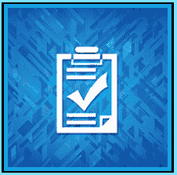

# 销售清单

> 原文:[https://www . social engering . info/2021/07/seing-check list-done . html](https://www.socialengineering.info/2021/07/seing-checklist-done.html)

## **执行的每个 SE 的社会工程检查表。**

每当你计划对一家公司进行社会工程改造时，无论是只有少数员工处理一些订单的小企业，还是规模非常大的网上商店，比如(显然)亚马逊、Argos 和罗技，**你都需要在考虑执行攻击向量之前，准确地知道你在对付什么** **。**不可能进行我所说的**“盲目的自我评估”**，也就是说**你对公司如何运作知之甚少甚至一无所知**，然后期望事情顺利进行——你的自我评估很可能会过早结束。当然，这是基于**你从未接触过有问题的公司**，以及**在评估索赔时严格按章办事**的代表。

 

以上所述，只是 SE 经常失败的一个例子——当不仅要**准备好您的 SE 以应对攻击，还要确保它朝着积极的方向流动**,直到它最终对您有利——退款到您的帐户，或者免费派送替换物品时，需要考虑的事情还很多。请允许我为您简化如下。假设您第一次在一件**重约 900 克**的产品上使用[缺失项目方法](https://www.socialengineers.net/2020/09/the-missing-item-method-done.html)，并且您选择了 [John Lewis](https://www.johnlewis.com/) 作为目标，其中**您在**之前从未使用过。在您制定好计划后，您联系了他们的一名代表/代理，并告诉他**在打开由他们的承运商合作伙伴交付的包裹时，您的物品丢失了**。

 

在幕后，该公司通过联系为您送货的承运商展开了外部[调查，并**交叉检查了他们仓库记录的重量**。他们的调查结论是**“包裹没有轻 900 克”，所以你的物品没有丢失**。此外，还进行了内部调查，他们的**闭路电视镜头**显示，您的产品实际上**被正确地挑选、包装和发送**。因为你做了一个**【瞎 SE】**没有费心去研究公司，你完全不知道他们的仓库活动是**用闭路电视摄像头**监控的。此外，你对如何使用缺失项目法一无所知，即**货物“低于 120 克”**。这些事件/属性中的每一个都是导致您失败的 se 的原因。](https://www.socialengineers.net/2020/04/company-investigation.html)

 

如你所见，最重要的是充分了解**公司在**的运营情况，包括**你计划进行社交策划的**项目的性质，以及选择一种**兼容且合适的方法**——所有这些都携手合作，极大地有助于确保你的 SE 尽可能平稳运行，最大限度地减少中断。为了做到这一点，必须制定一个策略，让你能够**收集、分析和准备与你的 SE **所涉及的一切相关的信息**，然后“攻击你的攻击媒介”**。这就是我的切入点，我提供了一个**“清单”**，详细列出了每个 SE 在离开您的本地环境之前必须具备的最重要的要素。

 

简而言之，在对照**【公司】****【承运人】****【项目】****【方法】**制定您的 se 时，您将使用清单作为**【信息收集&准备工具】**——它们以完全相同的顺序运行，而**将用于将您的整个 SE 放在一起**。结果是，你将处于一个完美的位置来执行你的攻击，并处理此后出现在你面前的每一个障碍。我还在本文末尾添加了几个**“客户清单”**，原因是**它在给定 SE 的每个方面都起着不可或缺的作用**，所以当你看到它时，请确保理解你读到的每个单词。好了，不再拖延，让我们从**公司**开始切入正题。

 

**公司检查表:**

 

每个系统工程师必须做的第一件事，就是检查公司结构的一些细节——因为这将让你很好地理解将使用的**类型的方法，从而让你**有效地基于你正在寻找的**社会工程师项目的性质。鉴于每家公司在某种程度上都有所不同，没有哪两家是完全相同的，了解它们的政策和程序是非常必要的，所以确保**在标记清单**时总是从该公司开始，在任何情况下都不要跳过。你将要读到的并不是一份详尽的清单，而是**“只关注要点”**帮助你进入清单的下一阶段。**

 

*   Navigate to their terms and conditions
*   Determine their replacement policy
*   Determine their refund policy
*   How long is their manufacturer's warranty? Do they offer advanced replacement services?
*   Do they keep accounts when the items are not returned?
*   Determine who is responsible for the loss of goods in transit
*   Check which carriers are responsible for all deliveries
*   Check whether their warehouse has used CCTV cameras
*   Check how to contact the company (phone, email, live chat)
*   Do they respond to the PayPal dispute/claim?

 

**承运人清单:**

 

既然你已经完成了与该公司的合作，并且你已经记下了他们的承运商合作伙伴，下一步就是通过承运商本身- **也就是将为你目前正在准备的 SE**递送包裹的承运商。如果你不能完全确定是谁，也不能在网上找到任何信息，就像你是一个关心的客户一样与该公司联系，以确保包裹将安全到达你的家，**，然后简单地询问哪家承运公司将为你送货**。与销售代表交谈时，不需要提供跟踪和/或订单号等信息——你只是在问一个关于**(看似)**未来合法购买的问题，因此你会毫不犹豫地得到详细信息。

 

*   Navigate to its terms and conditions
*   Does the carrier transport dangerous goods?
*   Check whether to accept the responsibility of goods lost during shipment
*   When no one is at home, does the driver put the package in a safe place?
*   Is it up to the carrier/driver to put the package in a safe place?
*   Check whether they provide non-tracking service
*   Do you need one-time password (OTP) to verify delivery?
*   Was the photo of the parcel taken in the factory?
*   Do you accept the signature for each shipment?

 

**物品清单:**

 

你现在已经到了可以**根据你的发现选择你的物品的阶段——根据公司和他们的承运商**的评估结果，承运商将把包裹送到你的家、投递地址或你选择的任何其他收货地点。正如您在下面的清单中所看到的，每个方面的关注点都是**“物品的性质”**——在最终决定最合适的物品之前，确定这一点至关重要。例如，如果你使用了[缺失物品方法](https://www.socialengineers.net/2020/09/the-missing-item-method-done.html)，**，你会知道它** **很大程度上依赖于“产品重量”**来给它最大的成功机会，因此必须相应地挑选物品。当你完成下面的清单后，可以根据后面的题目选择一个合适的方法。

 

*   Identify articles (net weight)
*   Identify transportation (gross weight)
*   Check the full size of the product
*   Write down the value of the item
*   Is it in a box or something else?
*   If it is a box, can you view the items from the outside without opening the box? (using [sealed box method](https://www.socialengineers.net/2020/05/the-sealed-box-method.html) )
*   If it is a box, check whether it is sealed, wrapped in transparent film, or both (according to the above method)
*   If it is a technology product, write down the serial number and/or IMEI
*   If it is a technology product, does it contain batteries? (For [Leaky battery method](https://www.socialengineers.net/2020/06/leaking-battery-method.html) )
*   Check whether the goods can be returned (some companies do not accept the return of some products)
*   Is this item partially or completely made of glass? (applicable to [broken glass method](https://www.socialengineers.net/2020/03/broken-glass-method.html) )

 

**方法检查表:**

 

下面是到目前为止你根据清单所做的事情的回顾。首先，你已经了解了**公司的政策以及他们在**的整体运营情况，然后**检查了他们将为你的送货**提供服务的承运人，根据&公司承运人的结果，你**做出了明智的决定，选择了最合适的物品**。到目前为止，一切都很好，但是从现在开始发生的事情，将决定您的 SE 是否会完美地执行，或者在您的攻击向量启动后不久就结束。如果你忽略了你计划使用的方法的细节，从而**它不是针对公司、承运人和项目**的有效和适当的制定，不要浪费你的时间去销售。**“方法是你 SE 的支柱”**，所以你需要对你的清单极其小心。

 

*   Look at the names of all traditional methods
*   Separate those methods that apply to your se
*   thoroughly study each method and evaluate its advantages and disadvantages
*   Choose the most favorable and efficient method
*   Pay attention to any negative effects that this method may have on your SE
*   Company, carrier and products you want to sell
*   The goal of being fully familiar with the method
*   Make your method according to the company, carrier and product
*   Check whether there is any inconsistency during the final determination
*   Cross-check when it is finished.

 

**网上账户清单:**

 

你的在线账户的**地位与你迄今为止执行的每一个检查清单同等重要，因此为了帮助防止引起怀疑，**你必须以战略和有计划的方式打击每一个 SE**。例如，如果你在很短的时间内连续无数次出售同一家公司的同一账户，**你的账户很有可能会被锁定** - **，很有可能是永久锁定**。当然，您可以通过更改每个可识别的细节来简单地创建另一个，但是如果您有待定的事务，那么这很容易说明问题。正如那句老话所说的那样:“预防胜于治疗”，所以每次都要聪明一点，不要让“贪婪”损害你的判断。以下清单可防止账户关闭，并显著降低您销售活动的风险。**

 

*   Write down the due date of the account (the old account is less concerned than the new account)
*   Do you have a log of every SE execution?
*   How many legal purchases are there in the account?
*   How many SEs are executed on the account?
*   What was the last date of your SE?
*   What method was used for the last SE?
*   Do you allow enough clearance between one SE and the next SE?
*   Did you mix in low & high-value items when selling?
*   How many refunds have you claimed? (that is, when the company locks the account)
*   If a new account is created, is every identifiable detail changed?

 

**支付系统账户清单:**

 

这是最终的清单，虽然不是详尽的清单，但最重要的是**了解你的支付系统的工作方式**，以及当你的系统工程师失败时，你如何利用它。例如，如果你已经从事社会工程工作几个月/几年，你会知道**系统工程师在最好的情况下也会失败**，不管你如何有效地操纵销售代表/代理，他都不会改变拒绝你退款申请的决定。这时，你将把你的支付系统付诸行动，通过**使用他们的买家保护(或其他一些变体)** **来撤销账户**上的交易。支付系统非常复杂和详细，但从销售的角度来看，你需要知道的只是一些最终用于偿还你的资金的条件。

 

*   Navigate to the terms & conditions of your payment system
*   If it is PayPal, be familiar with their **unauthorized transaction** policy
*   If it's PayPal, read through their **Indian Rupee** (goods not received) clause
*   As mentioned above, check how their **snad** (obviously not in conformity with the description) clause [T21 check **refund** is implemented
*   If you are a British resident, you can use **Section 75** claim to get your money back, so please look into
*   Do you have **VCC** (virtual credit card) that can be used with [Advanced Replacement](https://www.socialengineers.net/2021/05/advanced-replacement.html) ?
*   Check the claim time limit of each payment system

 

**总之:**

 

现在你已经读到了这篇文章的结尾，鉴于它有些冗长，你可能会想，按照每个主题列出的每一个清单来看太麻烦了，但是我可以向你保证，没有什么比这更不真实的了。例如，**如果你和某家公司谈过几次，你可能已经知道他们的退款更换政策，包括他们使用的承运商以及他们的保修条款**，这样一来，你的清单就减少了一半。这同样适用于大多数其他主题。此外，**有些清单与你的系统工程师**不相关，因此你可以立即把它划掉，而无需进一步调查。总而言之，您现在有了一个可以很好地工作的平台，并且真正地为您的 SE 做好了应对攻击媒介的准备，因此请确保将每个清单用作您的**“信息收集和准备工具】**。