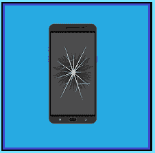

# 处理故障项目的方法

> 原文:[https://www . social engering . info/2021/04/disposed-faulty-item-method . html](https://www.socialengineering.info/2021/04/disposed-faulty-item-method.html)

## **避免将物品寄回公司。**

鉴于你迄今为止已经从事社会工程多年，你应该很清楚 ***有效操纵你的目标*** 所涉及的复杂性，以及完成工作需要采取的措施。除非销售代表/代理是脑残，当场批准您的索赔，几乎不问任何问题， ***否则不可避免地会有许多障碍必须绕过*** 才能最终实现您的目标——您的帐户将获得所购商品的全部费用，或者在没有寄回原商品的情况下派送替换品。事实是，当你的要求被代表评估时， ***在做出决定之前，你很难甚至无法控制他将采取的步骤*** ，但你肯定可以“在 SE 启动之前”帮助最大限度地减少引起怀疑**。**

 

要做到这一点，最重要的是**“用适当的方法支持您的产品和攻击媒介”**在销售工程师离开您的本地环境之前，因为一旦销售工程师离开，并且在客户服务代表手中，就很难(有时甚至不可能)改变您的攻击计划。简单地说，实现**“项目&方法兼容性”**是最重要的。也就是说，在大多数情况下,**“方法”**必须适合物品的性质(重量&大小)——你不能选择想到的第一个。例如，如果您订购了一台重约 2 千克的游戏笔记本电脑，并使用了 ***缺失项目方法*** ，那么您的 SE 在索赔的早期阶段可能会失败。

 

你为什么这么问？嗯，如果开始调查，并且公司交叉检查了承运人仓库记录的重量，他们会确定**“不是轻了 2 公斤”**，因此您的笔记本电脑被正确地挑选、包装和发送。哦，我提到过所有这些都与**“公司操纵和剥削”有关吗**。如果你是一个中级或高级色觉者，毫无疑问你已经解决了。如果没有，而且你最近刚刚开始社交工程或者想进入这个领域，我建议你先读一下我的教程《歌唱入门指南》，然后从你离开的地方继续。现在，为了精通项目&方法兼容性，掌握**“每一个 SEing 方法”**的知识是至关重要的——即使是那些很少使用的方法，这也是本文的目的。

 

我给你介绍一下**【处理不良物品法】**，虽然它的成功率比不上 [DNA](https://www.socialengineers.net/2020/08/the-dna-method.html) (未到货)[密封盒法](https://www.socialengineers.net/2020/05/the-sealed-box-method.html)之类的，但也绝不可一概而论。SEing 在最好的情况下也是不可预测的，因此*必须清楚地了解所有方法是如何构造的，*处理故障项的方法也不例外。如果你不确定什么是方法，为什么它们是每个社会工程攻击载体的组成部分， ***使用这个博客上的搜索功能***——你会找到很多信息来回答你的问题和担忧。好了，不再拖延，让我们开始吧。

 

**处置故障物品的方法是什么？**

 

你是否曾在网上或当地商场购买过直发器或电动剃须刀等物品，但当你回到家并给产品插上 ***插头时，它却无法正常工作？*** 至少在一个场合，我会说你的答案是**【是的】**。尽管商品在运送给供应商之前已经过制造商的检查和测试，但它们并不总是处于完美的状态。**这时，你要将**“处理不合格产品的方法”**付诸行动，告诉代表/代理，你是由于 ***“健康&安全原因”*** 而将其丢弃的。**

 

我已经在下一个主题中详细解释了它是如何实现的。在使用该方法之前，您必须首先 ***确认您的物品在公司的退款&更换政策*** 范围内。例如，一些零售商在收到货物后的 35 天内(或从发票日期起)提供换货或全额退款，所以 ***查看他们网站的条款，确认你的产品在*** 范围内。现在，一些用户缺少现金，他们不购买物品，而是使用[序列号方法](https://www.socialengineers.net/2020/12/locating-item-serial-numbers.html)来执行攻击，而其他人则用他们的信用卡订购，然后出售。两者的执行方式大同小异，因此在整个教程中，我将提到*“提前购买物品”*，所以让我们按照下面的主题来检查一下。

 

**有效使用处置故障物品的方法:**

 

在我开始之前，这种方法的目的是操纵销售代表“不退回您的商品进行退款/更换”，所以每次您需要与未来的销售工程师沟通时，请记住这一点。好了，下面是有效应用的方法。我们会说你买了一个电动牙刷，在联系公司后，你告诉销售代表它从一开始就不能正常工作。在这种情况下， ***他们的例行程序是通过几个故障诊断步骤*** 来尝试纠正问题，当他们认为这是制造商的缺陷时，**“他们会要求您退货”**，您的帐户将被记入购买价格的全部费用，或者免费运送的替换品。

 

现在到了故障排除阶段，告诉销售代表**“您的物品在您最小的儿子使用时爆炸”**，作为一名非常苦恼的家长，您立即以**“健康&安全问题”**为由处理掉了它。为了巩固你的自信，也要提到故障产品的影响， ***在你儿子的脸颊上留下了一个小伤口*** ，你很感激他没有受到进一步的伤害。或者，你可以使用一种同样有效的方法，这种方法与一系列具有某种电气和/或机械操作功能的产品兼容，比如说**“它着火了”**和上面的例子一样，你的儿子(或任何家庭成员) ***只受到轻微烧伤*** 。

 

将**“人身伤害”**作为等式的一部分非常重要，因为公司和制造商都非常清楚，总是有可能提起诉讼，要求对疼痛和痛苦进行赔偿。因此， ***公司非常重视“健康&安全*** ，而消费者并不知道，他们有适当的措施来处理每一个事件，因此 ***他们必须遵守适用的法规*** 。话虽如此，一些销售代表要么没有脑细胞，要么懒得按照他们的指导方针做工作，因此尽可能地让你的索赔变得困难。但是成功的关键，是对以上所有这些保持**【坚定不移】****【持之以恒】**。因此，由于(似乎)发生的事件， ***该物品的处置是完全正当的*** ，退款或更换应该正在进行中。

 

**物品适用于处理有故障物品的方法:**

 

尽管**陈述的是绝对明显的**，但由于这样或那样的原因，一些用户往往最初忽略了处理故障项目的方法只能用于 ***“具有某种类型功能的产品”*** 。我不是那种喜欢告诉我的读者 ***使用常识*** 的社会工程师，但我觉得有时需要提醒他们 ***使用一些主动性一点也不难——即在分析/执行最简单的任务*** 时。不管怎样，我相信你已经明白了，所以我就说到这里。为了帮助你做出明智的决定，我在下面列出了几个与这个方法兼容的项目。

 

*   Speaker (for example, Bose Home Speaker 300)
*   Headphones (for example, Bose is quiet and comfortable)
*   Nintendo Switch console
*   SSD (solid state hard disk)
*   Computer monitor
*   electric toothbrush
*   Computer (notebook computer)
*   Electric shaver
*   苹果 AirPods
*   mobile phone

绝不是以上一份详尽的清单- ***还有数百种其他商品可供选择，但我还是亲自挑选了那些最典型的 此外，他们有一个很好的成功率与处理有问题的项目的方法，因此 ***你可以使用它作为一个通用指南时，选择项目在一个类似的类别*** 。***

**总之:**

既然你已经读到了这篇文章的结尾，我毫不怀疑你已经熟悉了**“处理故障物品的方法”的每一个方面我想重申将 ***【健康&安全】贯彻到每一个 SE 方法中的要点，以及(在可能的情况下)由于项目的缺陷而遭受某种类型的“人身伤害”。但是，不要过度！仅适用于证明该公司的产品是伤害本身的直接原因。*****