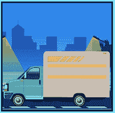

# 什么确认交货

> 原文:[https://www . social engineering . info/2021/01/what-confirms-delivery-done . html](https://www.socialengineering.info/2021/01/what-confirms-delivery-done.html)

## **什么确认包裹最终送达。**

当访问 ASOS、罗技、Argos、Zalando、John Lewis 等在线商店，当然还有名为亚马逊的最大电子商务公司时，从社会工程的角度来看，它们都有一个共同点，那就是 ***通过承运人发送&接收包裹，承运人在你的 SE*** 时间提供送货服务。目的是欺骗他们的代表将(购买的)物品的费用记入您的账户，或者免费发送替换物品。为了做到这一点，第一步是 ***根据你的调查结果制定你的方法，并(在适用的情况下)根据你打算销售的物品的性质应用它*** 。这是完美地执行你的攻击向量的垫脚石，也有助于保持它始终在一个一致的水平，直到它最终对你有利-退款或更换。

 

**【公司操纵与剥削的艺术】**中运用的传统手法很多，比如 ***错收、*** ***漏收/偏收、 ***【密封箱】******装箱*** 等等。尽管各种形状和大小的用户都非常熟悉它们的用法和应用，但有一种名为**【DNA】**的特殊方法，它是 ***【未到达】*** 的缩写，这让许多社会工程师感到困惑，即**【什么视为包裹已送达】**他们的住宅或其他地方。我将以一种非常简单的方式来讨论这个问题，因此当你读完每个主题时，你会清楚地理解什么才是真正定义**“一个标记为已交付的包裹”**。与本博客上的大多数指南不同，本教程要简短得多，而且直截了当，但是 ***鉴于本教程仅与“DNA 方法”相关，*** 我想让你确切地知道它需要什么，所以让我们直入主题吧。***

 

**什么是 DNA 法？**

 

如你所知，**【DNA】**是**【未到达】**的缩写，社会工程师用它(顾名思义)来表示他们一直等待送到他们家(或投递地址)的包裹没有到达。也就是说， ***他们从网上零售商/商店购买了一些东西，但是承运人没有将它送到他们的住所*** 。显然，这位先生确实收到了，但他另有所指。关于 DNA 最好的一点，是它的 ***【载体型】*** ，因而被认为是一种 ***【万能法】*** ***可以用在几乎任何“合理大小&***的物品上。换句话说，只要你不是在出售家庭住宅(可以这么说)，物品的大小和重量并不重要。 ***但你必须现实一点，选择可销售的商品*** ，而不是一件重量 50 公斤、高度超过 2 米的商品，因此排除这一点，任何商品都可以。

 

逻辑地思考一分钟。当在网上订购时，你的包裹到达你家的唯一途径是通过承运人服务，对吗？我很高兴你同意。本质上，不管你买了什么——无论是手机、游戏笔记本电脑、一双运动鞋还是折叠状态的办公椅， ***,都不会改变承运人会开车经过并放下你的包裹的事实——不管重量如何&尺寸*** 。然后你联系公司 ***【第二天】*** (你不应该知道它来了，所以等到第二天早上)，告诉代表你还在等你的送货。无论你做什么， ***【不要给出比要求更多的细节】*** 。你说得越多，他们就有越多的理由拒绝你的索赔！

 

由于这种方法的性质，很常见的是*“展开调查”，由此在 DNA 的情况下， ***公司将与为您送货的承运人联系，以交叉检查他们的货运文件*** 。他们将试图确定的是，你声称没有收到你的货物是否属实，如果属实，他们将试图找到你的包裹的下落。一般来说，他们在调查中所做的事情是核实收款人的签名，检查司机拍摄的账户持有人家中的照片，这些照片与每一种情况都有重大关系，**“检查 GPS &跟踪信息，以确认正确的送货地址”**。如果是对的，他们会尽一切努力结束你的索赔。从社会工程的角度来看，这是混乱的开始。很多用户不理解为什么**“跟踪不能作为发货确认”**，这就引出了我下面的话题。*

 **

***一个包裹被标注为已送达的真相:***

 **

*如果你已经在销售领域工作了几个月或几年，并且已经多次使用 DNA 方法来对付大公司，你就会知道这可能是一个漫长的过程，直到你的索赔以某种方式最终确定下来——成功或失败。发生后一种情况(失败)的主要原因是因为处理您索赔的代表/代理人用类似下面的话来证明他的决定: ***“跟踪显示您的包裹已送达正确的地址"*** ”，这毫无意义。你很快就会明白为什么会这样。该代表将始终坚持他所说的话，并将对交付状态保持坚定，这就是为什么知道跟踪没有效果是至关重要的-因为它无法确认交付**“到达了包裹所属的人”*。****

 **

*注意到我刚刚引用了**“到达那个人”**的话了吗？那是因为 ***【跟踪】*** 无法将包裹标记为已送达****人**。它只能得出结论，它已经成功地交付到地址“”——是你的家，一个投递点或任何其他居住地。结果，**“您没有亲自收到您的包裹”**，因此导致跟踪确认无效且不确定。为了让您更好地理解，我将提供一个简单的例子，您可以参考。假设你住在一个总共有 30 多个单元的公寓楼里。你正期待着来自雇主的邮件，其中包含一些非常重要的文件，因此， ***你的老板已经通过“挂号信/跟踪”发送了它——只是为了确保它到达正确的地址*** 。***

 ******

***邮递员来到你的大楼，在将邮件放入各自信箱的过程中，出于这样或那样的原因， ***他错误地将你的信封“放入了别人的邮箱”*** 。过了一天左右，你联系了你的老板，说你还在等待它的到来，所以他拿到了跟踪号码，并立即联系了邮政服务- ***“他确认你的邮件确实到达了正确的地址”*** 。就这样了。你能看到刚刚发生了什么吗？没错，**“跟踪显示你的信封寄到了正确的地址”**，然而**“收到的不是你”**，而是你楼里的另一个人。当使用 DNA 方法声称**“您”**没有收到您的包裹时，这种类比没有什么不同。但是，为了让销售代表/代理为您所用，您必须充分了解如何有效地使用 DNA 方法，因此我们接下来会讲到这一点。***

 ******

*****如何有效地使用 DNA 方法:*****

 ******

***为了让 DNA 方法发挥作用，有几个要素你必须付诸实施，特别是要认识到**“交付”**的包裹和**“亲自收到”**的包裹之间的区别。前者属于你的**“房子”**，后者属于**“你自己”**，如你所见，它们显然彼此大相径庭。当你的销售工程师正在处理销售代表在调查过程中向你提出的问题和其他垃圾问题时， ***至关重要的是，你始终坚持同一个故事，即“你仍然在等待你的包裹到达”*** 。代表将尝试通过跟踪来证明交付确认，但正如您所知， ***这仅表明“它已到达您的家”，而“不是您自己”*** 原因如下。***

 ******

***除非承运人司机给你拍一张照片(在你家门口)，照片上你拿着包裹，包裹跟踪 ID 清晰可见，背景上显示你的门牌号码， ***否则公司的调查无法确定“你亲自接受了你的货物”*** 。显然，没有你的允许，上述方式的照片不会被拍摄-如果司机在你的私人领地上，他不能给你拍照，因此*公司在评估你的索赔时将依赖于承运人的跟踪记录*，如你所知，这是徒劳的。为了确保你已经理解了你刚刚读过的所有内容，我将在下面的段落中最后一次总结一下。***

 ******

***单纯的追踪确认**【到达你家】**仅此而已，因此对你而言， ***【任何人】比如路人都有可能签收了你的包裹。而且，“承运司机”本来可以拿走的！*** 有无数种可能性，无论是哪种情况，事实是，包裹追踪标志着您的包裹只到达了正确的目的地，即**“您的家”**。在那一点之外(似乎)发生了什么，与你无关。总而言之，公司没有任何证据证明司机**“把包交给你”**。因此，在使用 DNA 方法时，请记住以上所有要点，如果代表/代理使用跟踪来验证交货， ***不断反复告诉他，您仍在等待您的货物到达，因此，“您没有亲自接受货物”*** 。***

 ******

*****完美的 DNA 材料:*****

 ******

***与大多数其他传统方法一样，DNA 确实有其优点&缺点，但作为一个 SE 'er yourself， ***你的工作是识别“优点”并努力找到漏洞，这将使你的 SE 获得最佳成功机会*** 。好吧，我已经用**“DNA 方法”**帮你做到了，一个特定的事件经常发生，而且几乎每次都对你有利。这是一个基于常识的非常简单的过程，然而由于一些奇怪的原因，许多社会工程师不明白如何利用它。我指的是这个。每个为 UPS、FedEx、DHL、DPD 等大型运输公司 ***工作的司机每天都有一个计划交付运行，每天可以交付 120-150 个包裹*** 。***

 ******

***因此，他们主要是在赶时间，确保每位顾客都能按时收到货物，所有包裹都能在下班前送达。然而，不可避免的是，由于不可预见的情况，事情并不总是按照计划进行， ***司机倾向于走一些捷径，其中之一是*** **【在家门口放下包裹】**然后立即离开，不要求签名或任何其他形式的交货确认。此外，司机也忘了拍下他放在那里的包裹的照片，所以 ***考虑到所有的事件，他们基本上已经确定了自己的 DNA！*** 公司只有跟踪验证，没有任何价值，因为签名和照片都不存在，*绝对没有任何迹象表明“你亲自接受了”* -任何人都可能在一夜之间从你家门口偷走它。这种方法的成功率超过 90%,所以当你遇到类似的 DNA 方法时，一定要记住这一点。***

 ******

*****总之:*****

 ******

***读完整篇文章后，你不仅应该熟悉如何有效地使用 DNA 方法，更重要的是，你应该清楚地知道 ***跟踪只确认*** **“包裹到达了正确的地址”****“没有到达正确的人”**。相信我，公司知道这可能会被用来对付他们，他们会尽一切力量告诉你不是这样，但不要屈服于他们的要求。 ***坚持并坚持“您没有亲自收到包裹”的事实*** -并一直坚持这一点，直到您的索赔最终确定为退款或更换商品。***

 ******