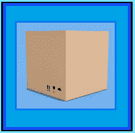

# 密封盒方法事件

> 原文：<https://www.socialengineering.info/2021/01/sealed-box-method-events.html>

## **使用密封盒法时会出现什么情况。**

关于通常被称为**“公司操纵和剥削”**的新型人类黑客，社会工程师利用他们的技能组合来欺骗代表，让他们的账户被贷记或免费发送替代物品，有相当多的传统方法用于完成这项工作。这种方法包括(但不限于)DNA*(未到达)、 ***漏项*** 、 ***错项接收*** 、 ***偏法*** 、 ***拳法***——所有这些方法都是初级、中级和高级水平的人主要使用的。它们受欢迎的原因是，它们都已经过广泛的在线零售商测试，如 Zalando、ASOS、John Lewis、Argos、亚马逊和许多其他公司，并被证明非常有效地确保了社会工程师的有利结果，退款、更换或两者兼而有之。*

 **

*但是，为了确保 SE 从开始到结束尽可能平稳运行，尽量减少中断，除了收到的 DNA &错误项目、 ***之外，其他所有方法都必须基于项目的性质*** 。例如，如果你计划通过使用**“遗漏项目法”**来阿瑟 Bose SoundLink 便携式蓝牙扬声器，其重量为 900 克*，那么它注定会失败——因为它会在托运时记录重量，因此公司调查将得出结论，它是正确发送和装运的。对于上述方法来说，它实在太重了，因此，你必须选择另一种非常适合该物品配置的方法。你刚刚读到的，叫做**“方法制定”**。换句话说，你通过 ***使用了一种经过计算的战略方法，确保“Item &方法在各方面都兼容*** ”，这反过来从头到尾支持你的攻击向量。**

 ****

**虽然有效地选择和制定方法至关重要，但同样重要的是 ***了解*** ***“当 SE 与其相关方法一起进行时会发生什么”***——这正是本文所要讲述的。请允许我用简单的语言来澄清它。作为销售人员，你知道当 ***组合你的方法*** 时你在做什么，对吗？你当然知道。 ***但是，当*** ***“代表/代理正在评估您对您的方法的主张”时，您是否意识到发生的一系列事件*** 。显然不是。我要说的是，你有能力和技能来完美地巩固你的方法&项，为你的攻击做好准备，但在执行的那一刻， ***“你对公司范围内发生的事情几乎没有控制力”*** 。**

 ****

*****很重要的一点是，要很好地了解销售代表*** 是如何处理你的方法的，这样你就可以用批判性思维来准备，万一他们向你提出各种问题和要求，你就能以明智的方式处理他们的要求。这就是我进来的地方。我将在本教程中重点介绍的方法名为**“密封箱方法”**，我将为您提供代表在处理您的索赔时执行的最常见程序，以及 ***一个看似有问题的特定事件，该事件将在您的 SE 完全确定后发生*** 。我已经在最后一个主题**“另一个客户将收到您的退货”**中介绍过了。在开始这篇文章的目标之前，我想让你了解一下密封盒方法需要什么，所以现在让我们来看看。**

 ****

****什么是封箱法？****

 ****

**顾名思义，这是当您 ***【貌似将您购买的物品】*** 放在公司的工厂密封箱中，然后要求退款时使用。注意到我是如何使用 ***【貌似退回你购买的物品】*** 作为关键词的吗？那是因为作为一名社会工程师，你不会做这种事情，而是将对你完全无用的东西寄回给你的账户。听起来不可能？恰恰相反——这是一个非常简单的过程，但是你需要将你的方法学得尽善尽美，以下是你的方法。 ***你买了一些装在工厂密封盒子里的东西*** ，当你收到它时，你会非常小心地打开它，不要损坏盒子/包装的封条或任何其他部分，然后 ***把你原来的东西拿出来，用你放在家里的“任何同等重量的东西”替换它*** 。之后， ***把所有东西都装回原来的状态*** (特别注意不要撕/破封条)寄回你要出售的公司。**

 ****

**当销售代表接受您的退货时，他会看到没有被篡改的迹象，并且 ***假设您已经将箱子以购买时的状态退回*** 因此，箱子将被放回库存，退款将会发出。为了做到这一点，不要有任何闪失， ***不打开盒子*** 就无法从外部看到你的物品，这一点至关重要。 ***也就是说，箱子的四面必须全部用硬纸板覆盖，并且没有透明薄膜*** 。为什么？很明显，当销售代表/代理收到你放在里面的无用物品的退货时， ***如果有透明胶片，他会立即注意到*** 当然，你的 se 会当场失败！除此之外，这种方法有很高的成功率，但前提是你系统地按照上面的例子重新包装盒子。**

 ****

****T2 事件: 盒子在返回时被扫描****

 ****

**除非你仍然认为你生活在 20 世纪 60 年代，在那个时代，几乎所有的加工、发送和接收都是手工记录的，没有计算机和基于互联网的技术，在今天的仓储&物流和货运配送， ***每一个大规模经营的主要零售商都使用“扫描系统”来记录和监控他们的库存流动*** 。这适用于公司的仓储部门提货、包装和发送货物，也适用于承运人在目的地收集、储存和丢弃包裹。因此，就该公司而言， ***当您发送(SE 密封盒)退货以获得退款时，必须“这是您购买的实际盒子”*** 。**

 ****

**许多社会工程师认为他们可以发送任何看起来一模一样的东西，但是当内部商品部门尝试并**“扫描它”时会发生什么**。它不会出现在他们的库存中，因此 ***他们会立即识别出这不是他们的*** 你知道接下来会发生什么，不是吗？这就对了，和你可怜的唱歌努力说再见吧。我觉得没必要再进一步解释了。这是一个简单的常识问题- **您的箱子在返回时被扫描的可能性非常大(如果不能保证的话)**，所以您现在知道当被要求将其寄回时该怎么做了。**

 ****

****事件: 可能被检查篡改****

 ****

**在这个主题中，你将要阅读的内容对你的系统工程师能否成功起着重要的作用，所以一定要充分理解每一个单词。正如上面已经简要提到的几个段落，为了使密封箱方法获得最大的成功机会， ***“当你将所有东西组装并密封在一起时，不要表现出任何不一致的迹象，这绝对至关重要”*** (随函附上你的随机/无用物品)，然后将其送回公司。换句话说， ***您的成品必须是原产品*** 的复制品，也就是说，因为您的退货很有可能会在收到时被进货部门/退货中心检查。如果他们注意到盒子本身的缺陷，特别是 ***【密封不完整】*** ，那么他们就有充分的理由进一步调查。**

 ****

**现在，我并不是说它**会被检查，而是说它**【可能】**会被检查，考虑到这种可能性的存在，你肯定不想冒你的 SE 过早结束的风险。那么，如何确保你重新包装盒子的方式与制造商的包装相匹配呢？嗯， ***你需要一些东西来对比一下，最有效的方法，就是“在你打算打开盒子的地方拍一张照片”*** 。你不会准确地记得它是如何密封的，因此这张照片将是你再次组装时的参考点。有道理？很好！****

 ********

****请记住，有些盒子是用透明薄膜包装的，封条几乎粘在一起，看起来无法拆除，许多人认为拆开封条会造成永久性损坏，但事实并非如此。有一件事我想让你锁进你大脑的记忆库。 ***“你不是在争分夺秒地试图尽快完成任务吗”*** 。你基本上有世界上所有的时间来拆卸&重新组装它，所以如果需要的话，花一整个星期！完善密封盒方法的等式很简单- *“如果可以做到，就可以撤销”*反之亦然。****

 ********

******事件: 箱子可能被打开&勾选******

 ********

****如您所知，*通过不表现出任何篡改密封盒的迹象，您可以完全控制自己正在做的事情，然而，销售代表决定如何处理您的索赔以及他们在处理您的退货时采取的行动却并非如此。 ***不可能确定当他们收到你的货物时会发生什么*** ，尽管事实上你密封箱子的方式没有留下任何错误的余地，你已经考虑到了每一个角度， ***他们仍然有机会打开箱子检查里面的东西*** 。因此，他们显然会意识到这不是他们已经开发票并寄给你的物品，因此在这种情况下， ***你需要做好准备，当他们开始询问你时，你将如何回答*** 。*****

 ********

****编造一个借口，比你想象的要容易得多，而*有助于巩固你的反应的是，当你归还盒子* 时，盒子(看起来)是密封的，没有动过 ***。让我们退一步，从合法的角度思考这个问题，不要涉及任何社会工程。你浏览了亚马逊的网站，为你的电脑购买了最新的 GPU，过了一段时间，你的妻子送了一个一模一样的 GPU 作为生日礼物，让你大吃一惊。 ***当承运人送来你的包裹时，“你没有开 GPU”，而是寄回亚马逊退款*** 。销售代表打开它，发现一个旧硬盘，然后开始问各种各样的问题。你理直气壮地回答说:**“我不知道怎么会这样，我已经把你寄给我的东西退回去了”。*********

 ******

***作为一个真正诚实的顾客，你没有什么可隐瞒的，你告诉了我全部的真相，而 ***证明你的故事的事实是*** ***“盒子是密封的，没有任何迹象表明它被篡改过”*** 。因此，您的帐户将获得 GPU 的全额报销。鉴于这种情况发生在合法购买的情况下，在同样的情况下销售有什么不同？我可以告诉你，它们都是一样的，如果你以真诚的态度对待你的 SE，期待结果对你有利。好吧，有一件非常重要的事情是你在使用密封盒方法时必须意识到的，这让我想到了本文的最后一个主题，如下所示。***

 ******

*****事件: 另一位客户将收到您的退货*****

 ******

***首先，在结束之前，我将简要回顾一下到目前为止你所学的内容。你购买了一件物品，用同等重量的无用物品替换了它，然后按照原厂状态完美地密封了盒子。然后你把它送回去要求退款。销售代表对它进行了评估，没有发现任何篡改的迹象，所以他记入了你的账户。然后，你的退货被放回库存，准备出售。*从这一点开始发生的事情，让很多社会工程师感到担忧——也就是说，因为“另一个客户将在晚些时候购买他们的退货”*他们相信这可以追溯到他们，但正如你很快就会看到的， ***完全没有理由担心*** 。随着事态的发展，情况如下。***

 ******

***在您的索赔最终确定后的某个时间， ***一位客户订购了一款 GPU，并不可避免地购买了您几周前提交的退货*** 。在他打开盒子后，令他惊讶的是，里面装着一个旧的不起作用的 GPU ( ***是“你的回报”*** )，它一文不值，所以他立即给公司打电话，解释了刚才发生的事情。 *****然而，*** *他们的系统显示，这是一件“退货商品”，上面写着“之前的买家是你”社会工程师！因此，有(微小的)可能性会联系到你，并要求你做出解释。******

 ******

***听起来相当紧张和可怕，是吗？恰恰相反。首先， ***你没有义务仅仅因为代表要求你这么做就坐在那里为你的行为辩护*** 。你完全有权利以一种得体的方式结束通话，比如说:**“对不起，我不知道你指的是什么，也不知道你为什么要问这些问题。**过得愉快。就这样结束了——你并不粗鲁，因此没有引起怀疑，也没有对所有的问题和顾虑表示无知。还有一件事我想指出，这将明确表明你没有任何不法行为。 ***“谁敢说那个买了你退货的家伙，不是在做你做过的事情——用和你一样的方法对公司进行社会工程改造？”*T10。鉴于你的退货被放入库存，然后被其他人挑选、包装、发送和购买， ***公司不可能追踪每一个动作，并最终认定是你的错*** 。因此，在使用密封盒方法时，一定要记住所有这些。*****

 ******

*****总之:*****

 ******

***我决定写这篇文章的一个主要原因是，我采访过的许多社会工程师过去(现在仍然)非常担心他们的行为可能导致的后果。 ***如果你读到这里也有同感，“我可以向你保证，没有理由恐慌”*** 。每一个标有前缀**“Event”**的话题都精确地解释了当你寄回密封的盒子时会发生什么，更有价值的是，我建议你如何有效地处理和绕过可能出现在你面前的各种形式的消极。我还根据最坏的情况设想了一些事件， 的意思是****如果(而不是“当”)它确实发生在你的销售经历中，你会确切地知道如何处理它*** ，所以请放心，没有理由担心。******