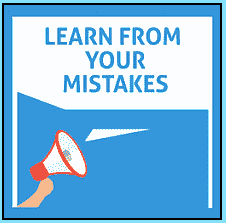

# 从你的错误中学习

> 原文:[https://www . social engineering . info/2020/11/learn-from-your-missons . html](https://www.socialengineering.info/2020/11/learn-from-your-mistakes.html)

## **如何从你的社会工程错误中吸取教训。**

纵观社会工程，无论是未经授权进入一家财富 500 强公司获取机密文件，还是为了退还一台价值超过 2000 美元的 75 英寸 UHD 智能 LED 电视而袭击一家大型在线商店，在大多数情况下， ***，你都会专注于获得回报的荣耀*** 。毕竟，当你可以操纵销售代表将购买价格的全部成本记入你的账户时，为什么要为顶级电视和最新的 IPhone 支付同样的费用呢？如果你还没有弄明白，我指的是**“新型人类黑客”**，也就是所谓的**“公司操纵和剥削”**，通过这种方式，销售者使用精心策划的战略方法，从他们决定瞄准的任何公司获得退款和替换物品。

 

无论是最大的电子商务公司，即亚马逊，还是只有少数员工的本地电器零售商，社会工程师都只有一个想法，那就是成功地实现他们的目标。 ***如果需要整整一个月才能得到他们所追求的东西，他们就会这样做，将自己从所有的干扰中隔离出来，最终完成他们的目标-*** 手头的任务取得成功。这主要与高级社会工程师有关，他们已经在现场工作多年，知道每种方法的来龙去脉，以及如何将它应用到他们的攻击载体，不留任何机会。然而，歌唱并不全是阳光和彩虹——它确实有相当多的复杂性，作为一个自我的人，你会很清楚你遇到的困难，因此，你会犯错误，其中一些会导致你的自我提前结束。

 

例如，您是否曾经使用过 ***【缺失物品法】并且没有考虑重量*** ，却发现已经开始调查，确认物品已被附上，因此您的索赔被驳回？或者你尝试了*的“密封盒子法”，退回(看似)未打开的盒子进行更换，而 ***销售代表立即注意到不一致的*** ，因此结果对你不利？我可以很有把握地假设，你对其中至少一个事件的回答是**“是”**。之后你做了什么？立即解雇你的 SE 并尝试另一个，或者"*通过考虑对你的方法和攻击有负面影响的所有因素来准确分析哪里出了问题？"*。如果你没有做到后者，那么这就是你犯下的最大错误——***你永远不会知道&为什么你的 SE 会失败*** ，这将影响到后续每一个同样性质的 SE！*

 **

*人的失误是不可避免的，不管你的专业水平如何，不管你的 se 运用得有多好， ***你都会犯错——而且还会时不时地犯错*** 。因此， ***最重要的是确定你到底哪里做错了，然后改正它*** 。许多 SE 并不为此烦恼，然后他们想知道为什么他们的 SE 在有机会发展之前就结束了。这就是促使我写这篇文章的原因——也就是为了展示**“如何通过从失败的 SE 中剔除负面因素，从错误中吸取教训”**。为此，我将使用三种方法(装箱、错误项目接收&部分)，向您展示 ***它们是如何使用的，为什么它们通常会失败，以及必须采取哪些措施来确保同样的事情不会再次发生*** 。这不仅有助于你在没有负面影响的情况下制定你的方法，还会显著增加你的 se 从头到尾顺利运行的可能性。先说拳法。*

 **

***拳法:***

 **

*如果你是一个初学者，刚刚进入这个场景，我会说你以前没有遇到过这个方法，所以请允许我简要地阐述一下它涉及的内容。也被称为**【装箱】**或简称为**【盒子】**，这种情况适用于你购买了一件物品(如 AirPods)，然后通过联系销售代表/代理商声称它不工作的时候。然后他会进行一些常规的故障诊断步骤，而你显然会说它仍然不起作用。当销售代表认为商品(看起来)有缺陷时， ***他会要求您退货，收到商品后，将会退款或更换商品*** 。当然， ***你没打算送回去*** ，那就是拳法发挥作用的时候。*你将只寄出里面什么也没有的盒子，但是你必须有条不紊地准备和寄回它。**

 ****

**这种方法的目的是 ***通过切割盒子并用不同颜色的胶带密封，使盒子看起来好像在运输*** (意思是在公司收到你的包裹之前有人偷走了物品)期间被篡改过。结果，公司将会看到它已经从原来的状态被改变了，并且相信确实有人偷了这个东西，并且你的索赔将会被批准。在应用这种方法之前，有几件事情需要考虑。首先， ***如果物品很轻，托运时不会记录重量(如“AirPods”)，您可以自行发送包装盒*** 。相比之下， ***如果物品比较重，就需要用“干冰”来代替重量*** 。所以你一直遵循这个程序，但没有明显的原因，你的索赔被拒绝。嗯，***SEs 失败总有原因*** ，现在我们就来看看那个。**

 ****

**拳击法失败的原因以及如何从错误中吸取教训**

 ****

**不合格的 SE: 箱子和包裹，**“没有明显被篡改的迹象”**所以当公司收到的时候，瞬间引起了怀疑。因此，它被认为是寄件人(你自己)负责没有寄回该项目。**

 ****

**另一方面，让我们假设上面所有的应用都是正确的，并且 ***你用干冰代替了物品*** 的重量。该公司对承运人展开了调查，并交叉检查了他们仓库中记录的重量。该报告的结论是有一个巨大的差异，即 ***包装比它应该有的*** 轻了很多。因此，物品没有被附上，你没有归还它是错误的。**

 ****

**经验教训:就第一条而言，它几乎是不言自明的。 ***你犯了一个错误，只是在包装/盒子上划了一个小口子*** ，这不足以证明物品被拿走了。这是事情的负面，所以通过**“把它撕得比物品的尺寸大一点”**来消除它的正面，这将保证它很可能真的在运输途中被偷。**

 ****

**第二个是关于**【干冰】*****你犯了一个错误，在包裹*** 中没有放足够的东西，因此它在到达承运人的仓库之前就升华了(变成了“气体”)。这就是为什么包裹在称重时比它应有的重量轻了很多——里面什么也没有！这是事情的消极一面，所以把积极的一面拿出来，一定要**“计算干冰相对于其重量升华所需的时间”**。 ***后续 SEs*** 不会发生同样的错误。**

 ****

****错项接收方法:****

 ****

**在我介绍它之前，鉴于你从未使用过它，我将快速为你定义它。简单来说，你收到的承运人交付的包裹中的 ***与你最初购买的*** 完全不同。很自然，正确的一个被发送出去了，但是你为了销售的目的说了另外的话。例如，您订购了一台**“17 英寸游戏笔记本电脑”**，但是收到了一包**“A3 复印纸”**作为错误商品。信不信由你，这是一个很好的组合，尤其是这两个项目在大小和重量上是兼容的，这是使用错误的项目接收方法时的理想选择。你很快就会明白为什么它很重要。好的，关于 SE，你已经购买了你计划送给社会工程师的物品，并且给了 ***公司将要求你退回错误的物品，你已经有了它供你处置*** 。**

 ****

**从承运人处接受您的货物后，您与公司代表取得了联系，并告诉他 ***当您打开箱子/包裹时，里面还有其他东西*** 。他对造成的不便表示歉意，并很乐意将购买物品的费用记入您的账户。为了做到这一点， ***他要求退回错误的商品，当他收到商品时，会处理您的退款***——这是大多数在线零售商的标准程序。因为您手头上有错误的商品，所以遵从代表的要求没有问题，所以您已经将其退回，等待您的付款被报销到您的信用卡中。几天后，你检查了你的电子邮件，令你惊讶的是，你的索赔被拒绝了- ***，理由是你的错误物品不属于他们*** 。让我们来看看你的销售工程师为什么没有成功。**

 ****

**错误物品接收方法失败的原因以及如何从错误中吸取教训**

 ****

**失败的 SE: 当代表收到您的退货， ***他扫描了您的错误项目，它没有在他们的系统中出现*** 。然后，他与会计部门核对，看是否有一项该描述的项目已开具发票，然而 ***他们没有记录*** 。这给了你拒绝索赔的充分理由。**

 ****

**教训:你犯了错误， ***“没有从同一家公司购买错误的商品”。*** 如果你这样做了，他们会扫描它， ***【将其识别为库存商品】*** (这是他们库存的一部分)，因此，该公司会认为他们确实向你发送了该商品！所以用 ***“从同一家公司用不同的账户买错了东西，送到另一个地址”*** 来表示积极的一面。因此，他们无法将其与您的当前帐户关联，因此无法将其与您的交易关联。 ***同样的错误不会发生在与此方法*** 相关的其他 se 上。**

 ****

****偏法:****

 ****

**这种方法在制定战略的时候非常有效，但是如果不这样应用，失败的几率非常高，你很快就会明白我的意思。就方法本身而言，它的工作原理是 ***购买多件商品，当你收到包裹时，你与代表/代理取得联系，并说“一件或多件商品丢失”*** 。也就是说，您的订单被部分完成，因此它被恰当地命名为 ***【部分方法】*** 。这是一个 ***【仓库领料&装箱错误】*** 的结果。要做到这一点，所有的货物(你已经订购的)，必须在同一批货物中，由承运人一次性交付。好的，让我们从 SE 开始。你决定从一家网上商店购买总共 12 件商品，当司机送货并把包裹交给你时，你打电话给该公司说**“当你打开盒子时少了 6 件商品”*****——即“2 双运动鞋”和“4 件夹克”。*****

 ****

**公司在使用分批法时， ***展开调查*** 是很常见的，所以在这种情况下，他们正是这样做的，并通过交叉检查整个包裹(您的“12 件物品”)的重量与承运人联系，目的是查看重量是否有差异-这意味着 ***如果“您的 6 件物品(以上性质的)丢失了”*** ，重量应该会轻很多，但是没有发现不一致之处。此外，该公司的记录表明 ***与您订单*** 的提货&包装没有任何差异。根据他们的调查结果和仓库跟踪记录，您的退款请求被拒绝，公司没有采取进一步行动。SE 对你不利并不奇怪，原因如下。**

 ****

**部分方法失败的原因以及如何从错误中吸取教训**

 ****

**失败的 SE: 失败的原因有几个。首先是你选择的物品性质为 SE-***【2 双运动鞋和 4 件运动夹克】*** 。因此，当公司开始调查时，这六件物品肯定会在承运商的称重设施中登记，因此它们肯定不会丢失。**

 ****

**你犯的另一个错误是声称你没有收到**“12 项中的 6 项”**。我可以向你保证 ***在总共只有 12 件*** 的同一张订单上出现“6 件”提货错误的可能性极小。除非店员在工作时半睡半醒，否则这种情况不会发生。即使重量没问题，我也要说你的 SE 仍然会因为这个原因而失败。**

 ****

**吸取的教训: ***你犯了一个错误，没有对你 SEd 的物品类型进行选择，即它们的“重量”*** 。与缺失物品法一样，为了避免包裹称重时被检测到，使用部分方法时，最重要的是将所有物品的重量控制在 120 克以下*，这实际上是将其推向极限。你的另一个错误是唱了**【6 项】**。如前所述，仓库人员很少会挑错数量，尤其是在同一张订单上。 ***毫无疑问，你在打击其他 se 的时候不会犯同样的错误*** 。***

 ****

****总之:****

 ****

**你在这篇文章中学到的是 ***分析每一个失败的系统工程师的重要性，以找出你错在哪里，如何有效地纠正它，并在未来的系统工程师*** 中不犯同样或类似的错误。如你所知，还有很多更传统的方法，如密封箱、遗失物品、序列号法等等，然而这已经超出了本文的范围。我希望你做的是 ***总是从消极中找出积极的一面，因为所有的 se 都没有按照计划进行*** 。因此，你会从错误中吸取教训，并准确地知道下一次应该做什么。**