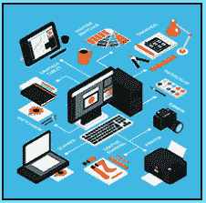

# 部分制造商方法

> 原文：<https://www.socialengineering.info/2020/11/partial-manufacturer-method.html>

## **箱子里的零件不见了。**

如果你一直在阅读我在这个博客上的教程，你会对社交工程公司使用的一系列方法了如指掌，这些公司通过运营商服务向客户交付商品。当然，我指的是 ***利用 ASOS、罗技之类的网上商店，并通过操纵他们的代表发放退款或更换商品*** 来陈述显而易见的、好的旧亚马逊。为了完成任务，攻击向量中使用的方法必须(在很大程度上)不仅适合当时正在使用的项目的性质，而且 ***它还必须完美地制定，从而为错误留下很少甚至没有余地*** 。因此，它将确保 SE 从一开始就尽可能平稳地运行，直到最终确定对 SE'ers 有利的索赔，这是一个成功的结果。

 

有这么多可用的方法，如果你是第一次接触**“人类黑客的新品种”**，即**“公司操纵和剥削”**(如上所述)，那么你有很多东西要学。详细阐述每一个方法已经超出了本文的范围，所以请参考我的[社会工程师目录](https://www.socialengineers.net/p/social-engineers-site-map.html)，在那里你会找到 30 多种满足你所有销售需求的方法。也就是说，我要做的是快速讨论什么定义了一个方法，以及为什么它在每个 SE 中都扮演着不可或缺的角色。简单来说， ***它是每一个社会工程攻击的支柱，它被用来引导它朝着正确的方向前进，如果你没有一个合适的方法，你的 SE 将不会前进*** 。把它想象成一组指令*，最终让你完成手头的任务。*

 **

*例如，如果你从宜家购买了一个娱乐单元，带有折叠形式的架子、抽屉等，你需要 ***组装说明*** 将它组装起来，成功完成你的项目。这同样适用于 SEing。**“组装说明”**是**“方法”**，本质上是 ***准备、指导和确保用户目标***——退款或更换项目。够清楚了吗？我很高兴你同意。既然你已经知道了方法是如何工作的，我想特别向你介绍一个你还没有遇到过的方法，不是通过它的名字——那是因为我在这篇文章发表的时候刚刚开发了它，我把它命名为:**“部分制造商方法”**。这与**“缺失项目”**和**“部分”**方法非常相似，但更有效，并且您将在页面的下方看到原因。为了掌握它是如何工作的，有必要了解其他两种方法，所以让我们从下面的**【缺失项】**开始。*

 **

***什么是缺项法？***

 **

*有很多方法可以利用这种方法，但是为了本指南的目的和避免拥挤，我将提供一个你可以很容易理解的一般例子。顾名思义，它被用户用来表示从网上商店订购的商品 ***，当它由承运商*** 交付时，当他们打开包装/箱子时“丢失”了。当然，这根本不是事实，但是社会工程师说这是——只是为了让他的账户被记入贷方或者另一件物品被免费发送。现在 ***这种方法需要一种经过计算的战略方法*** ，因此它不像选择想到的第一个项目那么简单，这就是为什么你(作为销售人员)必须有条不紊地选择项目。包裹在由公司发送之前在托运时称重，也在承运人的仓库称重，因此当你说物品丢失时，公司将展开所谓的**“调查”**。这是他们协议的一部分，看看你为什么没有收到你点的东西。*

 **

*当你在等待他们的回复时，在幕后，他们正在交叉检查**“重量”**，这是在他们的仓库和承运人的称重设施中记录的——就在包裹被装入货车交付到你的场所之前。 ***如果你的物品很重，它会被登记为*** ，如果**【派送】**和**【承运人】**的重量匹配，那么你的物品就没有丢失！跟你的 SE 说再见吧——失败了。正因为如此， ***选择称重时不会被检测到的极轻物品至关重要。我建议最多 120 克，这已经是极限了。现在，如果这种情况发生在与上面相同的场景中， ***权重将不会重到足以被记录*** ，因此您的 SE 的结果将会是相反的——成功。****

 **

***什么是偏法？***

 **

*这与上面的方法非常相似，就展开的调查而言，公司的程序也大同小异——确定权重并确定你所说的是否真实正确。与缺失商品法的唯一区别在于， ***不是单独订购“一个商品”并声称，部分方法涉及购买“多个商品”*** ***，然后社会工程师一个或多个*** 。要做到这一点， ***所有货物必须来自同一批货物*** 并由承运人一次性交付，然后在您打开包装时声称一件或多件物品丢失。也就是说，您的订单是部分填写了*，因此它被恰当地命名为**“部分方法”**。尽管你接下来要读的是显而易见的陈述，但许多人忽略了把它作为等式的一部分，然后他们想知道为什么他们的 SE 过早地结束了。**

 ****

**如果你打算 ***社会工程师不止一个项目，也许总共有两三个，计算*** 的“总重量”是至关重要的，意思是将每个项目的重量组合成一个单一的数字。是的，这是一个常识性的问题，但是由于这样或那样的原因，所有层次的 se 不知何故完全忽略了它，如果调查开始，SE 将失败——没有如果，和，或但是。为了让你明白我指的是什么，我将提供一个简单的场景如下。比方说我要去阿瑟 Fitbit Versa 2 手表在***【38 克】******【29 克】*** 左右还有一个至关重要的 240 GB SSD 在***【55 克】*** 。每一个项目的权重必须合并为一。在这种情况下，总数(38 + 29 + 55)是**“122 克”**，刚好超过了 120 克的限制，因此它们可以与部分方法一起使用。如果一件或多件物品重了 15-20 克，那么很可能在包裹称重的某个阶段被发现。**

 ****

**分部分项厂家方法**

 ****

**既然您已经完全理解了缺失项目和部分方法的使用方式以及索赔过程中的预期情况，那么您在遵循**“部分制造商方法”**的公式时应该不会有任何问题，所以不要再拖延了，让我们开始吧。好吧，就方法而言，它只是用来说*在购买你的物品后打开盒子，盒子本身*的“一部分不见了”。这是一个*【制造商错误】*的结果。换句话说，当盒子从承运商司机那里到达你家时，它是完好无损的——没有任何篡改的迹象，也没有任何与用于保护它的封条/胶带不一致的地方，但令你惊讶的是， ***【一个组件】没有被附上*** 而且你将会得到这个(单个组件)的更换或退款。**

 ****

**和前面提到的其他方法一样， ***你需要系统地选择你将要销售的*** 的“商品类型”，而不是不假思索地选择一些东西——在前进之前，有几个非常重要的因素必须考虑。我不喜欢(再一次)陈述显而易见的事情，但是因为一些用户不能掌握最简单的任务，我觉得这已经成为我所有教程的要求。除此之外，第一件事是 ***选择一个具有可拆卸部件或一些配件的项目，这些部件或配件是它发挥*** 功能所必需的。这方面的一个例子是“**CPU”**(处理器)，它与风扇/冷却器、RGB 电缆以及 CPU 本身一起打包。现在，当使用部分制造商方法时， ***你会看到最贵的部分是“CPU”***(有些零售价高达 590.00 美元)，因为 ***说当你打开它的时候，盒子里只有冷却器和电缆*** 。**

 ****

**这种方法之所以如此有效，是因为 ***制造商确实会因忘记将某个特定零件包装在各自的盒子里而出错*** 而且公司都很清楚这一点，并且在这种情况下他们会收到合法的索赔，因此您的 SE 也会成为这个等式的一部分！如果你已经完美地准备了你的方法，并以同样的方式执行了你的攻击，对于销售代表来说，区分你的销售工程师和真实交易将是一项非常艰巨的任务。第二个因素起着至关重要且更为重要的作用，那就是 ***“箱子的四面都必须用硬纸板完全包装”——没有透明薄膜/窗口*** ，因此无法从外部查看其内容。你会问“为什么会这样”？好吧，如果公司的仓库有闭路电视摄像头，正在积极监控货物的包装，并展开调查， ***他们可以参考摄像机镜头，并看到(“通过清晰的胶片”)你声称丢失的物品实际上是“在箱子*** 中”，因为它是包装和发送的，因此你的 se 将失败。为了帮助您在选择商品时做出明智的决定，请查看以下主题。**

 ****

****适用于分部分项厂商的方法:****

 ****

**正如你所知道的，选择可以以某种方式相互连接的零散物品是至关重要的，为了让你的 SE 物有所值，你将出售的*“部分”应该相当昂贵* 、 ，所以在 ***提供替换品*、**不退款的情况下，你仍然可以获得可观的利润。一个完美的例子是，你刚刚读到的关于成本(在撰写本文时)接近 600.00 美元的 CPU，以及大约 100-120 美元的冷却器/风扇，因此你将对前者(CPU)而不是后者进行社会改造。 ***我想重申一下“重量”——切记不要超过 120 克*** ，否则调查会认为对公司有利。只是为了让你有所了解，我已经列出了一些非常适合这种方法的项目，因此 ***应该作为将你的 SE 放在一起*** 时的通用指南。**

 ****

***   AirPods Pro with charging box. Weight: 56.4g*   AirPods (old model) with charging box. Weight*   A crucial 240 GB solid-state drive with USB cable. Weight: 60 grams.*   Ray-Ban Justin rectangular sunglasses with case. Weight: 95 grams.*   10k bridal wedding ring box, weight: 110g.**

 ****

**上面每件商品的重量，是它们运输方式的总重量**(净重)*。例如，关于 USB 电缆附带的**“SSD”**(可能还有驱动光盘和用户手册)，**它的重量约为 45 克**。其他的部分补足了总重量 60 克的差额。显然， ***你只会对 SSD*** 进行社会化改造。同样的原理也适用于**“雷朋太阳镜”**，它们的重量大约为 40 克，其余部分总共为 95 克。你会说 ***只到了*** 这种情况，所以很明显你会 se 什么。*****

 ********

******总之:******

 ********

****理由是你已经通读了每一个主题(如果你还没有，现在就回去通读吧！)，你将对 ***有一个清晰而准确的了解“部分制造商方法”*** 是如何运作的，包括正确制定它以准备成功操纵你的目标的要求。如前所述，使这种方法如此有效的是，制造商犯错误的次数比你想象的要多得多，这从另一个角度支持了你的说法。此外， ***说“完整物品的一部分丢失了”，似乎比声称整个物品*** 更不可疑。最后，我要再次提醒你不要忘记重量限制，即**“120 克”**。当然，有时销售代表在工作中半睡半醒，没有考虑重量就批准了你的索赔，但我没有留下任何机会，如果调查开始，你就完全被覆盖了。****