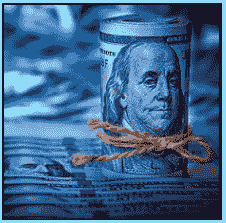

# 信用卡退款

> 原文:[https://www . social engineering . info/2020/10/credit-card-charge backs . html](https://www.socialengineering.info/2020/10/credit-card-chargebacks.html)

## **了解信用卡拒付。**

Social engineering takes an exceptional set of skills to manipulate the entity In question, and achieve the objective of the SE'er with minimal hassle from start to finish and ***for the most part, there will be a number of obstacles to circumvent throughout the process***. No matter how well you've researched your target, Inclusive of preparing your method based on your (researched) findings and flawlessly executed your attack, ***you have very little control over the sequence of events that take place thereafter.*** This applies to every facet of SEing- be It manipulating the postman to hand over your neighbor's bank statement by pretending you've lost the key to their mailbox, or getting a free meal at your favorite restaurant due to faking stomach cramps Immediately after eating, there will be some element of complexity Involved.
  This also pertains to the ***new breed of human hacking***, namely **"company manipulation and exploitation"**, whereby you Identify weaknesses In their terms & conditions, protocols, policies and customer representatives to obtain refunds and/or replacements. If you haven't worked It out by the title of this article, what I'm referring to Is ***SEing online stores on a large scale***  such as AMD, Currys PC World, HP and stating the obvious, Amazon. On the grounds you're reading this from an Intermediate or advanced SE'ers standpoint, you'd be well aware that It's not all sunshine and rainbows- ***Investigations will be opened, police reports requested, affidavits Issued to be signed & returned, carrier drivers visiting your home *** and the list goes on.
  Even If you've tackled the above-mentioned circumstances In a calculated and methodical manner with the Intention to refund a given Item, ***there's no guarantee that your SE will succeed each and every time***. All It takes, Is for the rep(s) whom you're dealing with at the time, to keep declining your claim- regardless of your compliance and effectiveness of your attack vector. As such, the 2k diamond ring that you've purchased and wanted to SE by way of having the funds credited back Into your account, has come to an end. Or has It? In situations similar to this, ***a lot of social engineers take It on the chin and believe that there's nothing more they can do to resurrect their claim, but this Is not the case at all***.
  As an SE'er yourself, you can file what's called a ***"chargeback" via your credit card provider***, an ask them to reimburse the full cost of the purchase Item Into the account of where the transaction took place. Before I elaborate on how this Is done, do note that ***It's completely different and segregated from a "PayPal Dispute/Claim"***. I've come across many users In the social engineering community that I'm registered with, who believe that a chargeback Is performed through PayPal Itself, however they're either misinformed of how It operates, or totally confused and cannot differentiate between both payment systems. It's this misapprehension that's prompted me to write this article. ***I will give you a clear understanding of how It's structured, and precisely how and when It should be used by the SE'er***. So without further delay, let's check It out.
  **Chargeback Introduction:**
  From this point onwards and for the remainder of this article, I will be referencing the social engineer from a third-person point of view, as well as yourself. Although a **"Chargeback"** Is often viewed as being related to PayPal, this Is In fact performed by ***contacting the credit card provider to request a refund***. In other words, the buyer (***you as the "social engineer" ***) asks their **"credit card provider"** to reverse the charge on their account, and they will then get In touch with PayPal who will request further Information. The type of Information can Include (but not limited to) proof of purchase and shipment, all communication between buyer & seller, transaction details and so forth. ***In order to ensure that the process runs smoothly, It's Important to be well-prepared by having all this (Inclusive of fake Info) at your disposal, prior to Initiating a chargeback.***
  Everything that was asked of you, Is collected by PayPal, who then forward the details to the credit card provider for review. As a result, ***It's the "credit card provider" who makes the final decision as to whether the buyer (social engineer) will receive a refund***, regardless of what PayPal has to say! **"Chargebacks also have a time frame of when they can be filed"**- *which Is 180 days after the Item was purchased*, so to not exceed It, be sure to make a mental note of this. There's not doubt that this certainly covers the buyer rather well from a legit perspective, but social engineers use this to their advantage when claiming a refund for a particular Item. Let's checkout what goes on In the mind of the SE'er.
  **How A Chargeback Is Used By The SE'er:**
  When the social engineer has exhausted all options with the company he's SEing, whereby they just refuse to budge and ultimately decline the claim, *he will then perform a chargeback, by contacting his credit card provider and they will contact PayPal*. But what If the SE'er does not have a credit card to his name? Well, there Is an alternative named a ***"bank reversal" which serves the same purpose, meaning a request Is made to his financial Institution to obtain a refund.*** The SE'er Is well and truly prepared for this- he'll have everything ready, such as a fake POP, evidence that he did not receive the package (when In fact he did by using the DNA method with a fake signature!) and so on.
  A chargeback has a pretty good success rate but ***the key to a favorable outcome, Is based on how well the social engineer has prepared his claim and most Importantly, being adamant and pushing his case to the absolute limit***. For example, at times, It can be a lengthy procedure with shooting off emails back and forth, having phone conversations with ex-amount of representatives to no avail and taking many days/weeks just to receive a response, but given the SE'er **"Is In control"** right from the get-go, failure Is not an option! When the credit card provider finally approves the claim for a refund, ***PayPal has no say In the matter- they must comply with the credit card provider's decision***. Going by personal experience, If you, as the social engineer, stick with your story and keep hitting them with the chargeback, It has an extremely high chance of succeeding.
  **When To Perform A Chargeback:**
  As per the title above, I've lost count as to the number of times I've been asked when a chargeback should be performed and whilst there are no hard and fast rules, ***I always recommend to hit It when all else fails***. Think of It as a **"backup"** to every social engineering attack you execute. For Instance, because of the nature and complexity of the majority of SEs, not everything goes according to plan and when It gets to the stage of either having to abort the SE (due to high risk circumstances) or It's eventually disapproved by an agent/rep and cannot be reversed, that's when you resort to your **"backup plan"**, namely the **"chargeback"**. It's simply a matter of common sense- why would you first opt for a chargeback, when you clearly have the choice to SE the company In question?
  Allow me to briefly elaborate on this and justify my above statement as follows. There will come a time when you're SEing a company for a refund or replacement Item, and ***their reps are either half-asleep on the job, or they just couldn't care less and approve your claim with no questions asked***. If you haven't come across this already, you most certainly will at some point during your SE. Now In this scenario, there was absolutely no reason for a chargeback- they did all the work for you, thus contacting your credit card provider would've been a waste of your **"backup plan"**. Moreover, ***the more chargebacks you perform, the more suspicion It will raise***, so the equation Is pretty simple- try your luck with the company FIRST. You will always have something to fall back on If It fails, and that **"something"** Is a **"chargeback"**.
  **In Conclusion:**
  You should now have a very good understanding of how chargebacks are structured, at what stage of the SE they should be used and the advantages of having It as a backup when your SE has come to an end without success. As a closing note, I'd like to say that It's good practice to be selective when deciding whether to pursue a chargeback. ***If It's a low value Item such as a Micro SD card costing 8.50$, then It's just not worth It***. In other words, save your chargebacks for Items that are worthy of going through the process- laptops, cell phones, an Apple Smart Watch Series 3 and the list goes on.