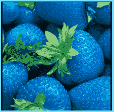

# 不新鲜食物法

> 原文:[https://www . social engineering . info/2020/08/the-stale-food-method . html](https://www.socialengineering.info/2020/08/the-stale-food-method.html)

## **社会工程使用了不新鲜的食物方法。**

If you're anything like myself and actively Involved In a social engineering community, ***you'd be mostly discussing ways to SE online retailers *** for things like AirPods, CPUs, articles of clothing, watches, laptops and the list goes on. Such Items are predominantly SEd from companies on a large scale like (obviously) Amazon, Dell or John Lewis and for the most part, result In a successful outcome. After all, who doesn't want a free pair of 300$ trainers or a core i9 processor that's retailing at 749$? It's their value that makes them a sought-after commodity to SE and whilst It's all well and good for the more advanced SE'ers, ***what about those who're new to the social engineering sector?***
  They'd have a very difficult time SEing any of the aforementioned Items and as a result, failure Is Inevitable, which can have a significant negative Impact on their confidence level. This Is certainly not good practice, and needs to be addressed before the SE has the chance to begin. ***It's of paramount Importance to start SEing by heading In the right direction***, and that's what prompted me to write this article, namely ***social engineering food/consumable products***  by using the **" Stale Food Method**". I have covered this further down the page. Even If you've never SEd a single company, you'd be surprised at just how easy It Is to get a free meal or drink from **"almost"** any food chain or restaurant.
  Notice how I've used **"almost"** as the operative word? That's because regardless of how well you've prepared and executed your SE, ***It's never guaranteed to work 100% each and every time! *** This applies to every business as well as every Item- Irrespective of Its nature. Why Is that you ask? Well, there are too many variables Involved, ranging from stubborn representatives who refuse to accept your claim right from the get-go, to payment systems that decline chargebacks for no apparent reason. That said, seldom will you experience this with food Items and the like. ***In fact, as an honest person, did you know that you've unintentionally SEd at some stage when (perhaps) wining and dining?***  Yes, you most definitely have, so let's checkout how and why you did this.
  **You Have SEd Without Even Knowing It:**
  Believe It or not, It's very safe to assume that ***you've been social engineering your favorite dish or beverage on a number of occasions without even realizing It***. For example, how many times have you ordered takeout and It wasn't to your expectations- either not cooked properly, or had some sort of unpleasant taste? Or may be you found a hair In your classic baked macaroni & cheese, while dining at a fancy restaurant? I'd say you've come across similar circumstances at least once, and asked for a refund or replacement meal thereafter. ***All this was done on "legit grounds", and Is no different to SEing when using manipulative tactics to achieve the same result- "a refund or replacement"***.
  Think about It for a minute from a logical and ***genuine standpoint***. Let's say you had a pizza delivered and ***It was exactly what you expected by appearance***- It had all the right toppings as per your order, and was just at the right temperature to be eaten and satisfy your hunger. However, around 10 minutes later, you had really bad stomach cramps and puked quite a few times. Did you call the pizza place and (apart from abusing them!) ask for a refund as well as "another free pizza?". I thought as much. The **"other free pizza"** Is what's known as: **"A legit SE"**. Now *If you performed your very own SE based on the exact same scenario, It would've had the same outcome*- without a shadow of a doubt.
  The point of this entire topic, Is to make you aware that If you base your SE as though It's legit by manipulating It accordingly, then you'll find that the **"Stale Food Method"** will rarely fail. Moreover, ***every entity has no Idea that they're being social engineered***, they think It's for real, so treat It as such and you can't go wrong. I often get asked as to why It's so simple to SE food & drink products, so we'll have a look at that now.
  **Why It's Easy To SE Food & Drinks:**
  You do not have to be a master social engineer to get either a free replacement meal, or your money back after eating or drinking something and complaining straight after. From an SEing perspective, ***there are a couple of key elements that help solidify your SE- with the first one being*** **"health & safety"**. Every licensed business operating In the food Industry, regardless of where It's located around the globe, must comply with the applicable laws and regulations. Generally speaking, this can Include ***food that's suitable for consumption, handling & storage, cleanliness/proper hygiene, segregation of cooked and raw products***  and much more. So when the company receives a complaint relative to a health Issue, they'll have no choice but to Issue a replacement meal/drink or a full refund.
  Although this does not apply to all consumable products, the second point I'd like to state, Is a **"customer satisfaction guarantee"** (or some variant) that's marked on the packaging Itself. Have a look at the label, and If It reads something like **"If this product does not meet your expectations or If you have any other enquiry, please contact us on...."**, then they've basically SEd themselves! This Is a huge vulnerability that can be exploited by using the **"Stale Food Method"** with Incredible ease, hence there's no need to elaborate further. As you should have gathered by now, ***you can social engineer any edible Item of choice, drinks Included***. Now you may be wondering how to execute your attack, so I'll briefly demonstrate an example In the topic below.
  **The SE In Action:**
  For the purpose of this tutorial, I will show you how to SE **"Protein Powder"** when ordered from any company you choose, and have It delivered to your home by one of their carrier drivers. ***Feel free to also apply this to any type of drink such as Red Bull***, by manipulating the methodology according to the nature of your SE at the time. In other words, use common sense and good judgement when preparing It against your target. So without further delay, let's rip Into It.
  As an established SE'er, prior to formulating your method and executing your attack, you know that It's of the utmost Importance to **"research the company & Item"** you're planning to SE, thus you've done this and have found that the protein powder has a 90 day satisfaction guarantee from the date of purchase. Upon further research, you have Identified that ***you must return your Item***  before a refund can be processed, therefore you've specifically placed an order for **"Whey Protein Powder In vanilla flavor"**. There Is a very good reason for this, and you'll see why shortly! To make It worth your while, It costs 33.99$ and Its capacity Is 5 LB
  The carrier delivers your package and to make your SE appear legit, you decide to wait around 30 minutes before contacting the company. ***This gives just the right amount of time to open the package, make your protein shake, and give them a call thereafter***. When speaking with their representative, you said that you'd like to make a complaint about one of their products- and purposely sounded distressed. When he asked what the problem Is, you told him that **"after drinking the Whey Protein Powder, you Immediately felt sick and puked shortly afterwards"**. In addition, you advised that **"It had an unpleasant odor and looked quite stale"**. The rep Is satisfied that a refund Is warranted, but said that ***you must return the unused portion***. 
  This may seem like a problem, but It's easily manipulated and Is the reason why you purchased the **"Whey Protein Powder In vanilla flavor"**. You expected to return It, so you drove to the local mall and grabbed *5 LB of self raising flour- that Is the same color as the Protein Powder  *and only costed around 2.00$. Next, you emptied the Protein Powder In another container and replaced the original container with the flour. To finalize the process, ***a little bit of the Protein Powder was sprinkled on top- to give the appearance that It does In fact contain the powder and not the flour***. Given It looked extremely similar to the Protein Powder, the representative had no reason to question It, and Issued a refund Into your account. A job well done Indeed. 
  **In Conclusion:**
  This article Is rather lengthy until It gets to the actual social engineering part (as you've just read above) and my reasoning behind this, Is to give you a clear understanding of every facet when It comes to SEing food & drink products. ***I'd prefer to give more Information than not enough- due to the negative Impact that Insufficient details can have on your SE.*** As already mentioned, you can apply the **"Stale Food Method"** on any consumable product, but be sure to exercise common sense by manipulating It accordingly. It's not difficult at all, so take all the time you need to ensure that your SE will result In a successful outcome.