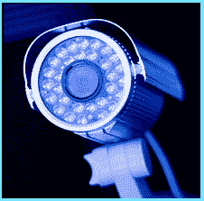

# 监控摄像头

> 原文:[https://www . social engering . info/2020/04/seing-security-camera s . html](https://www.socialengineering.info/2020/04/seing-security-cameras.html)

## **为什么安防摄像头验证不够好。**

From a business/workplace standpoint, security cameras play a major role to help monitor unauthorized access attempts Into the premises. Whilst they serve their purpose rather well to see who's coming and going, believe It or not, they're of very little help when It comes to **"Identifying & verifying"** visitors- even those who attend on a regular basis. 
  Social engineers are well aware that one of the easiest methods to gain access to a restricted building (and circumvent security cameras), Is to assume the role of a "delivery driver", who works for the carrier that the company uses quite often for receiving goods. But first, the SE'er must **"research his target"**.
  **Researching And Preparing The Attack:**
  The social engineer has selected the perfect timing- no public holidays scheduled for the week and It's heading close to the busiest time of year, namely **"Christmas"**. As such, the company he's planning to SE, will have a lot of movement throughout the day, particularly packages being delivered by their local carrier and It's this who the SE'er will use to bypass the security cameras at the entry door, and simply walk Into the building.
  The SE'er has sat In his vehicle right opposite the company for an entire week during business hours, and monitored the exact time of when the carrier driver arrives and leaves. He's also taken note of the company he works for. Let's just say It's **"FedEx"**. In addition, the social engineer has taken photos of the carrier's uniform, the nature of the packages that're delivered and the type of authorization (If any) required to enter the building. He's now satisfied with his findings, and has everything he needs to execute his attack.
  **The SEing Attack Begins:**
  After getting dressed In a **"FedEx uniform"** and carrying what seems to be a **"FedEx package"**, the social engineer makes his way to the company he's planning to gain unauthorized access Into the building. He's well aware that the real guy has a set run at 11:10 am, so the SE'er will arrive 20 minutes earlier. Upon walking toward the entry door, he makes sure that his **"FedEx cap"** Is partly covering his face and presses the buzzer on the Intercom. 
  **"Hello, may I help you"**, Is the voice of a man on the other end of the speaker. **"It's FedEx and I have a package for (company name)"** replies the social engineer. The company employee can clearly see via ***"the building's security cameras"***, that It's a FedEx guy who's waiting at the door with a package for delivery. He's also expecting a delivery around this time of the day. On these grounds, the employee buzzes (who he thinks Is) the FedEx driver In, by remotely unlocking the door. The social engineer simply walks Into the complex, and snoops around for anything of value.
  **In Conclusion:**
  Just because someone Is dressed In a FedEx uniform, doesn't necessarily mean that he does In fact **"work for FedEx"**. Sure, probably 99% of the times It Is the case, but what about the remaining 1%? This also applies to other visitors, such as a guy dressed In a suit and tie **"claiming to be"** the sales rep of your company's printing machines. As you've realized, authenticating access solely via security cameras, Is not good enough for those you do not **"personally recognize"**. 
  For regular delivery drivers, ensure they have a building entry code and for visitors who randomly turn up, meet them at the entry door, question why they've arrived and escort them Into the building. Don't think for one minute, that the above example (and worse) cannot happen to you. It can and It will, If you neglect to follow good security measures.