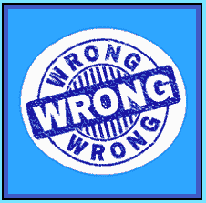

# 初学者收到了错误的项目

> 原文：<https://www.socialengineering.info/2022/04/beginner-wrong-item-received.html>

## **错误物品领取方法入门**

关于社会工程商店，如(但不限于)Wayfair、Zalando、Nike、Amazon、GoPro、Best Buy 等，其目的是欺骗他们的代表执行他们不应该做的行为，即**报销资金并由他们支付费用发送替换物品**，要完成这项工作需要做很多工作。熟悉该公司的**退款、保修和退货政策**，以及他们用来为其交付服务的**承运商合作伙伴**，对于帮助确保良好的结果绝对至关重要。

 

如果这还不足以让人热血沸腾，那么还有一系列的**传统方法**可以考虑，比如 [DNA](https://www.socialengineers.net/2020/08/the-dna-method.html) 、[缺失项目/部分](https://www.socialengineers.net/2021/06/missing-item-partial-methods.html)、[装箱](https://www.socialengineers.net/2021/02/the-boxing-method.html)、[密封箱](https://www.socialengineers.net/2020/05/the-sealed-box-method.html)、[处理故障项目、](https://www.socialengineers.net/2021/04/disposed-faulty-item-method.html)、[电池漏液](https://www.socialengineers.net/2020/06/leaking-battery-method.html)等等——我们将选择最适合您计划的产品性质的**当在中级或高级水平上操作时，这一切都很好，迄今为止你已经持续销售了许多年，但是如果你刚刚开始你的职业生涯在**“公司操纵和剥削”**的艺术中，你会对你刚刚读到的内容完全不知所措。**

 

的确如此——**针对社会工程师新手的教程少之又少**，因此很难找到能满足你需求的资源，而且这种方式很容易理解——特别是**试图找出一个给定的方法是如何构造和制定的**。放心，我会掩护你的。因为详细介绍每一种方法已经超出了本文的范围，**我将重点放在一种常用于各种形式和规模的公司的方法上，称为“错误接收物品方法”**。

 

我之所以选择这种方法而不是其他方法，是因为无数的用户在理解如何为他们的攻击媒介做好准备的基础知识方面存在重大问题，少数高级用户也是如此——他们根本无法掌握这种方法的制定和应用。这就是我进来的地方。今天您将学习的是对“错误物品接收方法”的**介绍，包括如何使用**针对仓储和制造环境**，以及如何**选择错误物品**并以在索赔过程中可能出现的**事件**结束。**

 

迷茫？不要担心，随着文章的推进，一切都会变得很有意义。现在，如果你对这种类型的社会工程非常陌生，而且**对**没有什么经验，我强烈建议你阅读我的[销售](https://www.socialengineers.net/2020/09/beginners-guide-to-seing.html)的初学者指南，完成后，你可以从这里停止的地方继续。好了，既然您已经启动并准备就绪，**了解** **【错误项目接收方法】**的来龙去脉很重要，所以我们现在就开始吧。

 

 

**错误的物品领取方法是什么？**

 

**“错误项目接收方法”**的最大优势是其通用性，这意味着它可以与每一家拥有满仓库存的公司兼容。除非你在卖车(可以这么说吧！)，几乎没有商品类型的限制，因此**它可以用于几乎所有的网上商店**，或者如果你喜欢，任何**店内零售商**。我将以一种非常简单的方式解释这个方法是如何工作的。在您购买产品并由承运商交付后，您会联系代表/代理并告知他**"包裹中包含了与您最初订购的不同的物品"**。

 

当然，这种事情根本没有发生，你只是说它对公司有影响。在进行方法本身之前，你首先需要**“购买你假装收到的错误商品”** -因为代表会要求你将其退回，并且*对* ***【原购买商品】*** 的退款或更换，只有当公司拥有**【错误商品】**时才会处理。为了更容易理解，我将按照时间顺序分解这个过程，如下所示。

 

1.  Buy the goods you plan to sell
2.  It takes no more than one day to buy the wrong goods from the same company
3.  When the parcel arrives **(together with the goods for sale)** , contact the sales representative/agent .
4.  After informing him to open the package, different commodities were attached to the letter.
5.  The sales representative will ask you to return (obviously) the goods sent by mistake.
6.  Return the **wrong commodity** purchased in step 2 above.
7.  When they receive the wrong goods, they will scan them and put them back in stock
8.  Then **refund/exchange** will be issued for SE goods.

 ****

如果你仔细遵循了上述所有步骤，就很容易明白这种方法是如何工作的，但是为了避免让你的大脑承受过多的信息，**我特意把所有的细节都压缩到最少**。为什么？因为我想让你先很好地了解一下**接收错题方法**的执行方式，当你熟悉了它的总体用法后，你可以继续阅读标题为**“如何选择错题”**的主题。现在，有两种方式可以使用该方法——一种是由于**“仓库错误”**，另一种是由于**“制造商错误”**，所以让我们先检查一下前者。

 

 

错收货仓错误

 

在我开始之前，一定要永远记住，你从来没有从公司收到过错误的商品- **这只是一个借口，可以为你正在销售的产品获得退款或更换**。好吧，就**“仓库错误”**而言，这发生在当店员从货架/货架上拿走你的产品时，但**他没有拿到你订购的产品，而是拿走了别的东西**。然后，它被打包并发送到你的地址，一个[投递站](https://www.socialengineers.net/2020/09/using-drop-house.html)或任何用于接受交付的地点。就在这个阶段，当**公司被告知在**发货中收到了错误的货物。

 

使用仓库错误的好处是，在挑选&包装货物时**错误是不可避免的，尤其是当客户订单大量涌入并且必须在截止日期前完成业务时。这就是它如此可信的原因- **这种方法实际上是基于真实的环境**，因此，在你的攻击过程中，猜疑被大大减少了。**

 

另一个优势，就是**“你选择购买的物品为错误物品，并不与任何细节**挂钩”。只要它的尺寸&和你的社会工程产品的重量差不多，它的包装就无关紧要了——因为**店员挑选了整个产品——(如果适用的话)盒子，显然还有里面的东西**。如您所见，收到错误物品**仓库错误**非常灵活，但对于接下来讨论的**“制造商错误”**就不一样了。

 

 

**错项收到厂家错误**

 

尽管这种方法在产品范围上有其局限性，但它可以用来对付 T2，在实现其目标方面，它的效果丝毫不减。你很快就会明白我在说什么。向前看，你刚刚在上面读到的，与**“仓库错误”**有关，意思是仓库管理员不小心犯了一个错误，从他们的仓库里拿走了完全不同的东西。嗯， ***那就是你操纵代表相信的*** 。或者，错误的物品接收方法可与**“制造商错误”**一起使用。

 

与此不同的是，你说**箱子里的物品是不正确的**。换句话说，你收到了正确的盒子，但是**里面装的是不同的产品**。要做到这一点，最重要的是**盒子的六面都用硬纸板包裹，从外面看不到。因此，没有证据表明里面装的是正确的物品。即使[闭路电视摄像头](https://www.socialengineers.net/2020/10/cctv-cameras-in-warehousing.html)拍到了仓库包装团队处理订单的画面，显然**的镜头看不到里面是什么！****

 

虽然**制造商错误**与拥有最先进物流和制造设施的工厂并不常见，但**这种情况确实时有发生**，社会工程师利用这种方法为自己谋利，他们说**“打开盒子后，原来购买的东西又多了一件”**。毫无疑问，该公司将试图对此提出质疑，但如果你**坚持己见，坚持你的说法**，包括**将销售代表推向极限**，索赔很有可能会被批准——也就是说，因为对该公司来说，不打开盒子就确定盒子里装的是什么**是一项非常艰巨的任务**。

 

 

**如何选择错误的项目**

 

为了最大限度地增加成功的机会，SE 必须通过使用**“错误项目的性质”**以及**“用于购买错误项目的方法”**进行战略计算。为了简化我所指的内容，我将提供如下类比。假设你打算为你的电脑安装阿瑟**【GPU】**(显卡)。你需要做的第一件事，就是记下它的**【精确重量】** -因为货物是托运称重的，因此 GPU 的 ***重量必须尽可能接近你将要购买的*** 错误商品的 ***重量。***

 

因此，如果公司决定联系承运人(为您送货的承运人)并交叉检查他们的记录，**不会有重量差异**，因此您的收货错误索赔是完全合理的。为了让 SE 物有所值，**确保错误的项目只需要几美元左右**，从而在购买项目上获得非常可观的利润——在这种情况下，是 GPU。当然**GPU 只是用来演示这个教程**——你可以买任何你喜欢的东西！

 

这是最重要的部分，所以要注意每一个书写的单词。当购买错误的商品时，从你出售的同一家公司**购买，并且必须在**“独立账户”上完成，每个可识别的细节都要改变**——要格外小心*没有任何东西与你的主要账户*相关联。此外，将错误的项目发送到**完全不同的地址**。**

 

因此，当你退回错误的商品并被扫描时，**它不会链接到你的主账户** - **他们会认为这是他们库存的一部分，并假设错误的商品被发送给了你**。退款/换货将在 x 个工作日内处理。如果所有这些都太难理解，我已经用几个简单的步骤为你分解了所有的内容，但是一定要花时间去理解你刚刚读到的内容。

 

1.  The weight of the wrong item must be consistent with (or close to) the original item
2.  The wrong item must be purchased from a completely different account
3.  The wrong item must be purchased from the same company.
4.  The wrong item must be sent to a completely different address
5.  If possible, the wrong item should belong to the same category as the original item
6.  If the company has a [CCTV camera](https://www.socialengineers.net/2020/10/cctv-cameras-in-warehousing.html) , don't use the wrong item to receive a "warehouse error"
7.  You will be asked to return the wrong item. Please do so as required.

 

**用错误的物品期待收到的方法**

 

为了帮助确保错误物品接收方法的有利结果，精通其用法和应用的所有方面是至关重要的，同样重要的是**“在代表/代理积极评估索赔时，提前获知可能发生的一系列事件”**。由于个人选择、缺乏知识或其他原因，许多社会工程师倾向于忽视/忽略它，这不是好的做法——因为*不知道错误的项目接收方法会带来什么，会导致巨大的并发症*——有时会导致失败。

 

这就是促使我以这个主题完成这篇文章的原因——特别是 ***概述了使用错误的物品接收方法***时将会经历的几个常见事件，因此你可以有效地处理每一个事件。就像你一分钟前读过的前一个主题一样，我在下面创建了一个编号列表，非常容易理解并直奔主题。简而言之，**它包含了一些“将要发生”** **的事件，或者是全部事件，或者是方法运行时的一些事件**。

1.  Items required to be returned (compliance is necessary)
2.  Returns will be scanned (so they must be purchased from the same company)
3.  The packaging (according to the given instructions) of the article & whose photo [possibly] is required to be taken wrong
4.  Internal [investigation](https://www.socialengineers.net/2020/04/company-investigation.html) may be opened (this is only the company agreement, so be patient)
5.  【

 

**总之**

 

你刚刚有幸阅读的整篇文章，都是关于**的来龙去脉，如何针对你要销售的产品构建和制定**错误的物品接收方法，以及**它在几种不同环境中的应用方式**——作为*仓库&制造商错误*。

您还学习了**如何选择错误的商品**，以一种极其有效且涵盖各个角度的方式确保 SE 顺利实现您想要的结果——退款或更换商品。现在你已经掌握了这些知识，**你将能够独立完成一次成功的销售，问题和干扰将会最小化**，所以，对于你计划完成的每一个错误项目，明智地运用你的技能。