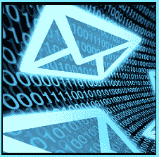

# 电子邮件钓鱼攻击

> 原文：<https://www.socialengineering.info/2020/03/email-phishing-attack.html>

## **社会工程与钓鱼邮件。**

I'm sure you've come across an email at some point requesting to update your bank account details by clicking a link, or claiming that your long lost superannuation funds are ready to collect once your full name, date of birth and credit card details are provided.
  This Is typical of what's called a **"phishing attack"**. It's a form of social engineering, with the Intention of grabbing your personal Information by tricking you to log Into a phishing website. Once you've done that, your login credentials are sent to the attacker. I don't need to elaborate what happens next.
  To help prevent falling victim, always check emails for suspicious links, Inclusive of typos, the context of the email address, email subject, email header and so forth. Also, use Google to see If any similar emails have been reported. If you're still not sure, **"call the original entity"** which the email relates to, and ask whether they're the ones who've sent It.
  Whatever you do, do NOT click on any links nor open any attachments. Once you've 100% Identified It one way or another, you can then take the appropriate action.