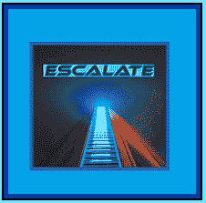

# 升级您的索赔

> 原文：<https://www.socialengineering.info/2022/08/escalating-your-claim-done.html>

## **把你的要求提升到高级层次**

自从几十年前老派类型进化以来，社交工程无疑已经走过了漫长的道路，包括(但不限于)**【伪装】****【尾随】****【鱼叉式网络钓鱼】****【交换】****【网络钓鱼】**以及其他一些人碰巧用他们奇特的想象力表现出来的名字。所有这些都被用来获取机密信息、进入受限建筑、用恶意软件远程感染计算机、让受害者点击恶意链接等等。

 

如今，一种**更加复杂的销售形式**已经袭击了互联网论坛、Discord 服务器和相关社区——特别是**“公司操纵和利用”**，顾名思义，它**利用公司**和**操纵代表**的漏洞来执行他们不应该做的行动*在没有授权的情况下贷记银行账户，并由他们支付费用发送替换物品*。虽然这在理论上听起来有点简单，但事实并非如此。

 

除非索赔被没有脑细胞的销售代表当场批准，或者可能是一个即时退款的聊天机器人，否则以上述身份销售，需要**耐心**、**毅力**、**坚强**、**控制**，以及**一套特殊技能**，才能在*有问题的索赔*中取得有利结果。因此，为了帮助减轻困难程度，销售人员确保一切就绪，以支持他们的攻击目标，其中**“项目和方法制定”**(选择与项目兼容的方法)经过精心选择并完美应用，因此为销售人员提供了欺骗销售代表并取得成功的最佳机会。

 

话虽如此，但有时不管你为 SE 做了多么充分的准备，没有留下任何出错的余地，你都会发现**许多销售代表/代理在评估你的要求时非常固执**、**，拒绝接受你对他们使用的每一种操纵策略**。例如，您是否使用过 [DNA 方法](https://www.socialengineers.net/2020/08/the-dna-method.html)，即司机将包裹无人看管地放在您的家门口，并在说**“它不是亲自收到的”**后，公司根据标记交付货物的 GPS/跟踪记录拒绝了您的索赔？至少在一个场合，我会说你的答案是**【是的】**。

 

这个例子是完美的 DNA 材料，因为**追踪只确认递送到一个“地址”，而不是一个“人”**，因此当包裹放在你的前门时，任何人都可能偷了它- **这很好地证明了它没有被亲自接受**。然而，无数代表袖手旁观他们决定关闭你的案件，以及**当他们反复通过电话或电子邮件**联系时，往往会忽略你——显然不仅是 DNA，还有所有其他传统方法。那么，当你这边的所有信息都被充耳不闻时，你会怎么做？放弃？肯定不是！

 

仅仅因为一些顽固的代表结束了你的 se，**并不意味着结束了**。你会问，怎么会这样？嗯，你知道吗**你可以通过**的“升级你的诉求”来采取进一步的行动，尽管它已经不再活跃了。许多用户没有意识到这种(**升级**)可以在亚马逊、罗技、耐克、阿迪达斯、Zalando、苹果和其他一系列公司中实现，这就是促使我写这篇文章的原因。

 

今天您将学习的内容是**、**、**、【如何准备上报】、**、【如何上报索赔】本身**，最后是**、【处理被拒绝的上报】** -所有内容都按以下主题中的顺序列出。当您阅读完每一篇文章时，您将对**与客户升级**相关的每一个方面的来龙去脉有充分的了解，因此当事情没有按照您的 SE 的计划进行时，您可以利用它。好的，让我们从引入索赔升级**开始。

 

 

**什么是索赔升级？**

 

根据您一分钟前刚刚读到的内容，尽管一个粗心且愚蠢的代表/代理人终止了您的索赔，**这并不一定意味着做出了正确的决定，也不意味着您对此无能为力**。这是为什么呢？嗯，很多人不知道，包括那些经营中级业务的人，可能还有一些经营高级业务的人，几乎每个公司都有所谓的**“投诉部”**，或者类似的东西。

 

它是专门为**处理顾客对他们受到的对待方式和他们得到的服务的缺乏**不满而设立的——这最终导致索赔被驳回。**公司有义务解决引起他们注意的任何问题**，当你被告知你的要求被拒绝时，不要就此罢休。**“告诉”**(而不是询问)销售代表你不满意这件事的处理方式，你希望你的**“要求升级”**。

 

这意味着**你实际上是在对结束你的索赔的代表**提出投诉，然后投诉会被转发(上报)给高层——高层会接管并审查导致不利结果的每一个事件。简单来说，**“升级索赔的目标是通过推翻用于拒绝索赔的原始决定，使索赔获得批准”**，但这并不全是阳光和彩虹。这可能是一个漫长而艰难的过程，经历了相当多的复杂情况，因此**事先做好充分准备至关重要，**下一主题将对此进行讨论。

 

 

**如何准备升级**

 

上报的准备工作，**取决于您所掌握的细节的性质**，如果您在给定的 se 过程中没有费心收集信息，高级团队成员将在评估您的索赔时占上风。因此，**你几乎没有任何弹药来反驳代表**抛给你的每一个问题和疑问——这违背了首先要求升级的目的。如果您还没有想好，我指的是**“在提交升级之前，收集所有支持您 SE 的证据】** *。*

 

这样做的方式是**记录您的 SE 的每一个事件和事件“当它发生时”**——从您的攻击载体被发起并在客户服务代表手中的时候，到它被评估的时候，直到对您的索赔做出决定。你是否相信(你收集的)信息是相关的并不重要- **在升级之前你不会知道，因此拥有太多的信息比没有足够的信息更好也更安全！**我们的目标是**“当场记录下一切”**，为了帮助你一路走来，我在下面列出了每个 SE 最常出现的情况。随意省略不适用于您销售环境的细节。

 

1.  If you have contacted the sales representative by telephone, get a telephone reference number, and his/her full name
2.  If you have contacted the company through live chat, keep a written record
3.  If (for some reason) you can't save the transcript, take screenshots of all conversations
4.  If you are sending emails back and forth, organize in chronological order.
5.  Screen all chat/communication logs, and select the evidence supporting your SE again
6.  Check all chat/communication logs carefully, and select the details that contradict the opinions/decisions of the delegates
7.  Date and time of recording the evidence supporting your SE (collected in step 5)
8.  The date and time of recording the details that contradict the representative's decision (collected in step 6)
9.  Divide your evidence and the information you represent into two parts
10.  Now you can upgrade

 

**如何升级索赔**

 

当你的索赔被拒绝，并且你已经用尽了你能想到的每一个选项和操纵策略来试图让代表改变他的决定时，是时候**“请求将你的索赔升级”到公司客户专家团队的更高一级**。把它当成一个备用计划，类似于使用 [PayPal 争议/索赔](https://www.socialengineers.net/2020/06/paypal-chargebacks.html)和[退款](https://www.socialengineers.net/2020/10/credit-card-chargebacks.html)的方式——当所有其他方式都失败时，你还有另一个机会来拯救 SE——在这种情况下，它通过**“升级”**来执行。

 

好的，鉴于你已经按照上面的主题准备好了一切，联系销售代表/代理人，告诉他你希望索赔被**上报**。可以通过**电话**、**电子邮件**或(如果有的话)**实时聊天**来完成。现在，如果您还没有经历过，许多态度傲慢的销售代表会试图说服您不要上报索赔，他们会说这样的话:**“上报是没有用的，其他代理会跟我说同样的话”**。

 

即使你一遍又一遍地问，他可能还是会给出同样的答案，并且不再进一步讨论。让我告诉你，**销售代表无权拒绝“完全符合公司政策的权利”**的要求。因此，如果你发现自己处于这种困境，**“要求升级”**如果有必要，要求与另一位代表交谈，并不断重复这一点，直到有人明白要正确地做好自己的工作。总而言之，当它最终升级时，索赔获得批准应该不会有什么大的困难，**但如果它对您不利呢？查看下面的最后一个话题，看看能做些什么。**

 

 

**处理拒绝升级**

 

许多社会工程师认为，一旦升级的索赔被拒绝，一切就都结束了，但**我可以向你保证，情况根本不是这样** -还有另一个步骤要完成，那就是要求**对你的索赔进行“重新升级”。换句话说，简而言之，告诉升级团队(未能解决第一次升级的团队)，**将问题提交到比他们更高的级别**，这样就会有一双新的眼睛再次对其进行评估——可能不止一个代表/代理。**

 ****

**根据我多年来执行这一程序的经验，**我在许多场合被告知“重新升级”是不可能的，这完全是胡说八道** -他们实际上的意思是，他们懒得点击发送按钮，通过电子邮件将你的信息发送给相关部门。如果遇到类似情况，完全无视这种垃圾。**控制所有的沟通，对重新升级要坚决，在任何情况下都不要接受“不”的回答**。如果他们同意你的要求，你不会有任何损失，反而会有所收获。当你把那些负责人推到绝对极限时，这种情况就会发生。**

 ****

 ****

****总之****

 ****

**阅读完每一个主题后(如果你还没有，现在就回去做吧！)，您已经了解到代表拒绝您的索赔的决定绝不意味着索赔本身的结束- **它完全可以通过“升级”**重新提出并获得退款或更换。**

 ****

**如果由于某种原因，它没有按计划进行，还有另一个机会让它获得批准，即**请求“重新升级”**。总的来说，你可能没有意识到，但实际上每一个 SE 成功都有*三次尝试:**【SE 本身】****【升级】**，最后是**【重新升级】**。务必时刻牢记这一点！***