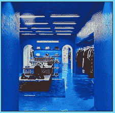

# 店内销售

> 原文：<https://www.socialengineering.info/2020/08/in-store-seing.html>

## **如何对店内零售商进行社会化改造。**

Most of the websites that you come across on the Internet regarding the how-tos of social engineering, pertain to gathering confidential Information, such as usernames & passwords from a given employee, or Infecting their systems with a malicious file to steal their credentials stored on their computer. If you've read the articles on this blog or have been SEing for quite a number of years, ***you'd predominantly SE companies remotely- namely online with the Intention of obtaining refunds or replacements***. No doubt all this Is true and correct, but there's yet ***another way to social engineer *** that works on a similar principle as online retailers (such as ASOS or John Lewis), and that's by *physically attending the store * that's often referred to as an **"In-store retailer"**.
  I've been heavily Involved In many social engineering communities where discussions of various types of SEing methods take place, and If you're much the same as myself, you'd know that **"In-store SEing"** Is rarely exchanged between users. This Is what's prompted me to write this tutorial- to give you a full understanding of what It's all about, and to also demonstrate ***the best methodologies to ensure your SE works In your favor***. So what exactly Is **"In-store SEing?"**. Let's check It out now.
  **In-Store SEing Defined:**
  The concept of this type of social engineering Is very similar to ordering an Item from an online company, having It delivered and then SEing the representative for a refund or replacement- ***with the main exception that "you return It and SE It In person"***. For example, have you ever received a gift that wasn't to your liking, and then drove to Walmart or Target and returned It for an exchange or a store/merchandise credit? I'd say your answer Is most likely **"Yes"**. In-store SEing Is based on the same events, however ***you don't return your Item at all***, but rather keep It by using a few clever tactics.
  The only drawback, Is that It's limited to only three methods at the most being the **"wrong Item received method",** the **"missing Item"** and the **"sealed box method"**. Although you don't have many options to choose from, ***It's still equally (If not more) effective as SEing companies on the net***. I will cover each of the aforementioned methods separately a little further down this article, but first and foremost, I'd like to elaborate why other methods are not appropriate as per the topic below.
  **Methods That Cannot Be Used:**
  You cannot use other traditional methods such as the **"DNA"** (Did Not Arrive), because ***you'll be returning It In person***, therefore a claim cannot be made to the company for not receiving the package. Moreover, the **"boxing method"** Is also out of the question- due to the fact that ***you're physically taking the Item to the store *** and not sending It with a carrier. The same applies to the **"similar Item method"**. Why? Well, If you replace the original Item (that you purchased) with something that looks quite the same, when you return It, ***If they check and*** ***scan It, they'll see that It's not theirs *** and your SE will fail.
  Now all this may sound like a very difficult process and you're probably thinking that the SE Is not worth the time and effort, but I can assure you that It's nothing of the sort. ***To make In-store SEing as simple as possible for you, I have segregated the three suitable methods***  In a very clear and easy to follow manner, whereby you can pick the one that you're most comfortable and confident with. So without further delay, let's rip Into each one- starting with the **"wrong Item received"**.
  **Using The Wrong Item Received Method:**
  As Its name Implies, this method Is commonly used by social engineers to say that ***the Item they've purchased and had delivered, was different to the one they ordered- hence "wrong Item received"***. Of course, they did In fact receive the correct one, but they're obviously stating otherwise for the purpose of SEing the company for a refund. In terms of the method Itself, when social engineering companies to the likes of Amazon, It has a very good success rate and Is no different with In-store SEing. However, ***It does require careful and strategic planning- you cannot just choose any wrong Item and expect It to work***. Why Is that you ask? Well, If you throw anything (In the box) that you have lying around the house and take It back to the store, for the most part, ***they'll scan It (If It still has a barcode) and see that It doesn't belong to them, thus your SE has failed***. When you think about It, It's pretty much common sense.
  To ensure a hassle-free process, buy something **"from the same store using cash and only costs a few dollars"** to the Item you'll be SEing. As such, because you're not using your credit card, they cannot link the purchase to you **"personally"** and given It's extremely cheap, you'll be making a significant profit. Now In addition to this, be sure **"the wrong Item Is from the same department as your original Item"**- as this give the Impression that It was the manufacturer/factory that made the error. For Instance, let's say you'll be social engineering a Dyson compact vacuum cleaner that's worth around 600$. ***When you buy the wrong Item, grab It from the "same section" (namely the "home appliances/electrical") *** such as a cheap mini fan heater worth 20$ or so. Not only does this seem like the Incorrect product was packed In the box, but most Importantly, you'll have "580$" more In your bank account.
  **Using The Missing Item Method:**
  Yet again, this Is another method that speaks for Itself, even If you've never heard of It before. As you've most likely gathered, you simply say that ***when you arrived home and opened the box (that you bought from an In-store retailer), It was empty***. That Is, It did not contain the Item you paid for. Now there's a couple of ways you can use this- one Is to claim that **"parts where missing"**, or that the **"entire product"** was not In the box. If you opt for the latter, don't choose something that's huge, like a microwave- It's extremely unlikely that the manufacturer forgot to pack an Item of that size and weight.
  With regards to ***"parts were missing", It needs to warrant the nature of the Item and that the missing part Is the most expensive.*** For example, If you've purchased an external **"SSD"** (Solid State Drive), It will come packaged with the Instruction manual, USB cable and obviously the drive Itself. This justifies that bits can pieces can In fact be missing, ***and you'd claim that "only the SSD" was not Included In the box***. You can get a USB cable for only a few dollars from any computer store, so this will certainly be worth your while. There Is no right or wrong as to which option you choose (entire Item or missing parts), but rather based on the one ***you're most confident with.***
  **Using The Sealed Box Method:**
  Going by personal experience, I'd say this Is the most effective method to use with In-store social engineering- specifically due to **"the employee not checking the actual Item on return"**, however the preparation of the SE must be flawless. More on this shortly. As opposed to the methods already mentioned above, ***you do not need to be selective with the type of Item "that you're going to return" when using the "sealed box method"***. The objective Is to buy something that you plan to keep, replace It with anything of the same size and weight and then return It In Its original condition for a refund. ***Because the box Is sealed and (appears to be) untouched, It does not give reason to the employee to check what's Inside***, hence they'll put It back Into stock.
  For this to work, you ***must be systematic with how you open and reseal the box***- as any signs of tampering can raise suspicion, thereby your SE may ultimately fail. Rest assured, I've got you covered. Given boxes are packaged and sealed In many different ways, It's not possible to be precise with the methodology used, so what you're about to read Is based on general terms. *It's human nature for people to Inspect goods at their opening point (predominantly at the top), thus "carefully" open the box at the bottom*- making sure that you do not damage anything. Next, take out your purchased Item and replace It with anything of roughly the same weight.
  Now this Is the most Important part! ***Seal It without any Inconsistencies whatsoever***- In the exact fashion as per Its factory state. It's good practice to compare your finished job with an original Image. You can Google It, or take a photo before you start and **"If they're an exact match"**, then your SE Is good to go. When you physically return It to the place of purchase with your receipt (and within the refund time frame), **"simply say that you've received one as a gift"*, and don't have the need to keep two products of the same type.*** 
  If you've followed this guide all the way through, then you can't go wrong. All the methods have been taken care of, but they're completely useless **"If you don't execute your attack effectively"**, which brings me to my next point. I shall provide you with an ***In-store social engineering example***, that you can alter and apply It accordingly to your very own SE, so let's see how this Is done.
  **The In-Store SE In Action:**
  In this scenario, I will be referencing the social engineer from a third-person perspective and not yourself. It details everything from first entering the store, to the time of when the SE succeeded. For the purpose of this article, *I will be using the "sealed box method"*, whereby the box will be scanned without (obviously) checking what's Inside and the refund will be processed. This Is an extremely simple procedure, ***so what I've done Is created a very manipulative approach that's aimed to ensure that the SE will head In the right direction from beginning to end***.  Furthermore, It will give you a good understanding of how SE'ers manipulate their target In a physical environment. Let's begin.
  The social engineer, knows that the **"timing of the attack"** Is of the utmost Importance, so he's decided to ***attend the store*** ***late on a Friday just before close of business***. As a result, employees are exhausted from the working week (and not as alert), and are In a hurry to balance the day's takings and go home In readiness for the weekend. **"Observation"** ***Is also an Integral part of every physical SEing attack vector,*** of which the SE'er knows all too well, so he'll be utilizing this the moment he walks through the door.
  Upon entering the store, he checks out exactly who's working at the customer service desk, and ***"notices a young female In her teens who appears quite stressed due to the Influx of customer claims"***. Perfect! As the social engineer provides her with the box and requests a refund, he compliments on her beautiful nails, hence ***distracts her attention away from the job***. As he hands over his receipt, he purposely knocks over the EFTPOS machine, leaving the poor female to pick up the pieces. 
  **"Given mixed emotions of compliments, stress and agitation are going through the mind of the female worker"**, she's not focusing on the job at hand and as such, accepts the box, quickly scans It and Immediately Issues a full refund thereafter- no questions asked. The SE'er apologizes for his carelessness, thanks her kindly, and leaves the store on a good and successful note. Mission accomplished with Incredible ease!
  **In Conclusion:**
  If you've been ***solely SEing online companies *** by using all traditional methods, I'd say It's safe to assume that what you've just read In the social engineering example above, Is totally different to how you'd expect to execute your attack. You may find this a little hard to believe, but **"In-store SEing Is a lot easier compared to doing It to the likes of Argos, Logitech etc"**. The main reason for this, Is because there's no need to deal with representatives who give you the runaround, by passing your call/chat from one rep to another or not replying to your email messages and so forth. ***In-store SEing happens there and then***- you walk In and walk out with your profit In no time at all.