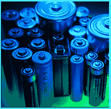

# 漏液电池法

> 原文：<https://www.socialengineering.info/2020/06/leaking-battery-method.html>

## **如何有效使用漏电池法。**

Social engineering methods and techniques pertaining to Item refunds and replacements, each differ In the way they're utilized against companies. Whilst some methods, such as the **"DNA (Did Not Arrive)"** are universal and can be used with just about any Item & company, ***others are very specific, thus the social engineer must take extra care when selecting a suitable Item***. One method that's part of this equation, Is the **"leaking battery method"**.
  How so? Well, stating the absolute obvious, ***you cannot use It against an Item that does not contain batteries to function, can you?***  This may sound like I'm being too conspicuous, but you wouldn't believe the number of SE'ers I've come across who've used the method when SEing ***a computer hard disk or solid state drive!  ***Perhaps lack of knowledge and awareness was the cause? I don't know and quite frankly, I don't care. **"My objective Is to educate"**, and not try to correct those who lack common sense and good judgement.
  Whilst the **"leaking battery method"** Is limited In a way, by no means does this Indicate that It's not as effective as the traditional ***boxing  ***or the ***wrong Item received method.*** In fact, for **"high value Items"** that warrant Its usage, It has a better chance of success, namely because ***most other methods can be difficult to justify against the (high) cost of the Item***. So what exactly does this method Involve? I'm glad you've asked! Let's check It out now.
  **The Leaking Battery Method Defined:**
  When social engineering any Item that requires batteries to function, as Its name suggests, ***SE'ers use the method to claim that the Item they've ordered from a given online retailer, was delivered with Its batteries leaking***. Of course and as you're aware, nothing of the sort has happened- It's simply suggesting that the Item was not received In Its original state, and that the company Is responsible to fulfill their part of the deal, by offering a refund or replacement. It's a simple, yet a very effective method for the reasons stated below.
  **Why The Method Is So Effective:**
  What makes this method so effective (and In support of my previous statement a couple of paragraphs above), Is that *there Is no way for the company or their carrier, to prove that the batteries did not leak during transit*. Moreover, ***who's to say that the battery wasn't a manufacturer's defect?***  Given the box Is sealed without any visibility of Its contents, they cannot solidify that the Item was packed and delivered unscathed. So you can clearly see that this method WILL work with careful and strategic planning **"against a suitable Item"**, which brings me to my next point.
  **When To Use The Leaking Battery Method:**
  For the purpose of this article, I'll use a **"Laptop"** as the Item you're planning to social engineer. This method, Is only as good as the suitability of the Item that It's used against. For Instance, when you're SEing the laptop and opt for the **"DNA"** or **"wrong Item received"** method, then due to the nature of such methods ***and the cost of the lappy***, It's almost guaranteed that an Investigation will be opened. As such, not only will details be cross-checked with the carrier (DNA-wise), but the company's Inventory (wrong Item received-wise) will also be examined- with the objective of trying to justify the reasons responsible for your claim.
  On the other hand, using the **"leaking battery method"**, will simply result In the company requesting photos be taken that clearly show the defective battery (and other Identifiable details such as a hand-written note, serial number etc), or they'll ask to return the laptop to Inspect the fault. Either way, an Investigation will not be opened which Is a relief to the SE'er- ***as some can be a very lengthy and arduous process, namely due to the cost of the Item***. Furthermore, a request for a **"police report"** (for the DNA) Is almost a certainty and In some cases, the company will ask for a **"statutory declaration"** or an **"affidavit"**. The leaking battery method totally avoids this!
  **How To Respond With The Leaking Battery Method:**
  There are quite a number of ways to circumvent company requests when using the leaking battery method, however this article has already exceeded Its reading time, hence It's beyond the scope of documenting each and every methodology, so I'll keep this very brief. ***You will have all the Information required to formulate your own plan***, so you don't need me to spoon-feed you.
  What I will say Is this. In terms of the company's request for photos, stating the obvious, you can use either the **"corrupted file method"** or simply **"Photoshop them"**. With regards to sending the laptop back, either ***SE a company who uses a carrier that will not accept dangerous/hazardous goods as part of their policy***, or use the good old **"Disposed of the Item"** method, whereby you say ***you've thrown the laptop In the trash for health & safety purposes.*** Both methods are appropriate and certainly equally effective.
  **In Conclusion:**
  I've experienced a lot of users who neglect to use the leaking battery method, due to their belief that It's too complex, or that they cannot manipulate the company and/or carrier as they do with other traditional methods. Let me tell you (and as you've already gathered), that ***Its manipulation Is extremely simple and has a very high success rate***. 
  Moreover, for high value Items such as the example of the laptop, **"It avoids Investigations altogether"**- the main reason being that It's not a company nor carrier-related Issue, but rather (seemingly) ***a manufacturer defect***  right from the get-go, and the defect Itself was ultimately responsible for leakage during transit.