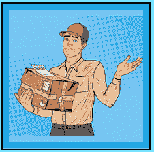

# 缺失项篡改方法

> 原文：<https://www.socialengineering.info/2021/09/missing-item-tampered-method.html>

## **箱子/包裹被篡改&物品丢失**

关于利用承运商合作伙伴提供送货服务的社会工程网上商店，其目的是**欺骗他们的代表赊账或由他们支付费用发送替换物品**，从而让用户保留原产品。为了成功做到这一点，**必须有一个适当的“计划”来完全支持攻击载体**，并在整个 SE 期间将它引导到正确的方向，在社会工程的说法中，**“计划”**被称为**“方法”**。**这基本上是一套说明，告诉销售工程师应该去哪里**，以及如何实现您想要的结果——退款或更换。

 

如果你是销售领域的新手，也就是**“公司操纵和剥削”**，我可以肯定地说，你对销售方法知之甚少，所以我会用一个你能理解的场景来解释。假设你买了一个折叠的大型电脑桌，里面有抽屉、搁板、橱柜等。综合起来，你将需要**“组装说明”，它将指导你实现目标**的每一步，但如果这些说明碰巧丢失了，你将要么无法完成任务，要么在试图完成你的项目时会有一段非常困难(和漫长)的时间。

 

同样的原则也适用于社会工程。根据上面的例子，**“组装说明**”就是**“方法”，如果它不适合项目的性质，或者你完全忽略了它，那么 SE 就会失败**。当然，许多系统工程师当场获得批准，但这是因为销售代表完全缺乏常识(或者可能与聊天机器人打交道)，而不是那些遵守公司协议和指导方针的人**在评估索赔时严格按照书办事**。在这种情况下，当务之急是将方法制定得尽善尽美，这也是本文的主题，**“漏项篡改法”**当然也不例外。稍后会有更多的介绍。

 

如果你是从一个中级或高级销售人员的角度阅读这篇文章的，这些销售人员一直在用传统方法打击 John Lewis、Lenovo、Asos 和 Amazon 等公司，如 [DNA](https://www.socialengineers.net/2020/08/the-dna-method.html) 、[收到错误商品](https://www.socialengineers.net/2020/07/wrong-item-received-method.html)、[密封箱](https://www.socialengineers.net/2020/05/the-sealed-box-method.html)、[装箱](https://www.socialengineers.net/2021/02/the-boxing-method.html)等，你会对它们的结构非常熟悉，但我会说你从未听说过**“缺失商品篡改方法”**，对吗？我也这么想。这是因为**我是这种方法的作者，我可以自信地说**这是最有效的方法之一，你会很乐意使用**。那么到底什么是漏项篡改法呢？在我讨论它之前，你需要清楚地了解古老的**“缺失项方法”****——因为这两种方法有着非常密切的关系**。所以不要再拖延了，让我们开始吧。**

 

**什么是缺项法？**

 

鉴于这种方法**是丢失项目篡改方法**的基础，熟悉它的结构并为你的攻击媒介做好准备是至关重要的，所以一定要从这一点开始吸收每一个单词。好的，顾名思义，**“遗失物品法”**被用户用来表示**他们从网上零售商处订购的物品，在承运人交付后打开包装/盒子**时遗失了。例如，我们将假设你从亚马逊(除了亚马逊还有谁)购买了**“一根内存”**，并通过他们的运营商服务将它送到你家。在**【打开盒子】**时，你会联系亚马逊并告诉代表里面什么都没有，这意味着**Ram 本身丢失了**。

 

或者，你可以说当你**打开包裹时，里面什么也没有，意思是**盒子和撞锤不见了**。当然，你确实收到了你的货物，但你是为了销售的目的才这样说的。请允许我详细说明这两种方法是如何工作的。**当*单纯使用漏项法*时，不是“仓库错误”就是“制造商错误”**。前者(仓库错误)，是当你打开**【包装】**里面什么都没有。也就是说，**箱子和里面的东西没有被封装**。这种情况可能发生在仓库管理员挑选您的订单时(可能还有其他几个人)，他完全忘记从货架上拿您的商品，或者他自己或者包装团队，**密封里面什么都没有的包裹，然后再发货**。**

 ****

**就**制造商错误**而言，你会声称当你打开**【盒子】**时，你的物品不见了。本质上，**是制造商没有将物品放在盒子**中并将其发送给公司，因此**只将盒子**发送给你。信不信由你，这两种错误发生的频率比你想象的要高得多。**在每个仓库环境中，错误都是不可避免的**，尤其是当它们被客户订单淹没，并且必须在业务结束前满足截止日期时。制造商的失误也是如此——在质量控制团队的最终检查中，事情可能会被忽略，因此**货物离开工厂时，箱子**中没有相应的物品。**

 ****

**无论你选择两个事件中的哪一个(仓库或制造商失误)，当**你坚持你的说法，说物品不见了**，两个事件都同样有效。现在，必须在方法中实施的一个关键要素是**“项目的权重”** **，如果您完全忽略它，您的 SE 很有可能会失败**。那么为什么体重如此重要呢？嗯，除非代表已经没有脑细胞了，没有问任何问题就批准了你的要求，**这种方法的本质保证了** [调查](https://www.socialengineers.net/2020/04/company-investigation.html)，如果你的物品相当重，**称重时就会被发现**，因此它不可能丢失，事实上是被正确挑选、包装和发送的——这将导致 SE 失败。**

 ****

**你会问，什么是安全的工作重量？根据经验，我总是建议**不要超过“120 克”**，这实际上是将 SE 推到了它的绝对极限。如果你不超过这个权重，大多数 SE 会对你有利，但我是那种不会放过任何机会的 SE 'er，会覆盖每个角度，所以**我会提供一个成功率超过 95%的权重**。在可能的情况下，我强烈建议坚持物品本身(净重)的限制**“40 克”，或者物品的包装(毛重/运输重量)&**。这就是*缺失项方法*的基本工作方式，现在你理解了它，你将能够很容易地适应**“缺失项篡改方法”**，所以让我们接下来检查一下。**

 ****

****缺项篡改方法是什么？****

 ****

****“缺失项目篡改方法”**与你刚刚读到的方法基于相同的原理，但在执行方式上略有不同。这意味着，这种方法的目的不是让仓库或制造商对没有收到你的产品负责，而是让它看起来像是**“承运人司机，或其他任何处理你的包裹的人”，在运输过程中篡改了它**。因此，**您的物品“就在”**之前被盗，包裹被送到您的地址、[投递点](https://www.socialengineers.net/2020/09/using-drop-house.html)或任何其他用于接受交付的地点。现在，与丢失物品方法(如上)不同的是，当“仅使用丢失物品篡改方法”时，**重量并不重要(但仍然相关)，也就是说，因为你给人的印象是有人篡改了你的包裹并拿走了你的物品**“当它在前往你的地址/投递点的途中”**。****

 ****

**因此，即使公司反复核对了承运商仓库记录的重量，并认为你的物品被装在包裹里，这也是没用的。为什么？因为**“您的物品在交付给您的过程中离开仓库后，在运输过程中(似乎)被盗”**。但是为了安全起见(特别是如果展开调查)，**保持重量< 120 克，最好是 40 克左右**。你很快就会明白为什么。正如前面所说，这是最有效的方法之一，但是**只有当你以一种有策略的、有计划的方式应用和执行它的时候** -我会在下面告诉你具体怎么做。您已经购买并收到了订单，大约 30 分钟后，您联系了销售代表，并告诉他当您打开包装盒/包装时，您的产品不见了。**

 ****

**现在，如果他问盒子上的封条是否破损和/或包装是否被撕掉，**不要马上说你注意到了篡改的迹象**，而是告诉他你会试着在垃圾桶里找到盒子/包装，一旦找到，你会马上联系他。当然，你不会做这种事- **这只是一种操纵策略，表现出你站在他一边，试图尽快解决问题！**那么为什么要使用这种方法呢？嗯，如果他们计划展开调查并检查重量(在这种情况下很有可能)**他们可能会批准你的索赔，而不需要你提供进一步的信息** -这就是为什么我说要把重量控制在 40/120 克以内。但是如果他们没有(批准)并且还在等待你的回复，**这时你就可以说你已经找到盒子了**。**

 ****

**简单地告诉销售代表/代理，因为你是从反面打开的，所以你注意到工厂封条没有完好无损，看起来已经损坏。**除了你不得不做的事情**，不要说更多的细节——只需要证明盒子不是以原来的状态来的。**总是让他问问题**，如果他询问收到的包裹，就说包裹的一边用胶带粘着，然后就这样- **不要再详细说明了**。**“你”**在整个索赔过程中所做的，是你给了阿瑟**“双重成功的机会”**。**第一次是公司通过调查做出决定**，如果他们在那个阶段不批准，**第二次机会是盒子/包装上的篡改迹象**。这两个操纵事件使得丢失项目篡改方法如此有效！**

 ****

****缺项篡改法的优点:****

 ****

****你使用的每一种方法都有其利弊**，无论你花了多少时间根据你所研究的公司的性质来制定它，以及有效地将其应用到你的兼容项目中，**它都会包含一定程度的弱点**。因此，必须**“通过评估你的方法** **的优点来关注你的方法的所有优点”**，以及当你的 SE 正在进行时，如何将它们用于你的优势。当你知道一个给定方法的来龙去脉时，分离和识别支持你的 SE 的关键元素一点也不困难，这实际上是一个常识和良好判断的问题。**

 ****

**举个例子，也是本文的正题，你很清楚**遗失物品篡改法表明有人(可能是承运商司机)撕开了你的箱子/包裹，拿走了你的产品，你的“交付”被“收到”了，但没有货物**，那么你认为这种方法在这种情况下有什么优势？通过分析你刚刚读到的内容，用一分钟的时间进行逻辑思考。我通过引用两个关键词让你更容易理解——特别是**“交付”**和**“收到”**——因为这种方法是基于**交付**期间发生的事件，以及**收到**包裹/箱子时的情况。如果考虑所有相关变量，两个关键字(**交付**和**接收**)都很容易识别，对吗？我也这么认为。所以我们来看看每一种的好处。**

 ****

**很难确定运输途中发生了什么**

 ****

**关于公司如何管理他们的库存，即他们必须通过挑选、包装和发送每一个订单来满足他们的客户需求，并遵守他们的政策&指导方针，他们确切地知道他们在当地环境中正在做什么。然而**“他们的货物通过承运人的网络运输”**就不一样了，尤其是当一个包裹经过许多人的手，直到它最终到达目的地。当然，全球定位系统和跟踪信息证实了它到达了正确的地址，但是**实际上用什么来验证“当司机把包裹交给你的时候，你的产品已经被包装好了？”**。我来为你解答- **《一无所有》**。**

 ****

**将包裹送到给定的地址，并使用签名或跟踪细节标记为成功送达是一回事，但“最终确定包裹内容”则完全是另一回事。即使你的物品重量记录在承运人的货单上，并且公司试图用它来确认它是否装在箱子/包装中，他们也绝对没有办法提供确凿的证据证明你的产品“在离开仓库并在运输过程中”仍然在那里，并且应该直接到达你的场所。**

 ****

**很难，如果不是不可能的话，让公司毫无疑问地得出结论**你的包裹是“里面有你的货物”给你的**。 即使照片**清晰地**拍摄到包裹**(这种情况永远不会发生)，也不能确定**【里面是什么】**，因此** **公司/承运人无法证明它完好无损地到达了你家，这也是丢失物品篡改方法成功的重要原因。****

 ********

****OTP 在收到包裹时无效****

 ********

****您将要阅读的内容与任何特定的公司和运营商服务无关，可能会因地点和其他因素而异，因此**请务必将此作为通用指南**。好的，如果(例如)你正在通过使用 [DNA 方法](https://www.socialengineers.net/2020/08/the-dna-method.html)出售一件零售价值数千美元的高价值物品，那么很有可能需要一个**“OTP”**(一次性密码)来验证包裹不仅被**送到了正确的地址，而且被你自己或你的家庭授权成员**亲自收到。这意味着，动态口令将发送到您的手机或您帐户上注册的电子邮件地址，当司机到达时，您必须告诉/向他显示密码以接受您的包裹。****

 ********

****如果你不给他 OTP，他完全有权利拒绝将包裹交给你，因此会将它标记为未送达的托运。虽然对于那些拥有技能和知识的人来说，一次性密码可以相对容易地绕过**，但我继续遇到无数的社会工程师很难绕过它，因此在这种情况下避免使用 DNA 方法。关于**漏项篡改方法**，请放心，**一个 OTP 没有任何影响**。你会问，怎么会这样？嗯，**“收到一个包裹”**与**“它包含什么”**没有任何关系，因为你声称里面什么也没有，**OTP 不会以任何方式、形状或形式影响 SE** 。因此，当你处于这种情况下，继续前进，并遵守 OTP -它不能用来对付你。******

 ********

******总之:******

 ********

****为什么**遗失物品篡改方法**有很高的成功率(正如上面已经讨论过的几个话题)，是因为**公司无法控制包裹在承运商司机的递送路线**上时发生的事件。也就是说，当它存储在承运商的仓库中(刚刚称重后)，然后被装载到货车/卡车上，送到您的地址时，**它不会阻止任何人打开它并偷走您的物品**。****

 ********

****从道德社会工程的角度来看，这种方法的唯一缺点是它可能会给司机带来麻烦——因为它很可能会把责任推到他身上。话虽如此，**当包裹/盒子停在**的货车后面，司机离开几分钟，把一些盒子带到某栋大楼的接待区时，路人可能已经打开了包裹/盒子。不管是什么情况，你唯一关心的是，你没有收到你的物品- **都是因为有人(似乎)在包裹送到你家或** [投递地址](https://www.socialengineers.net/2020/09/using-drop-house.html)之前偷走了它。****