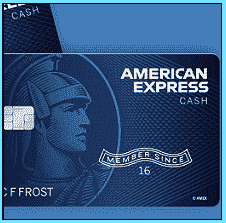

# 获取信用卡信息

> 原文：<https://www.socialengineering.info/2020/04/obtain-credit-card-info.html>

## **如何社会工程师完整的信用卡明细。**

Before I make a start, I'd like to point out that this article should **strictly be used as a means of educating yourself** with how social engineers manipulate their target to hand out their credit card Information. ***I do not condone nor encourage malicious behavior of any type.*** Now that that's out of the way, almost every adult has a credit card nowadays, that contains money to some degree, and used for online shopping and purchases made In person.
  Some social engineers, have no ethical and moral standards and obtain their victim's credit card details, with the Intention of using It to withdraw cash, purchase big screen TVs, wine and dine at fancy restaurants and the list goes on. The alarming part Is, If you're not careful, It's **"very easy"** to grab your credit card details.
  **Requirements For The Attack:**
  As with every SE, **"Researching the target"** Is paramount. As such, for this to work, the social engineer **"must have the victim's cell phone number"** and (obviously) establish that he does In fact **"own a credit card**". It's not difficult to grab the number, and the same applies with Identifying credit card ownership- not Its details, just **"ownership"** of the card. This can be done, by performing a **"seller > buyer transaction"** between the social engineer and his target, with any cheap Item that the SE'er has advertised online. He can then see the payment system used to purchase the Item.
  **The Basis Of The Attack:**
  The objective, Is that the social engineer will pretend that he's from the **"Card Services"** of a major credit card provider. Such services deal with stolen cards, **"fraudulent transactions"** and more. It's the latter (**fraudulent transactions**), that the SE'er will use to his advantage, and SE his victim for his credit card details. The SE'er will also have the **"background noise suited to a business environment"**- with phones ringing, computer keyboards tapping away etc. YouTube has heaps of clips like this! You'll be amazed at just how easy the SE Is. Let's see how It's done.
  **The SE Attack In Action:**
  The timing Is of the utmost Importance, so the social engineer calls his victim at 5:25 pm on a Friday. He knows that Card Services close for business at 5:30 pm, thus In case of suspicion, his victim cannot call them to verify any Information. 
  Upon calling his victim's cell phone, the SE'er says : ***"Hello, I'm Brad McPherson calling from (provides the card service company name) may I speak with (victim's name)"***. The victim says: ***"Yes speaking"***. The SE'er then replies: ***"We've Identified a potential fraudulent charge on your credit card, did you purchase a computer laptop to the value of $2, 575?"*** The victim Is now In a state of  panic and replies: ***"No! I did no such thing"***. The social engineer now has full control of the conversation, and will obtain his victim's credit card details.
  To conclude the matter, the SE'er says: ***"Rest assured, we'll take care of It. To reverse the charge and for verification purposes, may I have the name on the account, credit card number, expiration date and CVV number?"***. The victim happily responds with: ***"Sure thing (and reads out the details)"***. The social engineer assures his victim, that the transaction will be reversed within the hour, ends the conversation on a good note and now has his victim's full credit card details.
  **In Conclusion:**
  See how simple It Is to grab anyone's credit card details? The caller (social engineer) can be extremely convincing and If you're not alert at the time of the call, you can very easily fall victim to this type of scam. So how do you differentiate this from the real deal? Well, for one thing, **"you will never be asked to read your full credit card details over the phone".** You may be requested to verify a few details, so If you have doubts with whom you're speaking with, **"ask them to read back your Information"**. If they cannot do so, then It's a scam!