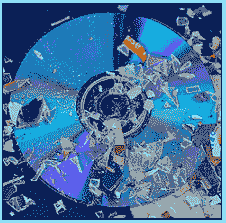

# 毁灭的证据

> 原文：<https://www.socialengineering.info/2021/03/proof-of-destruction.html>

## **请求销毁物品不归还。**

无论你当时是哪家公司的社交工程师，无论是一家员工不到几个人、每周净销售额只有几千美元的小型电脑商店，还是亚马逊这样规模的在线零售商，他们几乎一秒钟就能创造出这么多的销售额 ***他们都有处理退款和更换物品要求的协议*** 。即使你精心挑选了两家配送完全相同商品的公司，并使用相同的承运商来提供送货服务，也没有哪两家公司是彼此的翻版- ***它们在运营、履行客户订单和退货*** 方面会有一定程度的不同。因此，如果你从未接触过某家公司，*从“研究”他们如何处理&评估索赔*和退款理由&开始绝对至关重要。

自然，我指的是各个层面上的在线销售实体，其中有几个是**“steel series”**和**“罗技”**——我特意选择它们是有充分理由的。几分钟后你就会明白为什么了。现在，在考虑你的攻击计划之前，你必须对它们的结构有很好的了解，最重要的是， ***“对你计划销售的项目使用特定方法时要清楚地知道会发生什么”*** 。例如，如果您已经购买了一个 Arctis Pro 无线耳机，并打算使用罗技的**【故障项目方法】**，声称它不起作用，那么您是否知道他们的保修政策的要求，以及将产品记入您的帐户或免费发送更换项目需要做些什么？*如果你以前从未使用过它们，那么你根本不知道你面对的是什么*，因此对它们进行**研究的需求是最重要的。**

 ****

**如上所述，我提到了与技术相关的公司，因为 ***与亚马逊这样的公司相比，它们处理保修请求的方式往往不同——即使是在销售完全相同的产品时。*** 举个例子，因为亚马逊每天都会遇到大量的订单和索赔，所以不可能对 ***和*** 中的每一个进行彻底的评估。因此，为了减轻工作量，他们(有时)要么让他们的聊天机器人来做这项工作，并立即批准索赔，要么他们的代表也会这样做，他们会发出退款和更换，几乎不问任何问题。 其他规模巨大的公司，也以类似的方式经营。您现在知道为什么有些 se 执行起来非常容易了——他们根本没有人力来相应地解决每个问题。**

 ****

**话虽如此，但在大多数情况下，****他们确实遵守他们的协议"*** ，但即使这样，他们也不会要求您将*作为其索赔管理流程的一部分，这就引出了本文的目的。出于本教程的目的，我将提到两家以技术为基础的公司，它们是**“steel series”**和**“Logitech”**，即使在最好的情况下，也很难与它们打交道，即当它们要求一个**“POD”**，这是**“销毁证明”**的缩写。现在 ***并不是每个索赔都会发生*** 但是当它发生时，你必须做好充分的准备来有效地解决它。那么一个**【POD】**到底是什么，为什么要求呢？很高兴你问了！下面题目里来看看吧。****

 ********

******什么是毁灭的证明？******

 ********

****您将要阅读的内容可能因公司而异，具体取决于销售代表/代理要求您使用 POD 执行的任务类型，包括他们处理和加工的方式，因此 ***这应该作为一般指南*** 。出于各种意图和目的，我将称你为社会工程师。此外， ***这只适用于具有某种类型的功能来操作*** 的物品，如苹果 Airpods、电动牙刷、SSD(固态硬盘)等等。好吧，假设你购买了一个无线游戏键盘，收到它后，你打电话给公司，告诉他们它不能工作。当然， ***它运行得非常好，但是你说它不是为了销售目的*** 。长话短说， ***该代表并没有要求您将其寄回进行保修更换，而是要求提供一份“POD”——损坏证明*** 。****

 ********

****这意味着(正如它的名字所暗示的)，你需要 ***“以一种使你的物品失去功能的方式摧毁它”***——就你的键盘而言，打碎相当多的键，并从键盘上摔下几块碎片。从公司的角度来看，这样做的原因是 ***确保您的缺陷产品完全无用*** ，从而防止您伪造索赔。为了证实它确实已被销毁，销售代表将要求您提供证据，通过 ***“拍摄一张清楚显示损坏物品的照片”*** 以及(如果适用)序列号和设备旁边的手写说明- ***，所有这些必须在照片*** 中可见。****

 ********

****当您满足这些要求并将其作为附件通过电子邮件发送给代表/代理时，将会发送替换物品。有时，他们可能会要求 ***“拍摄一段视频并上传到 YouTube”***然后将链接发送给他们，但不要担心，我已经在本文结尾的标题**“使用损坏的视频方法”**中写了如何绕过这一点。请注意，每个 se 都是根据具体情况而定的，因此 ***“以上只是销售代表对 POD 的要求的一个示例”***——您的 SE 显然会有所不同。****

 ********

****好吧，在我的日常销售活动中，我不断被其他销售伙伴问及，为什么该公司会麻烦地向一个给定的销售伙伴 ***索要一个 POD，但对随后的销售伙伴*** 却完全不予理睬，虽然没有硬性规定来证明他们的行为，但一个原因是 ***“该商品的价值不值得将其寄回的运费”*** 。如上所述，通过电子邮件接收文件是免费的，因此评估索赔是完全合理的。显然，你想让你的物品保持原样，并获得免费更换，因此你需要操纵销售代表并绕过 POD，但在我开始之前， ***知道“什么触发了它”*** 非常重要，所以我们现在就来看看。****

 ********

******什么触发毁灭证明？******

 ********

****无论您目前使用的方法或计划在未来的 se 中使用的方法如何，在您不知道的情况下， ***“每一个都会触发一个或多个事件”*** 这些事件要么有利于您取得成功，要么在您的 SE 进行过程中使事情复杂化。例如，如果您使用了**“DNA”**(未到达)方法，声称您没有收到承运人交付的包裹，由于该方法的性质，几乎在所有情况下都会 ***【触发调查】*** ，并且(很可能)会导致 ***【向警方报案】*** 。如果你还没有经历过这些，当你使用 DNA 的时候，你会经历的。请放心，没有必要恐慌-这只是公司协议的一部分，以推进您的索赔。****

 ********

****同样可以说是 ***触发*** 销毁证明请求的方法，即**【故障项方法】**。这是用来说明你所购买的东西，比如电动剃须刀，不能用了，销售代表/代理会进行一些常规的故障诊断步骤，以确保你的东西确实有缺陷。在这个过程中，你可能会被问到类似于**“它是一夜之间充电的吗？”**或**“插上电源后，您看到 On 按钮附近有灯亮吗？”**和/或也许**“当你打开它时，你能听到任何声音吗？”**以此类推。这些问题用于确定它是否完全失去功能，如果是，它将满足保修更换，并且在这个阶段，当(由销售代表自行决定) ***出现“损坏证明”*** 。当这种情况发生时，有许多方法可以避开 POD，我在下面的主题中逐一介绍了这些方法。****

 ********

******如何绕开一个吊舱:******

 ********

****这是一个常识问题，你不会因为代表要求你销毁你正在出售的物品就这样做，因此 ***你需要寻找替代措施绕过 POD 而不引起怀疑*** 。可供选择的选项不多- ***其中一些比其他*** 更有效，但尽管如此，这并不是说每一个都不行。我已经概述了每个选项的利弊，所以选择一个你最舒服的，更重要的是，**充分利用它的潜力。让我们从 ***【损坏的文件方法】*** 开始。******

 ************

******使用损坏的文件方法******

 ************

******顾名思义，**“损坏文件方法”**用于通过使用类似的在线服务[来损坏给定文件，目的是规避验证文件内容的需要——在这种情况下，查看销毁证明。它的作用是使文件不可用，无论代表如何努力打开它，它都不会执行。毫无疑问，你会被要求再发送一次，这样做，但 ***“以不同的文件格式”，并不断重复这个过程，同时，确保它在你的终端*** 上工作得非常好。这给人的印象是你正在尽最大努力解决手头的问题。](https://corrupt-a-file.net/)******

 ************

******这种方法确实有如下缺点。因为一些代表严格按照书本工作，并精确地遵守他们的指导方针， ***他们会坚持发送功能文件*** 如果你不准备将 se 推到极限，他们可以在任何给定的时间拒绝你的要求。切记 ***人脑是*** 安全链中最薄弱的一环，因此成功运用这种方法的关键是**【保持坚定】****【坚定不移】****【坚持不懈】****【不接受拒绝】**。如果你这样努力，成功的可能性会大大增加。******

 ************

******使用处理故障项目的方法******

 ************

******虽然这种方法不经常使用，但它确实值得作为你的社会工程工具包的一部分——我稍后会解释为什么。**“处理故障项目”**的标题，很能说明问题。当销售代表/代理要求退货，或(与本文主题相关)要求拍照/录像以提供 POD 时， ***你说你出于“健康&安全”考虑*** 将其扔掉。当然，你什么也没做，但你的说法完全是为了销售。我引用了 ***“健康&安全”来说明公司对此非常重视，并制定了要求完全合规的协议*** ，然而，为了最大化对您有利的结果，我推荐使用一种特殊的攻击手段——因此，请注意您将要阅读的内容。******

 ************

******根据物品的性质，你可以使用两个理由中的一个。在第一个例子中，我们假设你是一个社会工程师，一把****电动牙刷，当你最小的儿子使用它*** 时，它“爆炸了”，谢天谢地，它只在他的脸颊上留下了一个小伤口。第二种选择几乎兼容所有具有某种功能的物品，只需告诉销售代表 ***【它着火了】*** 就可以了，和第一个例子一样，您的儿子(或任何家庭成员)只是轻微烧伤。在这两种情况下， ***您立即将其放入垃圾桶，并且由于(看似)发生的事件，该物品的处置是完全正当的*** 。*******

 ************

******Photoshop 图像文件******

 ************

******毫无疑问，Photoshopping 处理一个文件是最有效的方法，可以避免按照代表的要求提供一个真实的 POD 图像，但是 ***“必须非常精确地完成，不允许有任何错误”*** 。如果有任何与最终结果不一致的迹象，表明图像已被操纵，并不是它看起来是什么，你可以说再见你可怜的尝试。许多用户认为提供一个谷歌图片，其中包含与他们的产品相同的品牌&型号就足够了，但是按照销售代表/代理的指示，提供 ***"序列号和设备旁边的手写说明*** 又如何呢？或者也许是***【metadata】***，它有图像创建的时间和地点的细节？******

 ************

******如你所见， ***这可不是从网上随便找个东西然后抱最大希望那么简单！*** 如果你能熟练使用 Adobe Photoshop，那么尽一切办法，将你的技能付诸行动，根据销售代表告诉你的内容编辑图像(你从网上获得的)。至于元数据，你知道该怎么做——要么使用像这样的在线工具要么在 Photoshop 本身中，选择 ***“文件>“保存为 web 格式”*** ，然后选择***“JPEG”***作为一项附加的预防措施，将 ***【版权和联系方式】*** 改为 ***【无】*** 。如果你从未接触过 Photoshop， ***不要试图通过参加 20 分钟的速成班*** 来成为大师——无论你如何努力去完善它，你都不会获得完美的结果。向闭着眼睛也能完成工作的同伴寻求帮助！******

 ************

******使用损坏的视频方法******

 ************

******你很清楚 POD ***作为图像文件*** 所涉及的情况以及解决方法，但有时公司会告诉你 ***“拍摄一段视频，然后上传到互联网上最常见的平台，即 YouTube***。为此，您需要通过电子邮件将 URL 发送给代表进行评估。因为它在 YouTube 上，这看起来是一项艰巨的任务，但没有什么比这更偏离事实了。所有需要做的，就是使用一些常识和一个计算好的方法，这就是你怎么做的。一定要注意，他们可能会要求你在另一个网站如 Dailymotion 上托管它，但是如何应用该方法的公式仍然保持不变。出于本指南的目的，我将参考***“YouTube”***。******

 ************

******好的， ***有几种方法可以使用被破坏的视频方法*** ，因为如果第一种方法没有通过你的申请，你就需要使用第二种方法。首先，把你喜欢的任何视频上传到 YouTube，然后 ***“改变 URL 中的单个字符”*** 。这将使视频无用到显示错误 ***【视频不可用】*** (或一些变体)，但它仍将 ***“表明它作为视频托管在 YouTube 上”*** ，因此它会给人一种印象，即您确实遵从了代表的要求。他会说再发一次，所以每次他要求重新上传时，你都要重复一遍(改变网址),并向他保证你这边没有问题——一切正常。******

 ************

******目标是*让代表因无法观看视频而承担责任，并让视频尽可能真实，告诉他清空浏览器上的缓存和/或在另一台设备上使用完全不同的浏览器。如果他拒绝让步，坚持发送网址，或者可能被要求使用另一个视频分享网站， ***这时，你将实施第二个攻击计划*** ，如下所示。这是一个相当聪明的策略，我亲自把它放在一起！在这种情况下， ***“录制只有 10-15 秒可视镜头的视频”*** ，这表明你背对着摄像机，并准备好项目和其他片段&，然后 ***“中断视频的其余部分一分钟左右”*** 。*******

 ************

*********这表明视频是功能性的，这就是为什么它非常有效*** 并且由于它的持续时间约为 1:20 分钟(一分钟停电)， ***它使它看起来像你的记录在那里*** ，但代表看不到它-这使你免于被指责为不合规。他又一次犯了错，在多次试图在电脑上查看失败后，以及你通过给他施加最大压力将他推向绝对极限后，SE 很有可能会对你有利。一定要记得 ***“态度要坚决”，不停地说你在电脑上看完全没问题*** ，还说你不明白这么简单的任务怎么就处理不了。总之，以坚定而礼貌的方式表达你的不满，让他因为没有照顾好他的顾客而感到内疚。******

 ************

********总之:********

 ************

******知道什么定义了一个特定的事件**(在本例中是“POD”)**以及为什么一家公司在管理和评估索赔时使用它作为他们流程的一部分是一回事，但是 ***如果你对“如何处理它”知之甚少甚至一无所知，你的 se 可能会过早地结束*** 。每一个社会工程攻击都是基于它的价值，没有两个是相同的，因此，根据您的 se 的性质和环境，当遇到要求提供破坏证据的请求时，非常好地理解要采取的最佳行动过程是至关重要的。现在，您已经阅读完本文， ***您将拥有所有的工具和知识，来处理和成功任何出现在您面前的 POD***。******