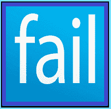

# 方法失败的原因

> 原文：<https://www.socialengineering.info/2021/10/reasons-methods-fail.html>

## **方法及其项目失败的常见原因。**

利用人类防火墙的艺术，通过操纵另一端的人执行他们不应该做的动作，**要达到你的目标可能(有时)是一项艰巨的任务。**无论是通过伪装成特定组织的员工并欺骗另一名工作人员输入他的 PIN 码并让你通过大门进入，还是联系一家财富 500 强公司的文员助理，就好像你是总部的 It 人员，需要他们的用户凭据来对他们的系统执行例行安全更新，**“每个攻击媒介都必须事先进行研究和准备，以给 SE 最大的成功机会”**。

 

如果你不熟悉你的目标，也就是说你从来没有对他们进行过分析，也没有花时间去做一些调查工作，看看他们是如何组织的，以及他们在组织中有什么措施，那么你的系统工程将在执行后不久结束。无论你打算对哪家公司进行社会工程设计，**“必须做的第一件事，就是研究并明确他们是如何运作的”**，包括由他们支付费用的退款理由，以及免费发送的替换物品。当你结束信息收集环节时，最重要的元素开始生效——**“根据你的(研究)发现以及你要销售的物品的性质制定你的方法”**。

 

当然，这与打击 Zalando、亚马逊、John Lewis 等在线零售商有关，他们使用**【方法】**操纵他们的代表给你的账户充值或发送替换商品，而你仍然可以保留原来的商品。如果你已经在这个岗位上干了几个月/几年，你就会确切地知道我指的是什么和**“为什么方法在决定系统工程师前进的方向中起着不可或缺的作用，以及结果是否会对你有利”**。您还会意识到这样一个事实，即 se 在最好的情况下也可能出错，尽管有无数的场景可以解释这一点，但最常见的原因是**“方法没有按计划发挥作用”**。稍后会有更多内容。

 

对每个 SE 实施**" Item&method compatibility "**至关重要，如果您忽略了这一点，它将不会向前发展或在其早期阶段终止。我遇到过许多自认为做对了一切的 SE，却发现他们的要求被无缘无故地拒绝了，当我询问他们 SE 的细节时，**“是他们的方法导致了这一切”**。这就是促使我写这篇文章的原因——演示**方法如何&为什么方法要么从一开始就对 SEs 失败负责，要么在评估声明的某个时候负责**。

 

现在你可能在想，当你几乎不考虑你的方法的时候，你的要求很快就被批准了，几乎没有人问任何问题，但我不是说那些脑残的代表，他们根本不关心如何做好他们的工作，而是指那些严格按书办事，每一步都遵循公司协议的人**。在这种情况下，你的方法必须准备完善，不留任何机会。**

 ****

**这就是我来的原因，通过讨论**“他们失败的原因”，因此你将清楚地了解在为你的攻击媒介准备好你自己的方法时要寻找什么。**为了避免拥挤，我已经将每种方法(在标题中用蓝色突出显示)链接到我在这个博客上的教程，并提供了每种方法需要什么的简短描述，以(如果适用的话)**结束，说明为什么方法本身会失败的一些共性**。所以不要再拖延了，让我们开始吧。**

 ****

****

 ****

**这种方法非常灵活，因此可以用在广泛的项目上，当社会工程师花时间系统地应用它时，成功的可能性非常高**。它通常是这样工作的。我们会说你计划从亚马逊销售一款**“固态硬盘**”。当你收到它时，你会把它退回来要求退款，但不是退回 SSD，**把你放在家里的任何无用的东西打包，并“按照出厂状态重新密封盒子”**。当公司收到它时，他们会把它放回库存，然后把退款存入你的账户。****

 ********

****方法可能失败的原因****

 ********

****①。盒子没有完全用硬纸板包裹，一面有一层小的透明薄膜，因此处理退货的员工立即注意到原来的物品不在里面。****

 ********

****②。无用物品的重量与原始物品的重量不同，因此承运人托运的货物重量不符。这得出结论，另一个项目被退回。****

 ********

****(三)。盒子在重新密封时显示出篡改的迹象，这引起了返回时的怀疑，在检查其内容时，无用的项目被暴露出来。****

 ********

********

 ********

****顾名思义，DNA(未到达)方法用于表示**由承运商司机递送的包裹没有到达目的地**。当然，这位先生确实收到了，但出于销售目的，他另有说明。DNA 被称为**“基于承运人的方法”**，因为它适合任何利用承运人服务向客户发送货物的公司。这种方法的好处在于，它不是特定于物品的，这意味着**它可以与任何尺寸&重量**合理的产品兼容。**** 

 ********

****方法可能失败的原因****

 ********

****①。一个 [OTP](https://www.socialengineers.net/2021/04/how-to-bypass-otp.html) (一次性密码)并没有被用户预料到，他也不知道如何绕过它，所以他别无选择，只能接受交付的包裹。****

 ********

****②。社会工程师指示将包裹放在他家的一个安全的地方，这使他对运输过程中的货物损失负责。因此，DNA 不能被使用。****

 ********

****(三)。订购的物品非常大且昂贵，在销售人员不在的情况下，该物品被转移到一个安全的提货地点，提货时需要提供身份证明，因此确认收到货物。****

 ********

****[**错题收法**](https://www.socialengineers.net/2020/07/wrong-item-received-method.html)****

 ********

****无论公司的一流物流设施如何，在每个仓库环境中都会发生提货和包装错误，因此，当承运人将货物交付到他们的场所时，客户会使用错误的收货方法来说明**箱子/包装中有完全不同的货物。然后，销售人员会打电话给销售代表，通知他(明显的)错误，**，并被指示将其退回**。退款/更换只有在公司收到退货时才会进行——这可以通过使用[装箱方法](https://www.socialengineers.net/2021/02/the-boxing-method.html)或**退回属于同一公司**的库存商品来绕过。******

 ****

**方法可能失败的原因**

 ****

**①。错误物品的重量与购买的重量不同，因此当公司交叉检查货物时，发现了差异。**

 ****

**②。销售人员没有从同一家公司购买错误的商品，当扫描退货时，它没有出现在他们的库存中，这证实了最初没有发送错误的商品。**

 ****

**(三)。(社会工程师)没有使用单独的账户购买错误的商品，当公司与他们的发票部门核对时，订单被链接到 SE'er，这意味着他们没有犯提货/包装错误。**

 ****

**[**漏项法**](https://www.socialengineers.net/2020/09/the-missing-item-method-done.html)**

 ****

**这是一种非常流行的方法，几乎在每一个销售社区都被使用和讨论，并且在极轻的产品上有很高的成功率**。它的工作原理是说，当你打开由承运商司机交付的箱子/包裹时，你的物品不在箱子/包裹中。例如，假设你买了一个 CPU，当你撕开盒子时，里面什么都没有，这意味着**CPU 本身不见了，只收到了盒子**。或者，你可以声称所有东西都不见了- **盒子和 CPU 都不在包装里**。****

 ********

****方法可能失败的原因****

 ********

****①。如果闭路电视摄像机积极地监视商店部门，录像将显示商品被正确地挑选、包装和运输。这与一个“仓库错误”有关-请参考我的指南以获取更多信息。****

 ********

****②。该物品太重，当该公司对运送服务的承运商展开[调查时，他们的调查结果证实该物品已被相应发送。](https://www.socialengineers.net/2020/04/company-investigation.html)****

 ********

****(三)。当销售人员声称两个箱子&都丢失时，他没有计算“装运重量”，所以重量不一致，导致销售人员失败。****

 ********

****[**偏法**](https://www.socialengineers.net/2020/09/the-partial-method.html)****

****鉴于你刚刚读过缺失项方法，你对**分部方法**所需要的东西不会有任何问题，也就是说因为**它的工作原理相似，但在执行方式上略有不同**，如下所示。你从网上商店购买了一堆商品，但是当你收到时，声称你的订单已经**【部分完成】**。换句话说(举例来说)，**你买了 5 件商品，但只收到其中的 3 或 4 件**。这几乎与遗漏物品法相同，但不是只销售一件产品，而是**购买“同一批货”的多件物品，然后联系销售代表/代理，告诉他们当你打开盒子/包装时，有一件或多件物品不在里面**。****

 ********

****方法可能失败的原因****

 ********

****①。这些物品是单独装运的，因为卖方没有事先调查公司/承运人，所以不能使用部分方法。****

 ********

****②。销售人员没有计算他所销售的每件物品的“总重量”，因此它们对于部分方法来说太重了，这导致了一个不成功的结果。****

 ********

****(三)。总共有 8 个“不同的项目”被 SEd，这是非常不太可能(如果不是不可能)的选择&包装错误的描述和数量发生。因此，索赔被驳回。****

 ********

****[**拳法**](https://www.socialengineers.net/2021/02/the-boxing-method.html)****

 ********

****当你因为告知销售代表你的产品有问题而被要求退货时，或者你说你已经改变主意并想要退款时，规避退货的有效方法之一是使用**“拳击法”**。目的是在公司收到退货之前，归还没有物品、**和** **的盒子/包装**，使其看起来好像有人偷了物品。这是通过在一侧撕开盒子并用不同颜色的胶带密封来完成的，这给人一种被篡改的印象，因此**这与一起盗窃相关事件**一致。根据物品的性质，该方法可以使用或不使用[干冰](https://www.socialengineers.net/2020/06/seing-using-dry-ice.html)。********

 

方法可能失败的原因

 

①。该物品非常大，因此在收集点立即发现了篡改的迹象，这表明该卖家对此负责。

 

②。这个东西非常重，所以不可能计算出干冰升华的时间——从包裹寄出的时间，到储存的时间和运输的时间。

 

(三)。卖家不知道的是，该公司和他们的承运人合作伙伴对货物在运输过程中的损失都没有责任，这最终免除了他们的责任。

 

 

**[被破坏的文件](https://www.socialengineers.net/2021/02/corrupted-file-method.html) & [被破坏的视频](https://www.socialengineers.net/2020/05/corrupted-video-method.html)方法**

 

在评估索赔的过程中，**一些公司要求提供一份** [POD](https://www.socialengineers.net/2021/03/proof-of-destruction.html) (销毁证明)，销毁物品并拍摄照片或视频，清楚地显示物品已完全损坏，而不是将物品退回。罗技(Logitech)和 SteelSeries 是选择 POD 的两家公司，特别是对于低价值的物品，原因是**运费的成本超过了物品本身的成本**，因此将(POD 的)照片/视频作为电子邮件附件发送是免费的，显然是一种更便宜的选择。很明显，**用户无意破坏物品，这时候破坏文件或破坏视频的方法开始起作用**。

 

方法可能失败的原因

 

①。代表们可能非常顽固，不断要求提供工作文件，如果销售人员拒绝遵守，他们完全有权利不批准这一要求。

 

②。如果 SE'er 缺乏信心，不愿意把 SE 逼到极限，可能执行没多久就走到尽头了。

 

(三)。一些代表/代理已经知道社会工程师使用的技术与损坏的文件/视频方法，所以他们会在收到索赔时拒绝索赔。

 

 

虽然这受限于它所能对付的物品，但这并不意味着它没有你刚才有幸读到的方法有效。这里有一个电池泄漏法工作原理的例子。当销售一件需要电池才能工作的商品时，顾客可以用它来表示**“他们订购的商品在交付时电池漏了”**。因为泄漏可能在运输过程中的任何时候发生，**公司很难最终证明物品是以原始的无故障状态交付的**，如果销售人员坚持他的故事(电池泄漏)，成功的机会很大。

 

方法可能失败的原因

 

①。公司可能会要求退回产品，如果他们已经组织承运商司机在装运前提取并检查物品，那么这种方法完全是浪费时间。

 

②。对于价值非常低的物品，可能需要“POD”(销毁证明)和“POP”(购买证明)，而不是退还物品，这可能会导致严重的并发症。

 

(三)。如果物品很大很重，装箱方法不能用来绕过退货，如果[处理故障物品的方法](https://www.socialengineers.net/2021/04/disposed-faulty-item-method.html)失败，该方法也会失败。

 

 

打击社会工程领域最大的垃圾之一是**“FTID 方法”**，它是**假跟踪 ID** 的缩写。如果你现在才看到这个，你会被它的名字误导，因为这个垃圾的作者连标题都搞不清楚。**“跟踪 ID”根本不是假的**，而是虚构的**“装运”**，通过操纵运输标签并删除与发送者相关的所有可识别细节。只有跟踪 ID(及其各自的条形码)保持原样，只是为了显示包裹/信封已被递送到正确的目的地。**“那只是它是如何制定的一个例子”**，还有很多其他的但是我不支持这个垃圾，所以我在这里不做评论。请务必阅读我的指南，看看它是如何工作的。

 

为什么该方法会失败

 

①。承运人在收集点、他们的仓库和目的地扫描包裹，因此，如果卖方在运输标签上添加了另一个地址，希望司机将根据标签上的详细信息单独交付，那么他的销售尝试将会失败。

 

②。当公司收到包裹/信封时，该方法基本上依靠进口货物部门的懒惰来处理看似无用的货物。不幸的是，在当今最先进的物流系统中，退货会被相应地检查。

 

(三)。如果发件人的详细信息完全从运输标签中删除，许多运输公司将根据跟踪信息在他们的仓库重新打印标签，这使得该方法无效。

 

 

当购买一件需要某种功能才能操作的物品时，比如电动牙刷或直发器，事实是，**它们并不总是完好无损的**。工厂缺陷是不可避免的，企业对此心知肚明，但不会向消费者披露。社会工程师也知道这一点，并通过说**产品从一开始就停止工作，或者在购买后不久**就停止工作，将**“故障项目方法**付诸行动。销售代表很可能会要求**将物品退回**，或者在某些情况下，要求提供[箱](https://www.socialengineers.net/2021/03/proof-of-destruction.html)(销毁证明)。

 

方法可能失败的原因

 

①。如果顾客被要求归还物品，而物品又大又重，通过[装箱](https://www.socialengineers.net/2021/02/the-boxing-method.html)来规避归还将是一个非常困难的过程。

 

②。如果要求 POD 而不是返回，这可能会使 SE 变得复杂，尤其是对初学者来说——因为这将增加额外的任务，如使用[损坏的文件方法](https://www.socialengineers.net/2021/02/corrupted-file-method.html)或 Photoshop It to perfection。

 

(三)。在故障排除过程中，销售人员(与代表)的一个错误举动可能会引起怀疑，索赔最终可能会被拒绝。

 

碎玻璃法

 

虽然碎玻璃法在当今公司操纵和剥削的世界中并不常用，但当它以战略性的方式准备和执行时，它肯定能很好地达到目的。它的工作方式是通过**购买一种显然是用玻璃制造的产品**比如一瓶香水或古龙水，以及**当运输司机放下包裹时，“物品被砸得粉碎”**当店员打开盒子时。这种方法之所以如此有效，是因为公司/承运人几乎不可能**“提供证据证明物品从发送之时到运输途中一直完好无损”**。

 

方法可能失败的原因

 

①。为了获得退款，销售代表可能会要求退回打碎的玻璃，一些顾客倾向于退回任何看起来与原产品相似的东西。如果彻底检查过了，就和 SE 说再见吧。

 

②。如果销售代表认为物品的成本超过了运费，而不是将其退回，他会要求通过拍照清楚地显示物品是碎片来证明玻璃破碎。因此，必须使用[损坏文件方法](https://www.socialengineers.net/2021/02/corrupted-file-method.html)，这可能会导致很多问题，甚至导致失败——特别是当代表坚持发送工作文件时。

 

(三)。一些公司，包括他们的承运人合作伙伴，对运输过程中损坏的货物不承担责任，这将免除他们的责任。

 

**总之:**

 

这篇文章的目的，不仅是要展示方法如何以及为什么对社会工程师有利，而且要展示为什么它们**“可能”**失败的原因。我引用了**【may】**，也在每一个话题中列出(除了有缺陷的所谓 FTID 方法)，因为这并不是暗示方法**会失败。换句话说，**由于每个话题中提到的原因，索赔很有可能会被拒绝**。因此，了解这一点非常重要，这样你就会知道你的方法会带来什么(如果还不算太晚的话)，**你可以通过在制定方法时应用不同的方法，将消极因素转化为积极因素**。**