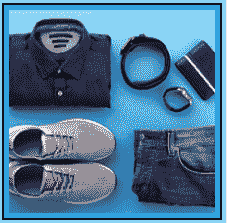

# 销售服装

> 原文：<https://www.socialengineering.info/2022/02/seing-articles-of-clothing-done.html>

## **如何社会工程师的服装文章**

事实是，**每个社会工程师在某种程度上都与他们寻求销售的**产品类型不同。例如，那些技术头脑的人会选择电脑显示器、数码相机、耳机、苹果 AirPods、游戏笔记本电脑，如果他们希望从头开始构建一台台式电脑，他们会选择最新的 GPU、SSD、CPU、PSU 等等。信不信由你，**有许多女性顾客**喜欢美容产品、GHD 直发器、手镯&耳环以及基本上任何能让她们的外表变得最好的东西——所有这些都不花一分钱。

 

当然，我指的是**去网上商店欺骗他们的代表/代理**将购买产品的全部费用记入你的账户，或者由他们支付费用派送替换产品，而你仍然可以保留原来的产品。所有这些都被称为**、**、*我才是真正这样命名的人*，而且有很好的理由——你**、**、**、**操纵公司的代表，利用他们的漏洞最终得到你想要的东西——最好是退款。

 

虽然不是每个社会工程师都有完全相同的兴趣(整体而言)，但有一个特殊的元素是每个人都不能缺少的- **那就是购买“衣服”**。无论是一条裤子，一件全拉链连帽衫，还是几件短袖 t 恤，你总是需要经常添置一些衣物，这就是为什么它是一种非常受欢迎的商品。然而，由于这样或那样的原因，许多用户发现不仅很难决定目标公司，而且很难选择最合适的方法。

 

举例来说，直到今天，我仍然会在一些论坛上看到这样的信息:**“我已经订购了 10 件衣服，它们很轻，所以我将 PEB 其中的 4 件”**。真的吗？他们对**光的定义是什么？**。他们知道 PEB(部分空箱)法的重量限制是 **120 克吗？**。他们是否计算了待检物品的总重量**和总重量**？从上面引用的信息的上下文判断，我可以自信地说，SE 很少甚至没有产生任何想法，然后他们想知道为什么代表/代理拒绝索赔。

 

现在，我无意以任何方式贬低社会工程师，因为他们缺乏如上所述的知识，而是在计划销售服装时引导他们正确的方向。为此，在本文中，我主要关注了服装常用的 ***四种方法*，即**【缺失的项目】****【部分】**【PEB】**【收到错误的项目】**和**【DNA】**(未到达)——所有这些方法对于希望针对特定类型的服装制定这些方法的无经验的销售人员来说都有些混乱。**

 

除此之外，最重要的是要很好地理解*公司内部如何运作，以及他们的 ***退货政策***——因为这些都会对销售工程师产生重大影响，很可能会导致失败，因此我会在页面的后面详细介绍。但是首先，让我们从准确地了解**服装**的特征开始本教程，然后我们将转移到**公司方面的事情**，并以上面段落中提到的**四种方法**结束。*

 **

 **

***什么定义了一件衣服？***

 **

*尽管这个话题的标题是非常常识性的，不言自明的，并且在很大程度上不需要任何详细说明，一些社会工程师仍然寻求澄清**是什么把服装**分类的——特别是它们的自然&可用性——为了建立销售最佳公司的(主要)目的。例如，许多人判断术语**、**的含义是:**、**、**内衣**、**运动裤**，如果是女性，**连衣裙**和**裙子**——这当然符合**、**的定义。*

 **

*但是它比覆盖上身、躯干和四肢的衣服延伸得更远。还有许多其他东西也是这个等式的一部分，例如 ***帽子&鸭舌帽******手套******鞋类*** 运动鞋 ***凉鞋、靴子*** 和 ***袜子*** 尽管一些时尚大师不敢苟同，但*太阳镜*事实上确实符合相同的标准。显然，这不是一份详尽的服装清单，因此**在准备应对攻击媒介的方法时，它应该只是一份通用指南**，但在讨论之前，**对“研究你将出售的公司”至关重要**，所以现在让我们来看看。*

 **

 **

***销售服装前先研究公司:***

 **

*在考虑整合你的销售工程师之前，首先要做的是**熟悉公司如何运作**，以及他们在不仅仅处理**退货**时所采取的措施。而且**在他们挑选&包装存货**期间发生了什么。因此，您可以做出明智的决定，对您计划销售的产品使用哪种方法。例如，如果你已经确定**他们的仓库被** [闭路电视摄像机](https://www.socialengineers.net/2020/10/cctv-cameras-in-warehousing.html)主动监控，你就不会使用**“丢失物品”**、**“收到错误物品”**或**“部分”**方法(在本主题后会有更多相关内容)。*

 **

*为什么，鉴于上述方法与声称**一件或多件物品不在包装内**或**收到不正确的物品**有关，承运商司机将物品送到你家后，公司将展开所谓的[调查](https://www.socialengineers.net/2020/04/company-investigation.html) -以确定你为什么没有收到货物。然后，他们会参考他们的摄像机镜头，并认为**您的产品实际上已正确** **包装和发送**。相机不会说谎，社会工程师会说谎！因为他们的(相机)证据确凿，你的索赔会被驳回。你能看出把**“研究”**作为你的首要任务的重要性吗？很好！*

 **

*当销售衣服和**使用缺失商品、部分**和**错误商品接收方法**时，选择没有[闭路电视摄像头](https://www.socialengineers.net/2020/10/cctv-cameras-in-warehousing.html)的零售商是至关重要的，但是你如何知道他们是否使用它们？有几种方法可以建立它，但是出于本教程的目的，**我将只讨论下面的几种方法**。第一种是陈述显而易见的事情，通过**在社会工程论坛或 Discord 服务器(你已经注册了)上请同事们**分享他们在该公司的经历。**在可能的情况下，确保得到不止一个回复** -如果有多个回复的匹配信息，那么它很可能是真实和正确的。*

 **

*第二种方式，是执行一次[的练习跑](https://www.socialengineers.net/2020/05/perform-practice-run.html)，意为一次**【试 SE】**。本质上，你不是出售你的真实物品，而是创建一个**"伪 SE"** **单独用作测试平台**——在这种情况下，购买一个非常便宜的物品并点击**缺失物品**、**部分**或**错误物品接收**方法。如果公司告诉你一个[调查](https://www.socialengineers.net/2020/04/company-investigation.html) **正在进行中，并且在 ex-amount of business days 批准索赔**之后，那么就有你的答案了——没有安装闭路电视摄像头。好的，研究的最后一个部分是**公司的“退货政策”**——检查你销售的产品是否**有资格退款**。例如，出于卫生目的，一些商店不接受泳装、内衣和面部覆盖物的退货。通过导航到他们的官方网站可以找到政策信息。*

 **

 **

***sè服装使用的遗失物品方法:***

 **

*正如本文第五段所提到的，各种体型的社会工程师使用的一种非常流行的方法是**“缺失项目法”**。其入选的众多原因之一，是因为其他一系列传统方法如[故障物品](https://www.socialengineers.net/2021/01/the-faulty-item-method.html)、[密封箱](https://www.socialengineers.net/2020/05/the-sealed-box-method.html)、[漏液电池](https://www.socialengineers.net/2020/06/leaking-battery-method.html)、[处理故障物品](https://www.socialengineers.net/2021/04/disposed-faulty-item-method.html)和[序号法](https://www.socialengineers.net/2020/04/serial-number-method_13.html) **都与“服装”**物品不兼容。**封箱法**适用于有工厂封条的纸箱包装的货物，其余为科技型产品。*

 **

***从**的角度来看，选择 ***漏项法*** 背后的逻辑是因为衣服的重量非常轻，然而这多少有些误解——也就是说**“每个 SE”**都有一个重量限制。你很快就会明白我的意思。那么**漏项方法**到底是什么呢？很高兴你问了！顾名思义，它用来表示从在线零售商处订购的商品在承运商司机交付后打开包装/盒子时**丢失。***

 **

*例如，我们将假设你从一家名为 **Zalando** 的时装公司购买了一副重约 22 克的**宝丽来太阳镜，并让他们的一个承运伙伴将它送到你家。在**“打开盒子/箱子”**时，你会联系 Zalando，告诉他们里面什么都没有，意思是**太阳镜本身不见了** -目的是要求退款或更换。或者，你可以说当**【包装被打开】**时，它是空的——所有东西都不见了，**盒子/箱子和太阳镜不在那里**。当然，你确实收到了，但你是为了销售的目的才这样说的。***

 **

*现在，除非销售代表/代理脑残，当场批准索赔，几乎不问任何问题，**公司很有可能会展开** [调查](https://www.socialengineers.net/2020/04/company-investigation.html)，并与为您送货的承运商联系。他们特别检查的是承运人称重设施记录的**“重量”**，但鉴于太阳镜轻如鸿毛，**他们绕过了检测，因此没有证据表明它们在包裹里**。因此，销售代表成功了，并在此后进行了退款。*

 **

*另一方面，如果衣服重到足以记录重量，**[调查](https://www.socialengineers.net/2020/04/company-investigation.html) **将断定它们被装在包裹里**，因此你的索赔将被驳回。有道理？很好。许多用户的问题是，他们阅读术语**“服装”**，因为(根据描述)它看起来很轻，他们立即假设几乎每件服装都可以用缺失项目法来处理——事实完全不是这样。作为一个经验法则，**我总是建议每件物品“120 克”的限制，这将它推向绝对的顶峰**。显然，权重越低，成功率越高。一定要记住这一点——这是 SE 是否会对你有利的主要因素。***

 ******

 ******

*****sè服装使用的偏法:*****

 ******

***鉴于你刚刚读过缺失项方法，你对**“分部方法”**的要求没有任何问题，因为它的工作原理相似，但**在执行方式上略有不同**。也被称为**【部分】**，这与从网上商店订购一堆商品有关，并声称当你收到它时，你的订单已部分完成。换句话说，例如，购买了 **5 件物品**，然而**你只收到了其中的 3 或 4 件**。***

 ******

***它的执行方式几乎与缺失商品法相同，但你不是只购买一件商品并单独出售，而是购买**“同一批货中的多件商品”**，然后联系销售代表，告诉他**当你打开包装时，有一件或多件商品不在包装中**。与漏件法一样，每件衣服必须非常轻，以免登记托运重量——最多**【120 克】**，但当**超过一件**时，必须计算它们的**【总重量】**。也就是说，当包裹被打开时，无论你声称丢失了什么，这就是你要处理的等式。***

 ******

***例如，假设您购买了**【5 件 t 恤和 2 双袜子】**，在致电公司时，您告诉代表**【只有 t 恤】**包含在承运人送来的包裹中**。**本质上，**“袜子”*(每双 40 克)*不见了**，这就是你们所看到的，所以**它们的重量必须放在一起作为一个单一的数字** -在这种情况下，总共**“80 克”**用部分方法被带上船，因为它在 **120 克支架**之下，这种方法是可行的。总而言之，单项不言自明，但命中多项时，记得**把它们的重量合并成一个单位**。***

 ******

 ******

*****SE 衣使用错误的物品领取方法:*****

 ******

***虽然这种方法不像你迄今为止有幸读到的那些方法那样经常使用(与衣服一起)，但这并不意味着它不如其他方法有效，尤其是当你花时间根据它的设计和应用来准备时。然而，许多社会工程师在试图正确地制定它时会遇到困难，如果你是其中之一，我将解释它是如何不可思议地轻松完成的。就其目的而言，**错误物品接收方法**的工作原理是订购你的产品，当包裹到达时，你说**它包含了完全不同的东西**。***

 ******

***自然，这种事情没有发生——你只是说它对公司有影响。在你继续使用这个方法之前，**“你首先需要购买*你假装收到的错误商品***——因为你将被要求将其退回，并且只有当公司拥有它时才会处理退款。现在这部分很重要，所以注意每一个写出来的字。**当购买*错误的商品*时，通过更改所有可识别的详细信息(因此它不与您的主/主要账户相关联)，并**“确保它是从您出售的同一家公司购买的”**并发送到**另一个地址**，从而“在单独的账户上”** **。*****

 ******

***因此，当退货被扫描时，他们会看到这是他们库存的一部分，**假设他们实际上发送了一个不正确的商品到你的家，** [卸货点](https://www.socialengineers.net/2020/09/using-drop-house.html)或任何你用来接受交货的地方——但是鉴于货物是托运称重的，最重要的是**“错误商品的重量尽可能接近你销售的产品的重量”**。基本上，如果公司与承运人联系并交叉检查他们的记录，**就不会有重量差异**，因此你的收货错误的索赔是完全合理的。基本上，衣服物品有多重并不重要——只要**错误物品和原始物品的重量都匹配(或接近)**，那么方法就准备好了。***

 ******

 ******

*****sè衣物使用 DNA 方法:*****

 ******

***我将要讨论的最后一种方法叫做**、**、**、**，这是**、**的缩写，它的好处在于它的灵活性，也就是说**你可以一次在同一批货上挑选几件衣服*-所有的**、**都不用担心计算它们的重量。我将在一分钟左右的时间里详细阐述这一点。好的，DNA 被用户用来表示他们一直等待被送到他们的地址(或[投递处](https://www.socialengineers.net/2020/09/using-drop-house.html))**的包裹没有如期到达**。简而言之，他们从网上商店购买了一些东西，**但是承运商司机忘记把东西送到他们的住处**。再次声明显而易见的是，该事件并未发生——它只是说给公司听的。******

 ******

***DNA 相对于大多数其他传统方法的优势在于，它是**“基于承运人的”**，这意味着它适用于任何合理尺寸的产品，货物的重量无关紧要——也就是说，因为**你纯粹是在声称承运人**的“包裹没有到达”，而不管它包含什么以及有多重。此外，**执行的每一次 SE 都将主要关注“承运人驾驶员的活动和您的操作”**以取得成功结果，在某些情况下，SE 甚至在与客户服务代表沟通之前就已经完成了 75%!***

 ******

***例如，当司机到达时，你告诉他**你刚刚一丝不挂地洗完澡**，礼貌地请他**把包裹放在你家门口**，大声说出来，如果他答应了，开始庆祝你的 SE - **你没有“亲自收到它”**，因此在无人看管的情况下它可能发生任何事情- **一个路人偷了它，或者也许你的邻居做了同样的事情**。如果需要签名，那么这是一种无用的验证形式- **用一个有点“易读”**(可读)的名字在上面签名，当它与你的名字交叉核对时，它将不会匹配，因此**不是“你”签名**。***

 ******

***这些只是 DNA 通常用来帮助确保退款或更换物品的几种情况，所以请记住每一种情况。回到销售衣服的问题上来(作为对你刚刚阅读过的内容的一个提醒)，以**你购买的东西是“用同一个包裹包装和运送的”**为由，你可以订购你喜欢的任意多的商品——因为**你只是专注于“没有收到包裹”**，因此衣服的重量、数量和性质并不重要。***

 ******

***但是现实一点——不要走极端，不要买价值超过 1 万英镑的名牌衣服！**公司/承运人将格外小心以确保交付**，例如要求 [OTP](https://www.socialengineers.net/2021/04/how-to-bypass-otp.html) (一次性密码)，或者[司机拍摄你家门口的照片](https://www.socialengineers.net/2020/12/carrier-taking-photos.html)，或者可能**安排包裹在特定的收集点**领取，并要求提供身份证明作为收货证明。总的来说，如果你聪明地在合理的范围内行事，同时运用常识和良好的判断力，你会发现 DNA 通常会成功。***

 ******

 ******

*****总之:*****

 ******

***嗯，这篇文章的阅读时间比我最初预期的要长得多，但是因为我是那种会从各个角度研究方法、项目、事件、公司、运营商等等的社会工程师，所以我的指南不可避免地会很深入而且相当冗长。我在这里的目的是**为你提供完美的材料来有效地销售你想到的任何一件衣服，不管它是什么性质的**。***

 ******

***例如，如果一种方法与物品和/或公司不兼容，或者您对制定该方法没有信心，**您可以选择至少一种其他方法**。您还了解了**“研究公司”**的重要性，以及为什么在选择合适的方法时它会起到不可或缺的作用。最后，**你现在可以高效准确地打击几乎所有规模的服装公司**。***