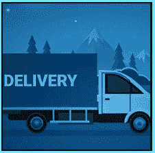

# 使用载体驱动程序

> 原文：<https://www.socialengineering.info/2020/09/seing-carrier-driver.html>

## **社会工程师司机不接受签名。**

The human mind Is a very powerful tool that can be used to achieve just about anything It's focused on doing from an offensive standpoint, but every strength has Its weakness and ***much to the delight of SE'ers, It's the weakest link In the security chain***. ***Anyone In any capacity can fall victim to social engineering***, be It one of the country's leading psychiatrists or the likes of the elite SE'er named Kevin Mitnick- they're all exploitable to some degree, regardless of their level of experience In the social engineering sector. Let's face It, ***It's just not possible to maintain the same consistency of awareness***, hence all It takes Is a momentary lapse of concentration, and Mr Mitnick will be at a loss as to how he was fooled Into clicking on a malicious link In his email message.
  Given this can happen to the most knowledgeable people In the SEing scene, ***manipulating those who're just average workers In the transport/freight Industry, such as "carrier drivers", can be done with Incredible ease.*** If you haven't already guessed, what I'm referring to Is employees who work for FedEx, DHL, Royal Mail, DPD, UPS and so forth and provide a delivery service for companies like Amazon, John Lewis, Argos etc. In my experience In the SEing community, users predominantly discuss ways to SE companies, with very little communication pertaining to their carriers and that's what prompted me to write this article, namely **"how to social engineer the driver to not accept a signature"**.
  The objective behind this, Is to purchase an Item you'd like to SE for a refund or replacement, and then ***not having to sign for the package when the driver delivers It at your premises***. As such, this solely relates to the **"DNA"** (Did Not Arrive) method, whereby (as Its name Implies) you'd claim that It didn't arrive and would like a refund/replacement. *Because a signature will not be taken, the SE Is 50% complete*- with the remaining 50% having to deal with the company's claims management process, which Is nothing more than standard procedure and complying with their requests. So how do you SE the driver to not record your signature? There are several ways to do this, so without further delay, let's checkout the first one.
  **Pretending To Argue On Your Cell Phone:**
  As opposed to the 80s and 90s where cell phones were somewhat of a rare commodity, almost every man and his dog (so to speak!) owns one nowadays and on this occasion, you'll be using It to your advantage to circumvent a signature on receipt of the package from the carrier. As per the topic's title, ***you will pretend that you're In a heated discussion/argument over the phone, with the Intention to make the driver leave the moment he delivers the package***. This Is In fact a very effective method, that can be used to SE anyone In almost any situation. For Instance, I'm sure you've come across someone arguing on his cell phone who seemed very upset and had a look on his face as though he wanted to bash the person on the other end, yes? I thought as much. My question Is: **"Did you approach him to ask If he's okay, or were you afraid that he might throw a few punches at you?"**. I'd say that you turned the other way, and walked off.
  This Is a similar tactic that you'll use to avoid a signature, but as with every SE, **"preparation"** Is of the utmost Importance. There's only one thing that you must do, and that Is to*** either turn off your cell phone or put It on silent***. The last you need when you're seemingly arguing, Is for your friend to get In contact, thereby your ringtone will sound as an Incoming call whilst you're supposed to be on the other line! This Is a dead giveaway that you're faking the call, hence will Immediately Indicate that you're up to no good. Okay, now that you have that under control, this Is how you'll execute your attack.
***As the driver pulls Into your driveway, walks towards you and Is around 50 feet away, speak extremely loud on your phone and make sure that you appear very distressed***. The closer he gets to you, the more you'll raise your voice- to the point of giving the Impression that you're going to lose your cool In an uncontrolled manner at any moment. Body language Is an Integral part of this, so use your hands to express disapproval by pointing fingers etc, ***but "don't overdo It"- keep It on a level that looks legit, yet quite offensive***. I can confidently say, that the driver will most likely drop off your package way before he reaches you, and will be glad to leave your house for his next scheduled job. I've done this a handful of times In all facets of SEing, and It hasn't failed me to date.
   **Pretending To Excessively Cough & Sneeze:**
  Going by personal experience, this particular method Is just as good as the one above and If Its execution Is done In a strategic fashion, the probability of failure Is highly unlikely. The reason for this, Is because ***you will be putting "health" as part of the equation, by presenting a risk to the driver as he approaches you asking to sign his hand-held device***. Don't worry, this will make perfect sense very shortly. At the time of writing, a very nasty virus named **"Coronavirus"**, has unfortunately Infected millions of people globally, and taken the lives of hundreds of thousands. It's very contagious and can spread by simply being within a meter of someone who already has It. ***It's this, and any other virus of similar nature, that makes this method so effective***.
  Although everyone may have (eventually) been vaccinated against the above-mentioned virus, due to Its severity, the effects certainly won't be forgotten anytime soon nor will anyone disregard the spread of the good old common cold. ***By using these In your favor, you can bypass the need to sign for your package with Incredible ease***, and this Is how you'll do It. In this case, **"the timing of your SE plays an Important role"**, so hit It during winter when everyone Is susceptible to falling sick. Moreover, the driver himself, may be unwell so he wouldn't want to be exposed to anything that will make his condition worse. Can you see how your SE Is on Its way to success before It's had the chance to begin?
  Now that you're aware of what's Involved, let's formulate your method prior to putting It Into practice. On the grounds you know when your purchase will be arriving at your home, around 30 minutes or so beforehand, ***prepare yourself by grabbing a bottle of eye drops from your local drug store***. Your goal Is to give the appearance as If you've just caught the flu and as a result, you (seemingly) look trashed, and not the type of person who anyone would like to associate with! Just before the carrier arrives, put the drops In each eye by doubling the dosage. ***As such, they will look very watery- which Is consistent with being sick***.
  As the driver walks In your direction, greet him by having a coughing fit, sneezing and wiping your mouth and eyes with your **"hands"**. As mentioned a few paragraphs up, ***do not overdo It- sometimes the obvious Is "too obvious" *** which can have the opposite effect. Notice how I've quoted the word **"hands"** just above?This Is the key element that will solidify your SE, whereby the driver will either place your package In front or near you, or ask for your name and head back to his van. After all, ***who wants to be In close contact with someone who's cleaned their germs with their hands? *** I definitely don't, and I'm sure you share the same opinion. A while ago, I've SEd a FedEx & DHL driver on the same principle as this, and It worked like a charm. I have no doubt It will be the same for you.
  **Talk About His Interests:**
  When you're at a birthday party, or perhaps Invited to a wedding and hanging around chatting with a group of people, ***every person will predominantly talk about themselves  *** by saying what they did during the week, as well as discuss their favorite sport, hobby, TV show and so forth- with very little time generated Into asking about your happenings. It's human nature for everyone to prioritize themselves over others, by putting their Interests first and when you respond to their liking, ***you'll find that your commonalities will begin to form and some degree of trust will start to develop***. Carrier drivers are no different. As a matter of fact, given that they're on the road all day without a companion, they enjoy stopping by and having a discussion. Now when It **"only relates to them"*, they become a lot more relaxed and tend to have faith In you and your actions***, and as such, they're somewhat hesitant to question your movements by chasing you for a signature.
  Taking all the above on board, this Is when you'll put your SEing skill set Into effect, by simply greeting the driver with open arms (so to speak) and begin your conversation by asking him how his day has been thus far. ***You will then "slowly build a trusting relationship"- with the objective of talking about everything that Is of Interest to him***. For example, mention a few topics that are common to the male gender such as football & baseball teams, alcoholic beverages, sports cars, workshop tools and the list goes on. On the other hand, ***If the driver Is a female, complement her on her nails & hair *** and also discuss fashion and TV shows like Desperate Housewives, Sex and the City, Grey's Anatomy and so on.
  To add to your list of manipulations, ***see whether their uniform contains a "name" (or ID of some sort), and keep referring to It throughout the conversation***. Why? Well, everyone feels appreciated when others address them by name. For Instance, did you have a feeling of being valued, when your boss spoke to you specifically by repeating your given name quite a number of times In a complementing manner? I'd say It's very safe to assume, that you've answered **"Yes"**. The carrier driver will feel exactly the same and ***when combining this with all the above, you have the perfect Ingredients to distract the need to sign for your package***. Ultimately, when the driver hands It to you, he/she Is so deep In conversation and captured by your politeness, that you can simply walk off without signing and to solidify the SE, end It on a positive note by saying: **"See you next time, enjoy the rest of your day"**.
  **Hands Being Covered In Mud:**
  This particular method Is my favorite, not only because ***It's the most effective compared to the ones that you've just read, but also due to the fact that*** ***there's hardly any preparation Involved***. Aside from personally trying this myself on a couple of occasions without fail, I've communicated with a handful of users In the SEing community, and each one stated that they experienced the same- a successful outcome. It's so easy to apply, that there's no purpose going Into great detail, hence this Is very much straight to the point. As per the topic's title, ***you'll circumvent a signature by having your hands covered In mud, whereby the driver will approach you with his device, see that you're absolutely filthy and refuse to hand It to you***. 
  After all, who wants their machine not only covered In mud, but the possibility of It losing functionality due to deposits entering Its circuitry. Essentially, he'll probably sign It himself (as many FedEx drivers do), or drop off your package at your doorstep. Now you may be thinking that he will say to wash your hands and once they're clean, put pen to paper thereafter. Let me tell you, that ***every carrier driver has a set run each and every day- with most having to meet deadlines*** ***and as a result, they don't hang around waiting for people like you to clean up In readiness to scribble something on their little gadget!*** 
  How many times have you accepted a delivery where the driver took all the time In the world to slowly walk over to you, hand the package and then calmly made his way back to the van? I can't remember the last time (If ever) this happened to me. For the most part, they're always In a rush to fulfill their schedule. So the equation Is pretty simple- ***just before he arrives, put on some old clothes, wet your hands and place them In soil to the point where they're clearly visible with dirt/mud***. I can guarantee you, that almost all drivers wouldn't want anything to do with you, thus bypassing a signature will be done with very little effort.       
  **In Conclusion:**
  In addition to the aforementioned methods, there are countless ways not to sign off your consignment, but It's way beyond the scope of this article to cover the lot. It's already passed Its reading time, so I've left It at that. As with every tutorial on this blog, my goal Is to provide you with **"proven methods that work based on personal experience"**, and not those that I've read from some wannabe SE'er who's had very little to no Involvement In the social engineering sector. As a closing note, I'd like to reiterate that ***everything pertains to the "DNA" (Did Not Arrive) method***, so keep this In mind when using It to SE a given company.