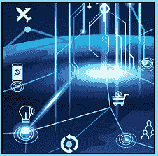

# 什么是“军事革命？”

> 原文：<https://www.socialengineering.info/2020/04/what-is-an.html>

## **RMA——是“退货授权”的简称。**

Without going Into too much detail, an **"RMA" (Return Merchandise Authorization)**, Is Issued by a company to approve a refund or replacement of an Item. In order for this to work, the Item being claimed, must still be under Its manufacturer warranty. Here's how It works. 
  Generally speaking, an email Is sent to the customer with an RMA number (or tracking number) confirming the replacement/refund. The customer then writes/sticks the number on the box that the Item Is being shipped In, and sends It via a given carrier. When the company receives the package with the Item enclosed, the replacement or refund Is processed thereafter. 
  To help ensure that returns are processed smoothly, some companies have this as a mandatory option as part of their claims management, but social engineers know exactly what to do to circumvent It. A very common method the SE'er will use, Is to **"Box the company"** In one of two ways.
  If the Item Is light enough to not register a weight on consignment, then the social engineer will send the package with nothing In It. On the other hand, If It's rather heavy, then a weight substitute such as **"dry Ice"**, will be added In the package. 
  Either way, the company will not receive the Item and given the circumstances are (seemingly) substantiated, the company will generate a refund or replacement. If you're not sure on the **"Box method"**, please read [my guide here](https://www.socialengineers.net/2020/03/test_88.html). The **RMA** process does vary from one organization to another, so this should only be considered as a general guide.