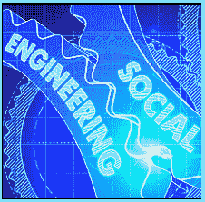

# 工作场所预防标志

> 原文：<https://www.socialengineering.info/2020/06/workplace-prevention-signs.html>

## **到处放置社会工程预防标志。**

The fact Is, no matter how well your staff have been trained to prevent social engineering attacks, It's human nature ***to either be forgetful, or not absorb the Information In It's entirety***. You may have Implemented scheduled training sessions, along with the best social engineering teacher who delivers the Information In a very clear, accurate and comprehensive manner, but It serves little purpose **"If your staff simply forget what they've been told**".
  Moreover, It's very easy for your employees to neglect the Importance of keeping a close eye on social engineering attacks each and every minute of the day, especially If they're  Inundated with meetings, deadlines and so forth. During my penetration testing on various organizations, I've experienced ***some workers who've completely forgotten to keep their defense active- even after being retrained as recent as a few days ago***. As such, a constant reminder, Is to place **"Social Engineering Prevention Signs"** In your building, so let's check this out now.
  **Where To Place The Prevention Signs:**
  This may seem as simple as putting a few **"Social Engineering Prevention Signs"** here and there, and leaving It at that, however It takes a lot more than this. They must be placed In full view, Irrespective of where your staff are located at the time. Furthermore, careful consideration of **"where they're placed"**, must be taken Into account. For Instance, there's not point placing them In a room that holds your company's archives that's visited only once a month. 
  **"It's best to target areas of the building that're heavily utilized on a daily basis"** such as the lunchroom, toward the entry & exit doors of certain departments, on the wall above printers, fax machines and water coolers and so forth. You know your company's main traffic areas, so evaluate each section and Identify the most appropriate location for each sign. So what exactly should the signs contain? We'll have a look at this now.
  **What To Write On Each Sign:**
  It's not possible to generalize about this. The content written on each sign, should be a ***very brief summary (In point form) of what was discussed at your last social engineering training session***. Do not Include a lot of detail- as this will most likely be Ignored altogether. Personally, I can't be bothered reading lengthy material, and I'm sure the majority of your staff feel the same. You will change the sign's contents with every new training session, so the problem Is, **"you'll need to entice your staff to read It"**. Here's what I recommend.
  **Change The Nature Of The Prevention Signs:**
  The moment changes have been applied, your workers **"must notice each sign as they walk by"**, and this will not happen If their appearance seems the same. For Instance, how many times have you read the company's **"Fire Safety Notice"** that's pinned at the entrance of the building? Just as I thought- probably once or twice at the most. 
  So how do you entice everyone to ***notice the Social Engineering Prevention Signs?*** Simply **"change their appearance, namely the background color"** every few weeks or so and with every change of content- bright orange on one occasion, fluorescent yellow the next time and so on. The drastic change In color, will hit them In the face every time they walk by, thus grab their attention there and then. Believe me, this Is a very effective method. 
  **In Conclusion:**
  Social engineering Is a very powerful tool and anyone on any level, can fall victim, regardless how well they've been trained. You will not prevent SEing attack vectors, nor fully protect your staff from being exploited, but you can certainly significantly minimize the risk, by following this article and every other (relative) post documented on this blog.